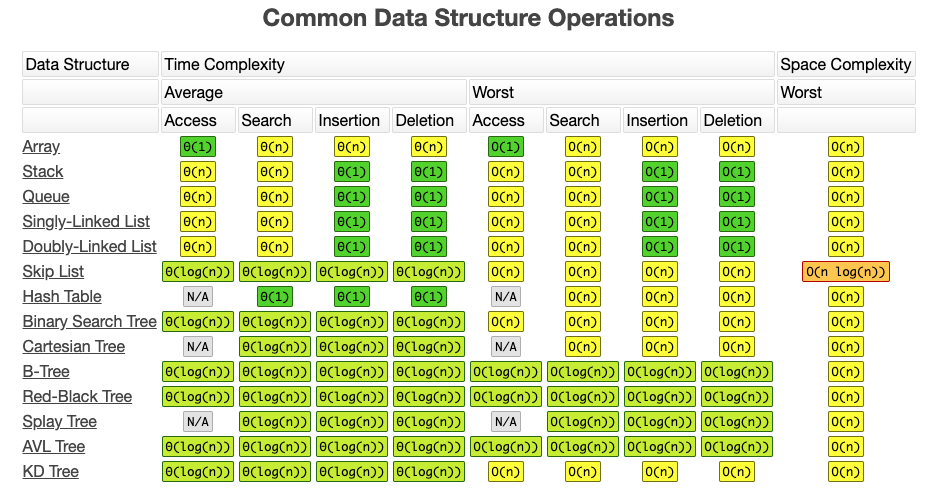

- [算法分析与设计](./algorithm-analysis-and-design.md)
- [红黑树深入剖析及Java实现](http://tech.meituan.com/redblack-tree.html)
- [漫画：什么是动态规划](http://mp.weixin.qq.com/s/_kHeAI4PvF-KH7IQrmnRVg)
- [漫画：什么是 B+ 树？](http://mp.weixin.qq.com/s/cK_GIhCuGoUwJpDpoaETxw)

