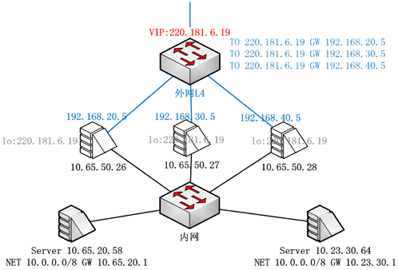
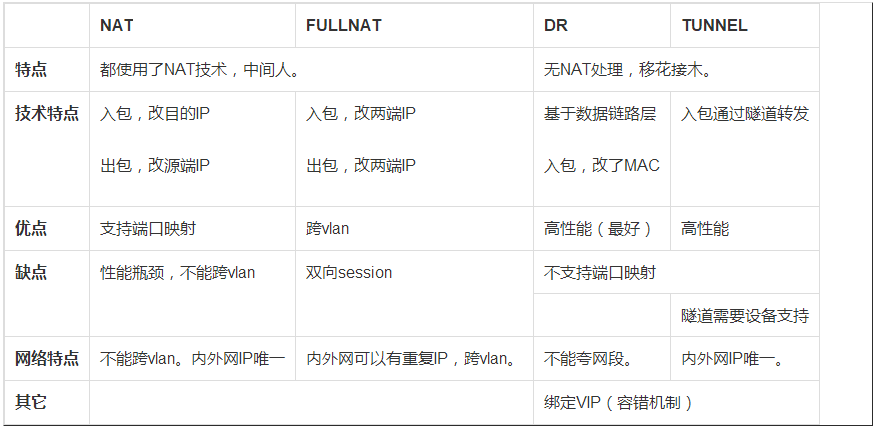

# LVS 负载均衡原理及安装配置详解

负载均衡集群是 load balance 集群的简写，翻译成中文就是负载均衡集群。常用的负载均衡开源软件有 nginx、lvs、haproxy，商业的硬件负载均衡设备F5、Netscale。这里主要是学习 LVS 并对其进行了详细的总结记录。


## 负载均衡 LVS 基本介绍

LB 集群的架构和原理很简单，就是当用户的请求过来时，会直接分发到 Director Server 上，然后它把用户的请求根据设置好的调度算法，智能均衡地分发到后端真正服务器（real server）上。为了避免不同机器上用户请求得到的数据不一样，需要用到了共享存储，这样保证所有用户请求的数据是一样的。

LVS 是 Linux Virtual Server 的简称，也就是 Linux 虚拟服务器。这是一个由章文嵩博士发起的一个开源项目，它的官方网站是 http://www.linuxvirtualserver.org 。现在 LVS 已经是 Linux 内核标准的一部分。使用 LVS 可以达到的技术目标是：通过 LVS 达到的负载均衡技术和 Linux 操作系统实现一个高性能高可用的 Linux 服务器集群，它具有良好的可靠性、可扩展性和可操作性。从而以低廉的成本实现最优的性能。LVS 是一个实现负载均衡集群的开源软件项目，LVS 架构从逻辑上可分为 `调度层`、`Server集群层` 和 `共享存储`。


## LVS 的基本工作原理


1. 当用户向负载均衡调度器（Director Server）发起请求，调度器将请求发往至内核空间。
2. PREROUTING 链首先会接收到用户请求，判断目标 IP 确定是本机 IP，将数据包发往 INPUT 链。
3. IPVS 是工作在 INPUT 链上的，当用户请求到达 INPUT 时，IPVS 会将用户请求和自己已定义好的集群服务进行比对，如果用户请求的就是定义的集群服务，那么此时 IPVS 会强行修改数据包里的目标 IP 地址及端口，并将新的数据包发往 POSTROUTING 链。
4. POSTROUTING 链接收数据包后发现目标 IP 地址刚好是自己的后端服务器，那么此时通过选路，将数据包最终发送给后端的服务器。

## LVS 的组成

LVS 由 2 部分程序组成，包括 `ipvs` 和 `ipvsadm`。

- ipvs(ip virtual server)：一段代码工作在内核空间，叫 ipvs，是真正生效实现调度的代码。
- ipvsadm：另外一段是工作在用户空间，叫 ipvsadm，负责为 ipvs 内核框架编写规则，定义谁是集群服务，而谁是后端真实的服务器（Real Server）。

## LVS 相关术语

- DS：Director Server。指的是前端负载均衡器节点。
- RS：Real Server。后端真实的工作服务器。
- VIP：向外部直接面向用户请求，作为用户请求的目标的 IP 地址。
- DIP：Director Server IP，主要用于和内部主机通讯的 IP 地址。
- RIP：Real Server IP，后端服务器的 IP 地址。
- CIP：Client IP，访问客户端的 IP 地址。

## LVS NAT 模式的原理和特点


1. 当用户请求到达 Director Server，此时请求的数据报文会先到内核空间的 PREROUTING 链。 此时报文的源 IP 为 CIP，目标 IP 为 VIP。
2. PREROUTING 检查发现数据包的目标 IP 是本机，将数据包送至 INPUT 链。
3. IPVS 比对数据包请求的服务是否为集群服务，若是，修改数据包的目标 IP 地址为后端服务器 IP，然后将数据包发至 POSTROUTING 链。 此时报文的源 IP 为 CIP，目标 IP 为 RIP。
4. POSTROUTING 链通过选路，将数据包发送给 Real Server。
5. Real Server 比对发现目标为自己的 IP，开始构建响应报文发回给 Director Server。 此时报文的源 IP 为 RIP，目标 IP 为 CIP。
6. Director Server 在响应客户端前，此时会将源 IP 地址修改为自己的 VIP 地址，然后响应给客户端。 此时报文的源 IP 为 VIP，目标 IP 为 CIP。

#### LVS NAT 特点

**优点**

- RS 应该使用私有地址，RS 的网关必须指向 DIP。
- DIP 和 RIP 必须在同一个网段内。
- 请求和响应报文都需要经过 Director Server，高负载场景中，Director Server 易成为性能瓶颈。
- 支持端口映射。
- RS 可以使用任意操作系统。

**缺陷**

- 对 Director Server 压力会比较大，请求和响应都需经过 Director Server。


## LVS DR 模式的原理和特点


1. 当用户请求到达 Director Server，此时请求的数据报文会先到内核空间的 PREROUTING 链。 此时报文的源 IP 为 CIP，目标 IP 为 VIP。
2. PREROUTING 检查发现数据包的目标 IP 是本机，将数据包送至 INPUT 链。
3. IPVS 比对数据包请求的服务是否为集群服务，若是，将请求报文中的源 MAC 地址修改为 DIP 的 MAC 地址，将目标 MAC 地址修改 RIP 的 MAC 地址，然后将数据包发至 POSTROUTING 链。 此时的源 IP 和目的 IP 均未修改，仅修改了源 MAC 地址为 DIP 的 MAC 地址，目标 MAC 地址为 RIP 的 MAC 地址。
4. 由于 DS 和 RS 在同一个网络中，所以是通过二层来传输。POSTROUTING 链检查目标 MAC 地址为 RIP 的 MAC 地址，那么此时数据包将会发至 Real Server。
5. RS 发现请求报文的 MAC 地址是自己的 MAC 地址，就接收此报文。处理完成之后，将响应报文通过 lo 接口传送给 eth0 网卡然后向外发出。 此时的源 IP 地址为 VIP，目标 IP 为 CIP。
6. 响应报文最终送达至客户端。

#### LVS DR 特点

**优点**

- 保证前端路由将目标地址为 VIP 报文统统发给 Director Server，而不是 RS。
- RS 可以使用私有地址；也可以是公网地址，如果使用公网地址，此时可以通过互联网对 RIP 进行直接访问。
- RS 跟 Director Server 必须在同一个物理网络中。
- 所有的请求报文经由 Director Server，但响应报文必须不能进过 Director Server。
- 不支持地址转换，也不支持端口映射。
- RS 可以是大多数常见的操作系统。
- RS 的网关绝不允许指向 DIP（因为我们不允许他经过 Director Server）。
- RS 上的 lo 接口配置 VIP 的 IP 地址。

**缺陷**

- RS 和 DS 必须在同一机房中。

**LVS DR 问题的解决方案**

- 在前端路由器做静态地址路由绑定，将对于 VIP 的地址仅路由到 Director Server。但用户未必有路由操作权限，因为有可能是运营商提供的，所以这个方法未必实用。
- arptables：在 arp 的层次上实现在 ARP 解析时做防火墙规则，过滤 RS 响应 ARP 请求。这是由 iptables 提供的。
- 修改 RS 上内核参数（`arp_ignore` 和 `arp_announce`）将 RS 上的 VIP 配置在 lo 接口的别名上，并限制其不能响应对 VIP 地址解析请求。


## LVS Tun 模式的原理和特点


1. 当用户请求到达 Director Server，此时请求的数据报文会先到内核空间的 PREROUTING 链。 此时报文的源 IP 为 CIP，目标 IP 为 VIP。
2. PREROUTING 检查发现数据包的目标 IP 是本机，将数据包送至 INPUT 链。
3. IPVS 比对数据包请求的服务是否为集群服务，若是，在请求报文的首部再次封装一层 IP 报文，封装源 IP 为 DIP，目标 IP 为 RIP。然后发至 POSTROUTING 链。 此时源 IP 为 DIP，目标 IP 为 RIP。
4. POSTROUTING 链根据最新封装的 IP 报文，将数据包发至 RS（因为在外层封装多了一层 IP 首部，所以可以理解为此时通过隧道传输）。 此时源 IP 为 DIP，目标 IP 为 RIP。
5. RS 接收到报文后发现是自己的 IP 地址，就将报文接收下来，拆除掉最外层的 IP 后，会发现里面还有一层 IP 首部，而且目标是自己的 lo 接口 VIP，那么此时 RS 开始处理此请求，处理完成之后，通过 lo 接口送给 eth0 网卡，然后向外传递。 此时的源 IP 地址为 VIP，目标 IP 为 CIP。
6. 响应报文最终送达至客户端。

#### LVS Tun 特点

- RIP、VIP、DIP 全是公网地址。
- RS 的网关不会也不可能指向 DIP。
- 所有的请求报文经由 Director Server，但响应报文必须不能进过 Director Server。
- 不支持端口映射。
- RS 的系统必须支持隧道。


## LVS FullNAT 模式的原理

LVS FullNAT 模式几乎和 LVS NAT 模式相同，不同之处即是：引入 Local Address（内网 IP 地址）。CIP->VIP 转换换为 LIP->RIP，而 LIP 和 RIP 均为 IDC 内网 IP，因此可以跨 VLAN 通讯。

注：IN/OUT 的数据流全部经过 LVS，为了保证带宽，建议采用万兆（10G）网卡。


## LVS 集群部署方式

LVS集群部署方式实现的主要方式为：

- LVS 和上联交换机间运行 OSPF 协议。
- 上联交换机通过 ECMP 等价路由，将数据流分发给 LVS 集群。
- LVS 集群再转发给业务服务器。

集群方式部署极大地保证了异常情况下，负载均衡服务的稳定性：

- **健壮性**：LVS 和交换机间运行 OSPF 心跳。1 个VIP配置在集群的所有 LVS 上。当一台 LVS 宕掉，交换机会自动发现并将其从 ECMP 等价路由中剔除。
- **可扩展**：如果当前 LVS 集群无法支撑某个 VIP 的流量，LVS 集群可以进行水平扩容。




## LVS 八种调度算法

### 轮叫调度 rr
这种算法是最简单的，就是按依次循环的方式将请求调度到不同的服务器上，该算法最大的特点就是简单。轮询算法假设所有的服务器处理请求的能力都是一样的，调度器会将所有的请求平均分配给每个真实服务器，不管后端 RS 配置和处理能力，非常均衡地分发下去。

### 加权轮叫 wrr
这种算法比 rr 的算法多了一个权重的概念，可以给 RS 设置权重，权重越高，那么分发的请求数越多，权重的取值范围 0 – 100。主要是对 rr 算法的一种优化和补充，LVS 会考虑每台服务器的性能，并给每台服务器添加要给权值，如果服务器 A 的权值为 1，服务器 B 的权值为 2，则调度到服务器 B 的请求会是服务器 A 的 2 倍。权值越高的服务器，处理的请求越多。

### 最少链接 lc
这个算法会根据后端 RS 的连接数来决定把请求分发给谁，比如 RS1 连接数比 RS2 连接数少，那么请求就优先发给 RS1。

### 加权最少链接 wlc
这个算法比 lc 多了一个权重的概念。

### 基于局部性的最少连接调度算法 lblc
这个算法是请求数据包的目标 IP 地址的一种调度算法，该算法先根据请求的目标 IP 地址寻找最近的该目标 IP 地址所有使用的服务器，如果这台服务器依然可用，并且有能力处理该请求，调度器会尽量选择相同的服务器，否则会继续选择其它可行的服务器

### 复杂的基于局部性最少的连接算法 lblcr
记录的不是要给目标 IP 与一台服务器之间的连接记录，它会维护一个目标 IP 到一组服务器之间的映射关系，防止单点服务器负载过高。

### 目标地址散列调度算法 dh
该算法是根据目标 IP 地址通过散列函数将目标 IP 与服务器建立映射关系，出现服务器不可用或负载过高的情况下，发往该目标 IP 的请求会固定发给该服务器。

### 源地址散列调度算法 sh
与目标地址散列调度算法类似，但它是根据源地址散列算法进行静态分配固定的服务器资源。


## 实践 LVS NAT 模式

### 实验环境

三台服务器，一台作为 Director Server，两台作为 Real Server，Director Server 有一个外网网卡(`172.16.254.200`) 和一个内网ip(`192.168.0.8`)，两个 real server 上只有内网 ip (`192.168.0.18`) 和 (`192.168.0.28`)，并且需要把两个 real server 的内网网关设置为 director 的内网 ip(`192.168.0.8`)。

### 安装和配置

```shell
yum install -y nginx ipvsadm
```

在 Director Server 上编辑 NAT 实现脚本（`vim /usr/local/sbin/lvs_nat.sh`）：
```shell
#! /bin/bash
# Director 服务器上开启路由转发功能:
echo 1 > /proc/sys/net/ipv4/ip_forward

# 关闭 icmp 的重定向
echo 0 > /proc/sys/net/ipv4/conf/all/send_redirects
echo 0 > /proc/sys/net/ipv4/conf/default/send_redirects
echo 0 > /proc/sys/net/ipv4/conf/eth0/send_redirects
echo 0 > /proc/sys/net/ipv4/conf/eth1/send_redirects

# director设置 nat 防火墙
iptables -t nat -F
iptables -t nat -X
iptables -t nat -A POSTROUTING -s 192.168.0.0/24 -j MASQUERADE

# director设置 ipvsadm
IPVSADM='/sbin/ipvsadm'
$IPVSADM -C
$IPVSADM -A -t 172.16.254.200:80 -s wrr
$IPVSADM -a -t 172.16.254.200:80 -r 192.168.0.18:80 -m -w 1
$IPVSADM -a -t 172.16.254.200:80 -r 192.168.0.28:80 -m -w 1
```

保存后，在 Director 上直接运行这个脚本就可以完成 LVS Nat 模式的配置。

```shell
sh /usr/local/sbin/lvs_nat.sh
```

查看 ipvsadm 设置的规则：
```shell
ipvsadm -ln
```

### 验证结果

通过浏览器测试 2 台机器上的 we b内容 http://172.16.254.200 。为了区分开，我们可以把 nginx 的默认页修改一下：

在 RS1 上执行 `echo "rs1rs1" >/usr/share/nginx/html/index.html`。

在 RS2 上执行 `echo "rs2rs2" >/usr/share/nginx/html/index.html`。

注意，切记一定要在两台 RS 上设置网关的 IP 为 Director 的内网 IP。


## 实践 LVS DR 模式

### 实验环境

三台机器：

- Director Server：
    - eth0   192.168.0.8
    - eth0:0 192.168.0.38(vip)
- Real Server1：
    - eth0 192.168.0.18
    - lo:0 192.168.0.38(vip)
- Real Server2：
    - eth0 192.168.0.28
    - lo:0 192.168.0.38(vip)

### 安装和配置

```shell
yum install nginx ipvsadm
```

在 Director Server 上编辑脚本（`vim /usr/local/sbin/lvs_dr.sh`）：
```shell
#! /bin/bash
echo 1 > /proc/sys/net/ipv4/ip_forward
ipv=/sbin/ipvsadm
vip=192.168.0.38
rs1=192.168.0.18
rs2=192.168.0.28
ifconfig eth0:0 down
ifconfig eth0:0 $vip broadcast $vip netmask 255.255.255.255 up
route add -host $vip dev eth0:0
$ipv -C
$ipv -A -t $vip:80 -s wrr
$ipv -a -t $vip:80 -r $rs1:80 -g -w 3
$ipv -a -t $vip:80 -r $rs2:80 -g -w 1
```
保存后执行该脚本。

在 2 台 Real Server 上配置脚本（`vim /usr/local/sbin/lvs_dr_rs.sh`）：
```shell
#! /bin/bash
vip=192.168.0.38
ifconfig lo:0 $vip broadcast $vip netmask 255.255.255.255 up
route add -host $vip lo:0
echo "1" >/proc/sys/net/ipv4/conf/lo/arp_ignore
echo "2" >/proc/sys/net/ipv4/conf/lo/arp_announce
echo "1" >/proc/sys/net/ipv4/conf/all/arp_ignore
echo "2" >/proc/sys/net/ipv4/conf/all/arp_announce
```
保存后执行该脚本。

### 验证结果

测试方式同上，浏览器访问 http://192.168.0.38 。

注意：在 DR 模式下，2 台 RS 节点的 Gateway 不需要设置成 DS 节点的 IP。


## LVS + Keepalive

LVS 可以实现负载均衡，但是不能够进行健康检查，比如一个 RS 出现故障，LVS 仍然会把请求转发给故障的 RS 服务器，这样就会导致请求的无效性。Keepalive 软件可以进行健康检查，而且能同时实现 LVS 的高可用性，解决 LVS 单点故障的问题，其实 Keepalive 就是为 LVS 而生的。

### 实验环境

4台节点

- Keepalived1 + lvs1(Director1)：192.168.0.48
- Keepalived2 + lvs2(Director2)：192.168.0.58
- Real server1：192.168.0.18
- Real server2：192.168.0.28
- IP: 192.168.0.38

### 安装系统软件

在 2 个 Lvs + Keepalived 节点上安装 `ipvsadm` 和 `keepalived`：`yum install -y ipvsadm keepalived`
在 2 个 Real Server + Nginx 节点上安装：`yum install -y nginx`

### 设置配置脚本

在 2 个 Real server 节点上配置脚本（`vim /usr/local/sbin/lvs_dr_rs.sh`）：
```shell
#! /bin/bash
vip=192.168.0.38
ifconfig lo:0 $vip broadcast $vip netmask 255.255.255.255 up
route add -host $vip lo:0
echo "1" >/proc/sys/net/ipv4/conf/lo/arp_ignore
echo "2" >/proc/sys/net/ipv4/conf/lo/arp_announce
echo "1" >/proc/sys/net/ipv4/conf/all/arp_ignore
echo "2" >/proc/sys/net/ipv4/conf/all/arp_announce
```
保存后并执行该脚本。

在 2 个 Keepalived 节点上配置主节点（`vim /etc/keepalived/keepalived.conf`）：
```
vrrp_instance VI_1 {
    state MASTER
    interface eth0
    virtual_router_id 51
    priority 100
    advert_int 1
    authentication {
        auth_type PASS
        auth_pass 1111
    }
    virtual_ipaddress {
        192.168.0.38
    }
}

virtual_server 192.168.0.38 80 {
    delay_loop 6
    lb_algo rr
    lb_kind DR
    persistence_timeout 0
    protocol TCP

    real_server 192.168.0.18 80 {
        weight 1
        TCP_CHECK {
            connect_timeout 10
            nb_get_retry 3
            delay_before_retry 3
            connect_port 80
        }
    }

    real_server 192.168.0.28 80 {
        weight 1
        TCP_CHECK {
            connect_timeout 10
            nb_get_retry 3
            delay_before_retry 3
            connect_port 80
        }
    }
}
```

Keepalived 从节点配置和主节点相似，只是把 `state MASTER` 和 `priority 100` 改为 `state BACKUP` 和 `priority 90`。

### 启动 Keepalived
```
service keepalived start
```

### 验证结果

##### 实验 1

手动关闭 192.168.0.18 节点的 nginx（`service nginx stop`），然后在客户端上去测试访问 http://192.168.0.38 。结果正常，不会出现访问 18 节点，一直访问的是 28 节点的内容。

##### 实验 2

手动重新开启 192.168.0.18 节点的 nginx（`service nginx start`），然后在客户端上去测试访问 http://192.168.0.38 。结果正常，按照 rr 调度算法访问 18 节点和 28 节点。

##### 实验 3

测试 keepalived 的 HA 特性，首先在 master 上执行命令 `ip addr`，可以看到 38 的 vip 在 master 节点上的；这时如果在 master 上执行 `service keepalived stop` 命令，这时 vip 已经不再 master 上，在 slave 节点上执行 `ip addr` 命令可以看到 vip 已经正确漂到 slave 节点，这时客户端去访问 http://192.168.0.38 。访问依然正常，验证了 keepalived 的 HA 特性。


## LVS 负载均衡中 `arp_ignore` 和 `arp_annonuce` 参数配置的含义

在 NAT、TUN、DR 三种 IP 负载均衡的技术中，DR 和 TUN 模式都需要在真实服务器上对 `arp_ignore` 和 `arp_announce` 参数进行配置，主要是实现禁止响应对 VIP 的 ARP 请求。

在 LVS 环境中，需要设定以下的参数
```shell
echo "1" > /proc/sys/net/ipv4/conf/all/arp_ignore
echo "1" > /proc/sys/net/ipv4/conf/lo/arp_ignore
echo "2" > /proc/sys/net/ipv4/conf/lo/arp_announce
echo "2" > /proc/sys/net/ipv4/conf/all/arp_announce
```

先来看看关于 `arp_ignore` 和 `arp_announce` 的有关介绍.
```
arp_ignore - INTEGER
    Define different modes for sending replies in response to
    received ARP requests that resolve local target IP addresses:
        0 - (default): reply for any local target IP address, configured on any interface
        1 - reply only if the target IP address is local address configured on the incoming interface
        2 - reply only if the target IP address is local address configured on the incoming interface
            and both with the sender's IP address are part from same subnet on this interface
        3 - do not reply for local addresses configured with scope host,
            only resolutions for global and link addresses are replied
        4-7 - reserved
        8 - do not reply for all local addresses

    The max value from conf/{all,interface}/arp_ignore is used
    when ARP request is received on the {interface}


arp_announce - INTEGER
    Define different restriction levels for announcing the local source IP address
    from IP packets in ARP requests sent on interface:
        0 - (default) Use any local address, configured on any interface
        1 - Try to avoid local addresses that are not in the target's subnet for this interface.
            This mode is useful when target hosts reachable via this interface require the source IP
            address in ARP requests to be part of their logical network configured on the receiving
            interface. When we generate the request we will check all our subnets that include the
            target IP and will preserve the source address if it is from such subnet.
            If there is no such subnet we select source address according to the rules for level 2.
        2 - Always use the best local address for this target. In this mode we ignore the source
            address in the IP packet and try to select local address that we prefer for talks
            with the target host. Such local address is selected by looking for primary IP addresses
            on all our subnets on the outgoing interface that include the target IP address.
            If no suitable local address is found we select the first local address we have on the
            outgoing interface or on all other interfaces, with the hope we will receive reply
            for our request and even sometimes no matter the source IP address we announce.

    The max value from conf/{all,interface}/arp_announce is used.

    Increasing the restriction level gives more chance for receiving answer from the resolved target
    while decreasing the level announces more valid sender's information.
```

关于对 `arp_announce` 理解的一点补充：
```
Assume that a linux box X has three interfaces - eth0, eth1 and eth2. Each interface has an IP address
IP0, IP1 and IP2. When a local application tries to send an IP packet with IP0 through the eth2.
Unfortunately, the target node’s mac address is not resolved. Thelinux box X will send the ARP request
to know the mac address of the target(or the gateway). In this case what is the IP source address of
the “ARP request message”? The IP0- the IP source address of the transmitting IP or IP2 - the outgoing
interface? Until now(actually just 3 hours before) ARP request uses the IP address assigned to the
outgoing interface(IP2 in the above example) However the linux’s behavior is a little bit different.
Actually the  selection of source address in ARP request is totally configurable bythe proc variable
“arp_announce”.

If we want to use the IP2 not the IP0 in the ARP request, we should change the value to 1 or 2.

The default value is 0 - allow IP0 is used for ARP request.
```

## NAT、FullNAT、DR、Tunnel 对比



------

From:
- http://www.cnblogs.com/liwei0526vip/p/6370103.html
- http://www.cnblogs.com/lgfeng/archive/2012/10/16/2726308.html
