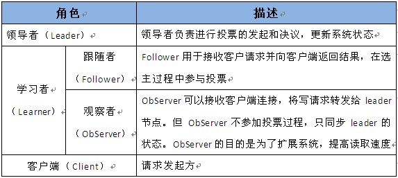
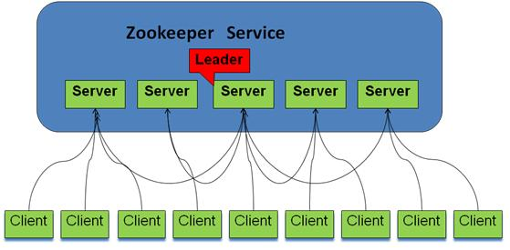
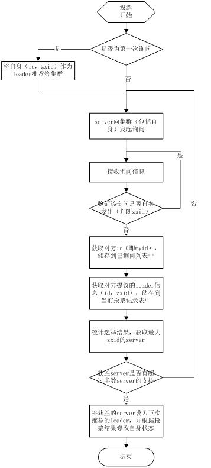
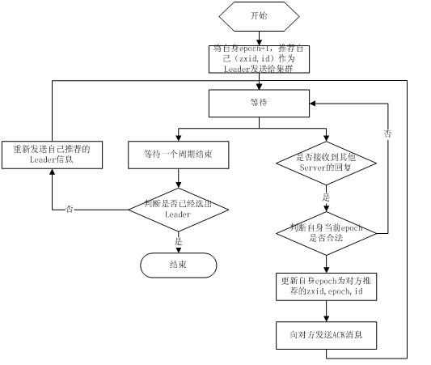
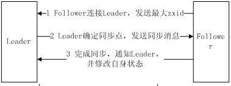
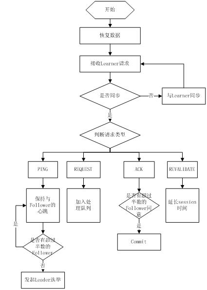
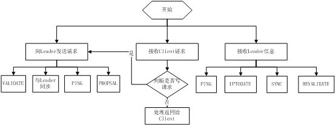
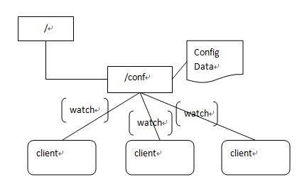
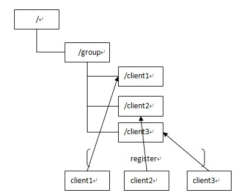

# zookeeper原理

ZooKeeper是一个分布式的，开放源码的分布式应用程序协调服务，它包含一个简单的原语集，分布式应用程序可以基于它实现同步服务，配置维护和命名服务等。Zookeeper是hadoop的一个子项目，其发展历程无需赘述。在分布式应用中，由于工程师不能很好地使用锁机制，以及基于消息的协调机制不适合在某些应用中使用，因此需要有一种可靠的、可扩展的、分布式的、可配置的协调机制来统一系统的状态。Zookeeper的目的就在于此。本文简单分析zookeeper的工作原理，对于如何使用zookeeper不是本文讨论的重点。

## 1 Zookeeper的基本概念
### 1.1 角色
Zookeeper中的角色主要有以下三类，如下表所示：

系统模型如图所示：

### 1.2 设计目的

1. **`最终一致性：`**client不论连接到哪个Server，展示给它都是同一个视图，这是zookeeper最重要的性能。
2. **`可靠性：`**具有简单、健壮、良好的性能，如果消息m被到一台服务器接受，那么它将被所有的服务器接受。
3. **`实时性：`**Zookeeper保证客户端将在一个时间间隔范围内获得服务器的更新信息，或者服务器失效的信息。但由于网络延时等原因，Zookeeper不能保证两个客户端能同时得到刚更新的数据，如果需要最新数据，应该在读数据之前调用sync()接口。
4. **`等待无关（wait-free）：`**慢的或者失效的client不得干预快速的client的请求，使得每个client都能有效的等待。
5. **`原子性：`**更新只能成功或者失败，没有中间状态。
6. **`顺序性：`**包括全局有序和偏序两种：全局有序是指如果在一台服务器上消息a在消息b前发布，则在所有Server上消息a都将在消息b前被发布；偏序是指如果一个消息b在消息a后被同一个发送者发布，a必将排在b前面。

## 2 ZooKeeper的工作原理

Zookeeper的核心是原子广播，这个机制保证了各个Server之间的同步。实现这个机制的协议叫做Zab协议。Zab协议有两种模式，它们分别是恢复模式（选主）和广播模式（同步）。当服务启动或者在领导者崩溃后，Zab就进入了恢复模式，当领导者被选举出来，且大多数Server完成了和leader的状态同步以后，恢复模式就结束了。状态同步保证了leader和Server具有相同的系统状态。

为了保证事务的顺序一致性，zookeeper采用了递增的事务id号（zxid）来标识事务。所有的提议（proposal）都在被提出的时候加上了zxid。实现中zxid是一个64位的数字，它高32位是epoch用来标识leader关系是否改变，每次一个leader被选出来，它都会有一个新的epoch，标识当前属于那个leader的统治时期。低32位用于递增计数。

每个Server在工作过程中有三种状态：
- `LOOKING`：当前Server不知道leader是谁，正在搜寻
- `LEADING`：当前Server即为选举出来的leader
- `FOLLOWING`：leader已经选举出来，当前Server与之同步

### 2.1 选主流程
当leader崩溃或者leader失去大多数的follower，这时候zk进入恢复模式，恢复模式需要重新选举出一个新的leader，让所有的Server都恢复到一个正确的状态。Zk的选举算法有两种：一种是基于basic paxos实现的，另外一种是基于fast paxos算法实现的。系统默认的选举算法为fast paxos。先介绍basic paxos流程：

1. 选举线程由当前Server发起选举的线程担任，其主要功能是对投票结果进行统计，并选出推荐的Server；
2. 选举线程首先向所有Server发起一次询问(包括自己)；
3. 选举线程收到回复后，验证是否是自己发起的询问(验证zxid是否一致)，然后获取对方的id(myid)，并存储到当前询问对象列表中，最后获取对方提议的leader相关信息(id,zxid)，并将这些信息存储到当次选举的投票记录表中；
4. 收到所有Server回复以后，就计算出zxid最大的那个Server，并将这个Server相关信息设置成下一次要投票的Server；
5. 线程将当前zxid最大的Server设置为当前Server要推荐的Leader，如果此时获胜的Server获得 n/2 + 1 的Server票数，设置当前推荐的leader为获胜的Server，将根据获胜的Server相关信息设置自己的状态，否则，继续这个过程，直到leader被选举出来。

通过流程分析我们可以得出：要使Leader获得多数Server的支持，则Server总数必须是奇数 2n+1，且存活的Server的数目不得少于 n+1.

每个Server启动后都会重复以上流程。在恢复模式下，如果是刚从崩溃状态恢复的或者刚启动的server还会从磁盘快照中恢复数据和会话信息，zk会记录事务日志并定期进行快照，方便在恢复时进行状态恢复。选主的具体流程图如下所示：

fast paxos流程是在选举过程中，某Server首先向所有Server提议自己要成为leader，当其它Server收到提议以后，解决epoch和zxid的冲突，并接受对方的提议，然后向对方发送接受提议完成的消息，重复这个流程，最后一定能选举出Leader。其流程图如下所示：

### 2.2 同步流程

选完leader以后，zk就进入状态同步过程。

1. leader等待server连接；
2. Follower连接leader，将最大的zxid发送给leader；
3. Leader根据follower的zxid确定同步点；
4. 完成同步后通知follower 已经成为uptodate状态；
5. Follower收到uptodate消息后，又可以重新接受client的请求进行服务了。

流程图如下所示：

### 2.3 工作流程

#### 2.3.1 Leader工作流程
Leader主要有三个功能：

1. 恢复数据；
2. 维持与Learner的心跳，接收Learner请求并判断Learner的请求消息类型；
3. Learner的消息类型主要有 `PING消息`、`REQUEST消息`、`ACK消息`、`REVALIDATE消息`，根据不同的消息类型，进行不同的处理。

- `PING消息` 是指Learner的心跳信息；
- `REQUEST消息` 是Follower发送的提议信息，包括写请求及同步请求；
- `ACK消息` 是Follower的对提议的回复，超过半数的Follower通过，则commit该提议；
- `REVALIDATE消息` 是用来延长SESSION有效时间。

Leader的工作流程简图如下所示，在实际实现中，流程要比下图复杂得多，启动了三个线程来实现功能。

#### 2.3.2 Follower工作流程

Follower主要有四个功能：

1. 向Leader发送请求（PING消息、REQUEST消息、ACK消息、REVALIDATE消息）；
2. 接收Leader消息并进行处理；
3. 接收Client的请求，如果为写请求，发送给Leader进行投票；
4. 返回Client结果。

Follower的消息循环处理如下几种来自Leader的消息：

1. **`PING消息`**： 心跳消息；
2. **`PROPOSAL消息`**：Leader发起的提案，要求Follower投票；
3. **`COMMIT消息`**：服务器端最新一次提案的信息；
4. **`UPTODATE消息`**：表明同步完成；
5. **`REVALIDATE消息`**：根据Leader的REVALIDATE结果，关闭待revalidate的session还是允许其接受消息；
6. **`SYNC消息`**：返回SYNC结果到客户端，这个消息最初由客户端发起，用来强制得到最新的更新。

Follower的工作流程简图如下所示，在实际实现中，Follower是通过5个线程来实现功能的。

对于observer的流程不再叙述，observer流程和Follower的唯一不同的地方就是observer不会参加leader发起的投票。

## 3 Zookeeper 监视（Watches） 简介

Zookeeper C API 的声明和描述在 include/zookeeper.h 中可以找到，另外大部分的 Zookeeper C API 常量、结构体声明也在 zookeeper.h 中，如果如果你在使用 C API 是遇到不明白的地方，最好看看 zookeeper.h，或者自己使用 doxygen 生成 Zookeeper C API 的帮助文档。

Zookeeper 中最有特色且最不容易理解的是监视(Watches)。Zookeeper 所有的读操作——getData(), getChildren(), 和 exists() 都 可以设置监视(watch)，监视事件可以理解为一次性的触发器， 官方定义如下： a watch event is one-time trigger, sent to the client that set the watch, which occurs when the data for which the watch was set changes。对此需要作出如下理解：

- **One-time trigger（一次性触发）**

    当设置监视的数据发生改变时，该监视事件会被发送到客户端，例如，如果客户端调用了 getData("/znode1", true) 并且稍后 /znode1 节点上的数据发生了改变或者被删除了，客户端将会获取到 /znode1 发生变化的监视事件，而如果 /znode1 再一次发生了变化，除非客户端再次对 /znode1 设置监视，否则客户端不会收到事件通知。

- **Sent to the client（发送至客户端）**

    Zookeeper 客户端和服务端是通过 socket 进行通信的，由于网络存在故障，所以监视事件很有可能不会成功地到达客户端，监视事件是异步发送至监视者的，Zookeeper 本身提供了保序性(ordering guarantee)：即客户端只有首先看到了监视事件后，才会感知到它所设置监视的 znode 发生了变化(a client will never see a change for which it has set a watch until it first sees the watch event). 网络延迟或者其他因素可能导致不同的客户端在不同的时刻感知某一监视事件，但是不同的客户端所看到的一切具有一致的顺序。

- **The data for which the watch was set（被设置 watch 的数据）**

    这意味着 znode 节点本身具有不同的改变方式。你也可以想象 Zookeeper 维护了两条监视链表：数据监视和子节点监视(data watches and child watches) getData() and exists() 设置数据监视，getChildren() 设置子节点监视。 或者，你也可以想象 Zookeeper 设置的不同监视返回不同的数据，getData() 和 exists() 返回 znode 节点的相关信息，而 getChildren() 返回子节点列表。因此， setData() 会触发设置在某一节点上所设置的数据监视(假定数据设置成功)，而一次成功的 create() 操作则会出发当前节点上所设置的数据监视以及父节点的子节点监视。一次成功的 delete() 操作将会触发当前节点的数据监视和子节点监视事件，同时也会触发该节点父节点的child watch。

Zookeeper 中的监视是轻量级的，因此容易设置、维护和分发。当客户端与 Zookeeper 服务器端失去联系时，客户端并不会收到监视事件的通知，只有当客户端重新连接后，若在必要的情况下，以前注册的监视会重新被注册并触发，对于开发人员来说 这通常是透明的。只有一种情况会导致监视事件的丢失，即：通过 exists() 设置了某个 znode 节点的监视，但是如果某个客户端在此 znode 节点被创建和删除的时间间隔内与 zookeeper 服务器失去了联系，该客户端即使稍后重新连接 zookeeper服务器后也得不到事件通知。

## 4 主流应用场景

Zookeeper的主流应用场景实现思路（除去官方示例）

### 4.1 配置管理
集中式的配置管理在应用集群中是非常常见的，一般商业公司内部都会实现一套集中的配置管理中心，应对不同的应用集群对于共享各自配置的需求，并且在配置变更时能够通知到集群中的每一个机器。

Zookeeper很容易实现这种集中式的配置管理，比如将APP1的所有配置配置到/APP1 znode下，APP1所有机器一启动就对/APP1这个节点进行监控(zk.exist("/APP1",true)),并且实现回调方法Watcher，那么在zookeeper上/APP1 znode节点下数据发生变化的时候，每个机器都会收到通知，Watcher方法将会被执行，那么应用再取下数据即可(zk.getData("/APP1",false,null));

以上这个例子只是简单的粗颗粒度配置监控，细颗粒度的数据可以进行分层级监控，这一切都是可以设计和控制的。

### 4.2 集群管理
应用集群中，我们常常需要让每一个机器知道集群中（或依赖的其他某一个集群）哪些机器是活着的，并且在集群机器因为宕机，网络断链等原因能够不在人工介入的情况下迅速通知到每一个机器。

Zookeeper同样很容易实现这个功能，比如我在zookeeper服务器端有一个znode叫/APP1SERVERS,那么集群中每一个机器启动的时候都去这个节点下创建一个EPHEMERAL类型的节点，比如server1创建/APP1SERVERS/SERVER1(可以使用ip,保证不重复)，server2创建/APP1SERVERS/SERVER2，然后SERVER1和SERVER2都watch /APP1SERVERS这个父节点，那么也就是这个父节点下数据或者子节点变化都会通知对该节点进行watch的客户端。因为EPHEMERAL类型节点有一个很重要的特性，就是客户端和服务器端连接断掉或者session过期就会使节点消失，那么在某一个机器挂掉或者断链的时候，其对应的节点就会消失，然后集群中所有对/APP1SERVERS进行watch的客户端都会收到通知，然后取得最新列表即可。

另外有一个应用场景就是集群选master,一旦master挂掉能够马上能从slave中选出一个master,实现步骤和前者一样，只是机器在启动的时候在APP1SERVERS创建的节点类型变为EPHEMERAL_SEQUENTIAL类型，这样每个节点会自动被编号

我们默认规定编号最小的为master,所以当我们对/APP1SERVERS节点做监控的时候，得到服务器列表，只要所有集群机器逻辑认为最小编号节点为master，那么master就被选出，而这个master宕机的时候，相应的znode会消失，然后新的服务器列表就被推送到客户端，然后每个节点逻辑认为最小编号节点为master，这样就做到动态master选举。

