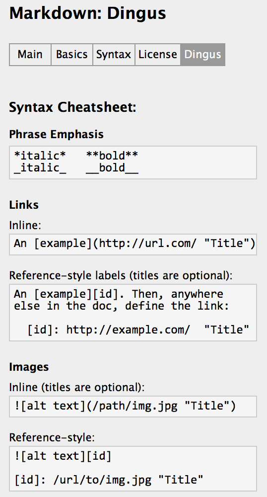
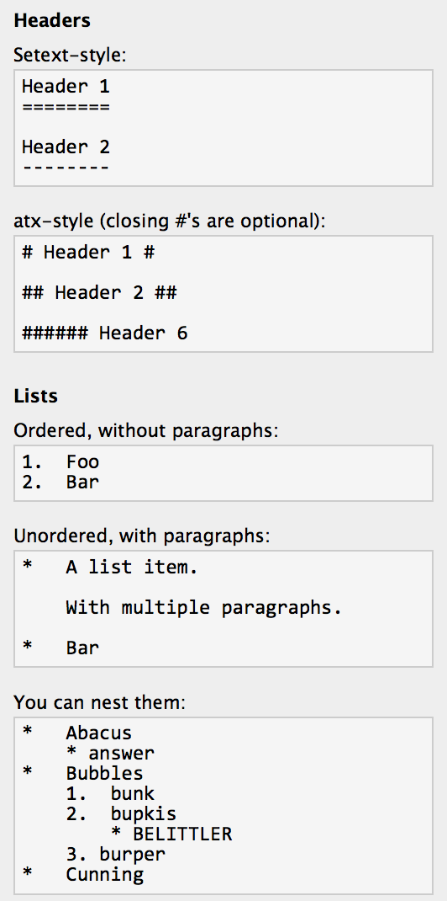

Markdown Base
=============

[Markdown Base](http://daringfireball.net/projects/markdown/syntax "Markdown Base")

## Cheatsheet





## Others

#### EMail
The use is the same as LINK(\<a href\>).

#### Inline HTML

For any markup that is not covered by Markdown’s syntax, you simply use HTML itself. There’s no need to preface it or delimit it to indicate that you’re switching from Markdown to HTML; you just use the tags.

The only restrictions are that block-level HTML elements, e.g. `<div>, <table>, <pre>, <p>, etc.`  must be separated from surrounding content by blank lines, and the start and end tags of the block should not be indented with tabs or spaces. Markdown is smart enough not to add extra (unwanted) `<p>` tags around HTML block-level tags.

For example, to add an HTML table to a Markdown article:
```
This is a regular paragraph.

<table>
    <tr>
        <td>Foo</td>
    </tr>
</table>

This is another regular paragraph.
```

Note that Markdown formatting syntax is not processed within block-level HTML tags. E.g., you can’t use Markdown-style *emphasis* inside an HTML block.

**`Span-level HTML tags, e.g. <span>, <cite>, or <del> can be used anywhere in a Markdown paragraph, list item, or header. If you want, you can even use HTML tags instead of Markdown formatting; e.g. if you’d prefer to use HTML <a> or  tags instead of Markdown’s link or image syntax, go right ahead.`**

#### Backslash Escapes
Markdown provides backslash escapes for the following characters:
```
\   backslash
`   backtick
*   asterisk
_   underscore
{}  curly braces
[]  square brackets
()  parentheses
#   hash mark
+   plus sign
-   minus sign (hyphen)
.   dot
!   exclamation mark
```
