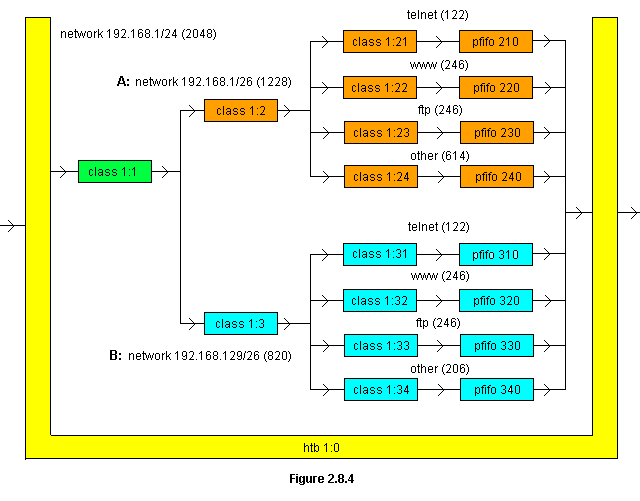

HTB Usage Example
=================

This is a queuing discipline diagram:



（1）creates the root HTB queuing discipline on ethernet interface eth0
```
# tc qdisc add dev eth0 root handle 1:0 htb
```

（2）create the root class 1:1 below the root
```
# tc class add dev eth0 parent 1:0 classid 1:1 htb rate 2048kbit
```
The rate parameter establishes the maximum bandwidth that will be permitted by the queuing discipline.

(3)create the class 1:2 to control flows to the A network (192.168.1/26) and the class 1:3 to control flows to the B network (192.168.129/26)
```
# tc class add dev eth0 parent 1:1 classid 1:2 htb rate 1228kbit ceil 2048kbit
# tc class add dev eth0 parent 1:1 classid 1:3 htb rate 820kbit ceil 2048kbit
```
class 1:2 and class 1:3 will share and borrow the bandwidth of 2048. If you don't want this borrowing, you can do it as below.
```
# tc class add dev eth0 parent 1:1 classid 1:2 htb rate 1228kbit ceil 1228kbit
# tc class add dev eth0 parent 1:1 classid 1:2 htb rate 820kbit ceil 820kbit
```

(4)configure the service classes on the network A
```
# tc class add dev eth0 parent 1:2 classid 1:21 htb rate 122kbit ceil 1228kbit
# tc class add dev eth0 parent 1:2 classid 1:22 htb rate 246kbit ceil 1228kbit
# tc class add dev eth0 parent 1:2 classid 1:23 htb rate 246kbit ceil 1228kbit
# tc class add dev eth0 parent 1:2 classid 1:24 htb rate 614kbit ceil 1228kbit
```

(5)configure the service classes on the network B
```
# tc class add dev eth0 parent 1:3 classid 1:31 htb rate 122kbit ceil 820kbit
# tc class add dev eth0 parent 1:3 classid 1:32 htb rate 246kbit ceil 820kbit
# tc class add dev eth0 parent 1:3 classid 1:33 htb rate 246kbit ceil 820kbit
# tc class add dev eth0 parent 1:3 classid 1:34 htb rate 206kbit ceil 820kbit
```

(6)add a pfifo queuing discipline to each of the service classes
```
# tc qdisc add dev eth0 parent 1:21 handle 210: pfifo limit 10
# tc qdisc add dev eth0 parent 1:22 handle 220: pfifo limit 10
# tc qdisc add dev eth0 parent 1:23 handle 230: pfifo limit 10
# tc qdisc add dev eth0 parent 1:24 handle 240: pfifo limit 10
# tc qdisc add dev eth0 parent 1:31 handle 310: pfifo limit 10
# tc qdisc add dev eth0 parent 1:32 handle 320: pfifo limit 10
# tc qdisc add dev eth0 parent 1:33 handle 330: pfifo limit 10
# tc qdisc add dev eth0 parent 1:34 handle 340: pfifo limit 10
```

(7)configure the filter that place the packets on each class on the network A
```
# tc filter add dev eth0 parent 1:0 protocol ip prio 1 u32 match ip dst 192.168.1/26 \
  match ip sport 23 0xffff flowid 1:21
# tc filter add dev eth0 parent 1:0 protocol ip prio 1 u32 match ip dst 192.168.1/26 \
  match ip sport 80 0xffff flowid 1:22
# tc filter add dev eth0 parent 1:0 protocol ip prio 1 u32 match ip dst 192.168.1/26 \
  match ip sport 20 0xffff flowid 1:23
# tc filter add dev eth0 parent 1:0 protocol ip prio 1 u32 match ip dst 192.168.1/26 \
  match ip sport 21 0xffff flowid 1:23
# tc filter add dev eth0 parent 1:0 protocol ip prio 1 u32 match ip dst 192.168.1/26 flowid 1:21
```

(8)configure the filter that place the packets on each class on the network B
```
# tc filter add dev eth0 parent 1:0 protocol ip prio 1 u32 match ip dst 192.168.129/26 \
  match ip sport 23 0xffff flowid 1:31
# tc filter add dev eth0 parent 1:0 protocol ip prio 1 u32 match ip dst 192.168.129/26 \
  match ip sport 80 0xffff flowid 1:32
# tc filter add dev eth0 parent 1:0 protocol ip prio 1 u32 match ip dst 192.168.129/26 \
  match ip sport 20 0xffff flowid 1:33
# tc filter add dev eth0 parent 1:0 protocol ip prio 1 u32 match ip dst 192.168.129/26 \
  match ip sport 21 0xffff flowid 1:23
# tc filter add dev eth0 parent 1:0 protocol ip prio 1 u32 match ip dst 192.168.129/26 flowid 1:34
```
