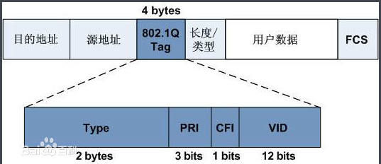
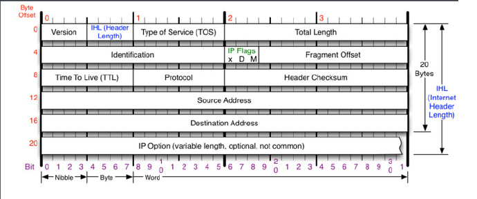
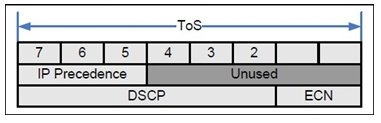

linux下QOS：理论篇
=================

关于qos ，也是linux下面必备功能之一，一般只需要结合iptables/etables/iproute2 和tc配合即可实现大部分功能. 网上讲这么方面的资料很多，大部分都讲tc命令的应用.这里就先从理论入手.

QoS（Quality of Service）服务质量，是网络的一种安全机制, 是用来解决网络延迟和阻塞等问题的一种技术。但是对关键应用和多媒体应用就十分必要。当网络过载或拥塞时，QoS 能确保重要业务量不受延迟或丢弃，同时保证网络的高效运行. 在网络总带宽固定的情况下，如果某类业务占用的带宽越多，那么其他业务能使用的带宽就越少，可能会影响其他业务的使用。因此，网络管理者需要根据各种业务的特点来对网络资源进行合理的规划和分配，从而使网络资源得到高效利用

### QoS服务模型

通常QoS提供以下三种服务模型：
* Best-Effort service（尽力而为服务模型）（系统默认；PFIFO_FAST）
* Integrated service（综合服务模型，简称Int-Serv）
* Differentiated service（区分服务模型，简称Diff-Serv）

##### (1) Best-Effort服务模型
Best-Effort是一个单一的服务模型，也是最简单的服务模型。对Best-Effort服务模型，网络尽最大的可能性来发送报文。但对时延、可靠性等性能不提供任何保证。

Best-Effort服务模型是网络的缺省服务模型，通过FIFO队列来实现。它适用于绝大多数网络应用，如FTP、E-Mail等。

##### (2) Int-Serv服务模型
Int-Serv是一个综合服务模型，它可以满足多种QoS需求。该模型使用资源预留协议（RSVP），RSVP运行在从源端到目的端的每个设备上，可以监视每个流，以防止其消耗资源过多。这种体系能够明确区分并保证每一个业务流的服务质量，为网络提供最细粒度化的服务质量区分。

但是，Inter-Serv模型对设备的要求很高，当网络中的数据流数量很大时，设备的存储和处理能力会遇到很大的压力。Inter-Serv模型可扩展性很差，难以在Internet核心网络实施，前主要与MPLS TE（Traffic Engineering，流量工程）结合使用.

##### (3) Diff-Serv服务模型
Diff-Serv是一个多服务模型，它可以满足不同的QoS需求。与Int-Serv不同，它不需要通知网络为每个业务预留资源。区分服务实现简单，扩展性较好，
可以说是为现在的网络量身打做的。这个这种类型的QOS中，数据流是要进行分类的，然后，我们可以进一步的对各种不同类的流进行的控制。这个控制的实现就是通过策略表来实现的。这样简单一说，我们就该知道了，实现他们是要有个类表，然后还得有个控制表—策略表.

它由RFC2475定义，在区分服务中，根据服务要求对不同业务的数据进行分类，对报文按类进行优先级标记，然后有差别地提供服务。

区分服务一般用来为一些重要的应用提供端到端的QoS，它通过下列技术来实现：

#### 流量标记与控制技术
它根据报文的CoS（Class of Service，服务等级）域、ToS域（对于IP报文是指IP优先级或者DSCP）、IP报文的五元组（协议、源地址、目的地址、源端口号、目的端口号）等信息进行报文分类，完成报文的标记和流量监管。目前实现流量监管技术多采用令牌桶机制。

#### 拥塞管理与拥塞避免技术
WRED、PQ、CQ、WFQ、CBQ等队列技术对拥塞的报文进行缓存和调度，实现拥塞管理与拥塞避免。

### QoS的应用

流量约定（SLA, Service Level Agreement服务等级协议）给数据流设定优先级，以此在网络／协议层面上，根据相互商定的尺度，设定有保障的性能、通过量、延迟等界限。一些特定形式的网络数据流需要定义服务质量，例如：

    多媒体流要求有保障的通过量
    IP电话需要严格的抖动和延迟限制
    性命攸关的应用系统，例如远程外科手术要求有可靠保证的可用性（也称作硬性　QoS）.

这些类型的服务被称为非弹性，意思是它们需要固定的带宽才能运作–如果得到多余的带宽，它们也无法使用；如果得到较少的带宽，则根本无法工作。相形之下，弹性应用可以从多余的带宽中受益。

### 网络中会遇到的情况

#### 1. 数据包丢失
当数据包到达一个缓冲器（buffer）已满的路由器时，则代表此次的发送失败，路由器会依网络的状况决定要丢弃一部份、不丢弃 或者是所有的数据包，而且这不可能在预先就知道，接收端的应用程序在这时必须请求重新传送，而这同时可能造成总体传输严重的延迟。

#### 2. 延迟
或许需要很长时间才能将数据包传送到终点，因为它会被漫长的队列迟滞，或需要运用间接路由以避免阻塞；也许能找到快速、直接的路由。总之，延迟非常难以预料。

#### 3. 传输顺序出错
当一群相关的数据包被路由经过因特网时，不同的数据包可能选择不同的路由器，这会导致每个数据包有不同的延迟时间。最后数据包到达目的地的顺序会和数据包从发送端发送出去的顺序不一致，这个问题必须要有特殊额外的协议负责刷新失序的数据包。

#### 4. 出错
有些时候，数据包在被运送的途中会发生跑错路径、被合并 甚至是 毁坏的情况，这时接收端必须要能侦测出这些情况，并将它们统统判别为已遗失的数据包，再请求发送端再送一份同样的数据包。

### 处理流程

#### 分类
Classifying即分类，其过程是根据信任策略或者根据分析每个报文的内容来确定将这些报文归类到以CoS值来表示的各个数据流中，因此分类动作的核心任务是确定输入报文的CoS值。分类发生在端口接收输入报文阶段，当某个端口关联了一个表示QoS策略的Policy-map后，分类就在该端口上生效，它对所有从该端口输入的报文起作用

##### (1) 协议
有些协议非常“健谈”，只要它们存在就会导致业务延迟，因此根据协议对数据包进行识别和优先级处理可以降低延迟。应用可以通过它们的EtherType进行识别。譬如，AppleTalk协议采用0x809B，IPX使用0×8137。根据协议进行优先级处理是控制或阻止少数较老设备所使用的“健谈”协议的一种强有力方法。

##### (2) TCP和UDP端口号码
许多应用都采用一些TCP或UDP端口进行通信，如HTTP采用TCP端口80。通过检查IP数据包的端口号码，智能网络可以确定数据包是由哪类应用产生的，这种方法也称为第四层交换，因为TCP和UDP都位于OSI模型的第四层。

##### (3) 源IP地址
许多应用都是通过其源IP地址进行识别的。由于服务器有时是专门针对单一应用而配置的，如电子邮件服务器，所以分析数据包的源IP地址可以识别该数据包是由什么应用产生的。当识别交换机与应用服务器不直接相连，而且许多不同服务器的数据流都到达该交换机时，这种方法就非常有用。

##### (4) 物理端口号码
与源IP地址类似，物理端口号码可以指示哪个服务器正在发送数据。这种方法取决于交换机物理端口和应用服务器的映射关系。虽然这是最简单的分类形式，但是它依赖于直接与该交换机连接的服务器

#### 策略
Policing 即策略，发生在数据流分类完成后，用于约束被分类的数据流所占用的传输带宽。Policing动作检查被归类的数据流中的每一个报文，如果该报文超出了作用于该数据流的Police所允许的限制带宽，那么该报文将会被做特殊处理，它或者要被丢弃，或者要被赋予另外的DSCP 值。

在QoS 处理流程中，Policing 动作是可选的。如果没有Policing 动作，那么被分类的数据流中的报文的DSCP 值将不会作任何修改，报文也不会在送往Marking 动作之前被丢弃。

#### 标识
Marking即标识，经过Classifying 和Policing 动作处理之后，为了确保被分类报文对应DSCP的值能够传递给网络上的下一跳设备，需要通过Marking 动作将为报文写入QoS 信息，可以使用QoS ACLs 改变报文的QoS信息，也可以使用Trust 方式直接保留报文中QoS 信息，例如，选择Trust DSCP 从而保留IP 报文头的DSCP 信息。

#### 队列
Queueing即队列，负责将数据流中报文送往端口的某个输出队列中，送往端口的不同输出队列的报文将获得不同等级和性质的传输服务策略。

每一个端口上都拥有8 个输出队列，通过设备上配置的DSCP-to-CoS Map 和Cos-to-Queue Map 两张映射表来将报文的DSCP 值转化成输出队列号，以便确定报文应该被送往的输出队列。

#### 调度

Scheduling即调度，为QoS 流程的最后一个环节。当报文被送到端口的不同输出队列上之后，设备将采用WRR 或者其它算法发送8 个队列中的报文。

可以通过设置WRR算法的权重值来配置各个输出队列在输出报文的时候所占用的每循环发送报文个数,从而影响传输带宽。或通过设置DRR算法的权重值来配置各个输出队列在输出报文的时候所占用的每循环发送报文字节数,从而影响传输带宽

#### COS TOS DSCP 的概念及区别

(1) COS是在第二层ISL或802.1Q数据帧中的ISL或802。1Q的报头中的3位用于COS，即优先标识。3bit，0–7个级别。

802.1Q:

(2) TOS是在第三层IP数据包中的8位TOS数据位，以来标识优先级。这8位中前3位表示优先级，后4位表示服务类型(分别为：最小延迟、最大吞吐量、最高可靠性、最小费用。只能其中一位为1，即生效。如果全为0就表示一般服务）。最后一位一般不用，置0

(3) DSCP也是三层IP中的8位TOS字段表示优先级。不同的是用了前6位表示优先级，可设0–63，共64个等级。（把前6位中的前3位设为优先级，后3位设为0，就可以实现DSCP和TOS互相映射兼容）。最后两位为早期拥塞通知。

因为COS二层标记中也是3位用于优先级，所以也可以把COS和TOS和DSCP中的优先级映射。

DSCP数位域标识出数据包所属的特定交付分类，具体实现方法是企业为分类制定明确的交付目标。路由器和其它设备可以通过数据包队列（本质上就是缓冲区）和相应算法，传递数据包，实现交付目标。一些推荐标准涉及到DSCP数位域的值（如RFC2474中列举的），它们围绕加速转发（进一步描述可参见RFC3246）和确保转发（RFC2597）定义了一些期望行为：加速转发让交付过程低丢包、低延时和抖动最小；确保转发则保证无损交付。

RFC推荐使用DSCP值46来标记加速转发分类（6位DSCP的二进制值为101110），它适用于诸如VoIP或IP会议的实时交互多媒体流；为确保转发流量分配了包含12个标记值的集合，来保证不同等级的交付。

这里cos和dscp是修改了数据报文的内容，可以在网络其他设备来调度，还有本地主机的工具可以打一些标记，tc的u32模块，iptables的MARK，以及iproute2的工具。

这些工具并不修改报文，而是提供本地内核调度用。

QOS要保证服务，就要设计流量控制
===============================

### 流量控制中的概念

#### 1. 整形
整形就是流量控制，把数据包的发送速率控制在一个固定的水平以下。由于整形通过延迟数据包的发送来控制数据包发送速率，故整形机制是非工作保存的。“非工作保存”可以理解为：系统必须进行一些操作来延迟数据包的发送。

反过来说，一种非工作保存的队列是可以进行流量整形的，而工作保存的队列（参考 PRIO）不能进行流量整形，因为工作保存队列无法延迟发送数据包。

#### 2. 调度
一个调度器会对将要发送的数据包顺序进行排列或重排。

#### 3. 分类
分类器能把不同类型的网络流量划分到不同的队列中去。

#### 4. 策略
决策器能计算并限制某个特定队列的流量

#### 5. 丢弃
丢弃一个数据包，一个数据流或一个分类下的数据包，都可以叫做丢弃。

#### 6. 标记
标记是一种对数据包进行一些修改的操作

##### 注意
这里说的标记不是fwmark。iptables，$ipt-mark;，ipchains以及–mark都只修改数据包的元数据，而不修改数据包本身。

流量控制中的标记操作会给数据包加上一个DSCP，接下来在由一个管理员控制的一个网络下的其他路由器上将会使用这个标记。

QoS的关键指标主要包括：**可用性**、**吞吐量**、**时延**、**时延变化(包括抖动和漂移)**和**丢失**。

### Linux TC

在linux中是通过Tc命令来实现的（外加内核的支持）。我们看到网上大部分说的队列规则、分类、分类器什么的都是说的TC的机制，而tc只是实现qos的方式之一.

在网络通信设备中不同的厂商对qos有各自的实现和配置. 基于QOS的特性，便产生了tc.

我们先看一个图：

#### 关于tc的设计

递归控制 所谓的递归控制就是分层次地控制，而对于每个层次，控制方式都是一致的 Qdisc –class –filter 的树型组织模式.

#### qdisc 队列规则(queueing discipline)
用来实现控制网络的收发速度.通过队列,linux可以将网络数据包缓存起来,然后根据用户的设置,在尽量不中断连接(如 tcp)的前提下来平滑网络流量.需要注意的是,linux 对接收队列的控制不够好,所以我们一般只用发送队列,即”控发不控收”.它封装了其他两个主要 tc 组件(类和分类器).内核如果需要通过某个网络接口发送数据包,它都需要按照为这个接口配置的 qdisc 队列规则把数据包加入队列.然后,内核会尽可能多地从 qdisc里面取出数据包,把它们交给网络适配器驱动模块.

最简单的 QDisc 是 pfifo 它不对进入的数据包做任何的处理,数据包采用先入先出的方式通过队列.不过,它会保存网络接口一时无法处理的数据包.常有的队列规则包括 FIFO 先进先出,RED 随机早期探测,SFQ 随机公平队列和令牌桶 Token Bucket,类基队列 CBQ,CBQ 是一种超级队列,即它能够包含其它队列,甚至其它 CBQ

#### Class 类
class 用来表示控制策略.很显然,很多时候,我们很可能要对不同的IP实行不同的流量控制策略,这时候我们就得用不同的class来表示不同的控制策略了.

#### Filter 规则
filter 用来将用户划入到具体的控制策略中

目前,tc可以使用的过滤器有：fwmark分类器,u32 分类器,基于路由的分类器和 RSVP 分类器（分别用于IPV6、IPV4）等；其中,fwmark 分类器允许我们使用 Linux netfilter 代码选择流量,而 u32 分类器允许我们选择基于 ANY 头的流量 .需要注意的是,filter (过滤器)是在QDisc 内部,它们不能作为主体

关于tc的具体应用，我们以后分析.这里仅仅以理论作为引导让我们了解什么是QOS.

From: http://blog.chinaunix.net/uid-20786208-id-5179964.html
