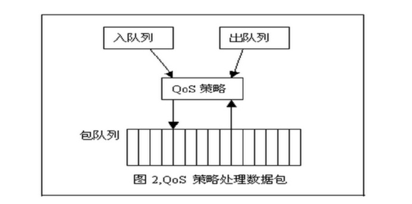
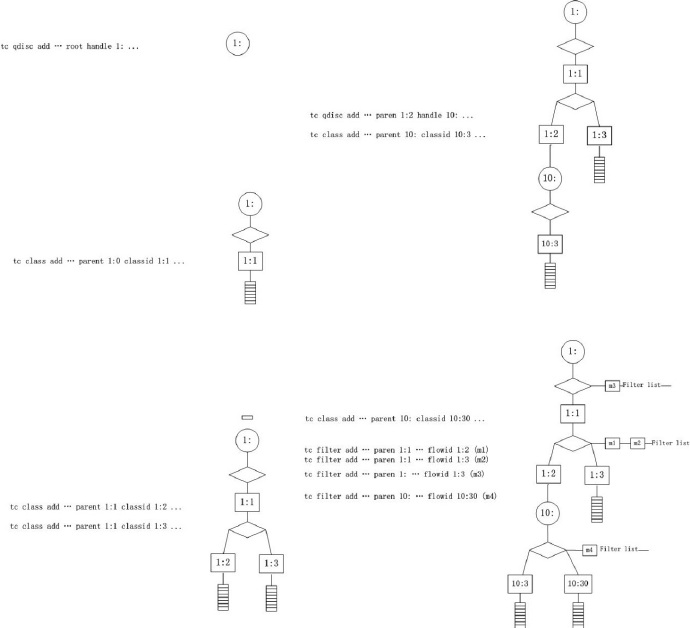
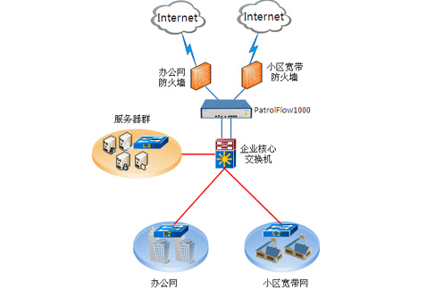
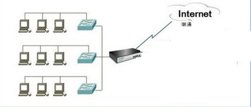

linux下QOS：应用篇
=================

接[上一篇](./qos-theory.md)。

Linux采用了基于对象的实现方法，qos还能保证对不同接口采用不同的策略，TC QOS有很多拥塞控制的机制默认的是FIFo还有其他PQ、CQ、WFQ等.



策略类用结构体：Qdisc_ops表示。每个设备可以采用不同的策略对象，在设备和对象的关联需要到Qdisc结构体。


通过上面的描述，整个TC的架构也就出来了，发送数据包的流程应该是这样的：

    （1） 上层协议开始发送数据包
    （2） 获得当前设备所采用的策略对象
    （3） 调用此对象的enqueue方法把数据包压入队列
    （4） 调用此对象的dequeue方法从队列中取出数据包
    （5） 调用网卡驱动的发送函数发送

并且在上一节我们已经讲了tc的三级树型组织.这里不再贴图. 还有一点注意的就是tc控发不空收.

### 命令格式
```
tc [ OPTIONS ] OBJECT { COMMAND | help }
tc [-force] -batch filename

OBJECT := { qdisc | class | filter | action | monitor }
OPTIONS := { -s[tatistics] | -d[etails] | -r[aw] | -p[retty] | -b[atch] [filename] }
```

#### Qdisc
```shell
tc qdisc [add | del | replace | change | show] dev ETH_STR [handle QHANDLE]
         [root | ingress parent CLASSID] [estimator INTERVAL TIME_CONSTANT]
         [stab [help | STAB_OPTIONS]] [[QDISC_KIND] [help | OPTIONS]]
tc qdisc show [dev ETH_STR] [ingress]

QDISC_KIND := { [p|b]fifo | tbf | prio | cbq | red | htb | etc. }
OPTIONS := ... try tc qdisc add <desired QDISC_KIND> help
STAB_OPTIONS := ... try tc qdisc add stab help
```

#### Class
```shell
tc class [add | del | change | replace | show] dev ETH_STR [classid CLASSID]
         [root | parent CLASSID] [[QDISC_KIND] [help | OPTIONS]]
tc class show [ dev STRING ] [ root | parent CLASSID ]

QDISC_KIND := { prio | cbq | htb | etc. }
OPTIONS := ... try tc class add <desired QDISC_KIND> help
```

#### Filter
```shell
tc filter [add | del | change | replace | show] dev ETH_STR [pre PRIO] protocol PROTO
          [estimator INTERVAL TIME_CONSTANT] [root | classid CLASSID] [handle FILTERID]
          [[FILTER_TYPE] [help | OPTIONS]]
tc filter show [dev ETH_STR] [root | parent CLASSID]

FILTER_TYPE := { rsvp | u32 | fw | route | etc. }
FILTERID := ... format depends on classifier, see there
OPTIONS := ... try tc filter add <desired FILTER_KIND> help
```
关于 `filter`，请参见[`QoS Filter`](./qos-filter.md)
 
#### Monitor  
```shell
tc monitor
```

#### 说明
如果要建立一个 `QDisc` 或者 `过滤器`，可以使用 `句柄(handle)` 来命名；如果要建立一个 `类`，可以使用`类识别符(classid)`来命名。

当一个QDisc被删除时，其上的所有子类以及附属于各个子类的过滤器都会被自动删除。

### 全名规则
所有的QDisc、类和过滤器都有ID。ID可以手工设置，也可以有内核自动分配。ID由一个主序列号和一个从序列号组成，两个数字用一个冒号分开。

##### QDISC
一个QDisc会被分配一个主序列号，叫做句柄(handle)，然后把从序列号作为类的命名空间。句柄采用象10:一样的表达方式。习惯上，需要为有子类的QDisc显式地分配一个句柄。

##### 类(CLASS)
在同一个QDisc里面的类分享这个QDisc的主序列号，但是每个类都有自己的从序列号，叫做类识别符(classid)。类识别符只与父QDisc有关，和父类无关。类的命名习惯和QDisc的相同。

##### 过滤器(FILTER)
过滤器的ID有三部分，只有在对过滤器进行散列组织才会用到。详情请参考tc-filters手册页。

### 单位
tc命令的所有参数都可以使用浮点数，可能会涉及到以下计数单位。

##### 带宽或者流速单位
unit                  |  explain
----------------------|-----------
kbps                  |  千字节／秒
mbps                  |  兆字节／秒
kbit                  |  KBits／秒
mbit                  |  MBits／秒
bps或者一个无单位数字   |  字节数／秒

##### 数据的数量单位
unit              |  explain
------------------|-----------
kb或者k           | 千字节
mb或者m           | 兆字节
mbit              | 兆bit
kbit              | 千bit
b或者一个无单位数字 | 字节数

##### 时间的计量单位
unit                           | explain
-------------------------------|-----------
s、sec或者secs                  | 秒
ms、msec或者msecs               | 分钟
us、usec、usecs或者一个无单位数字 | 微秒

### 具体的配置流程如下
Linux流量控制主要分为**`建立队列`**、**`建立分类`**和**`建立过滤器`**三个方面。

#### 基本实现步骤

    (1) 针对网络物理设备（如以太网卡eth0）绑定一个队列QDisc；
    (2) 在该队列上建立分类class；
    (3) 为每一分类建立一个基于路由的过滤器filter；
    (4) 最后与过滤器相配合，建立特定的路由表等

### 无分类qdisc 和 分类qdisc

#### 无分类

##### [p|b]fifo
使用最简单的qdisc，纯粹的先进先出。只有一个参数：limit，用来设置队列的长度,pfifo是以数据包的个数为单位；bfifo是以字节数为单位。

##### pfifo_fast
在编译内核时，如果打开了高级路由器(AdvancedRouter)编译选项，pfifo_fast就是系统的标准QDISC。它的队列包括三个波段(band)。在每个波段里面，使用先进先出规则。而三个波段(band)的优先级也不相同，`band 0`的优先级最高，`band 2`的最低。如果`band 0`里面有数据包，系统就不会处理`band 1`里面的数据包，`band 1`和`band 2`之间也是一样。数据包是按照服务类型(Type ofService,TOS)被分配多三个波段(band)里面的。

##### red
red是Random Early Detection(随机早期探测)的简写。如果使用这种QDISC，当带宽的占用接近于规定的带宽时，系统会随机地丢弃一些数据包。它非常适合高带宽应用。

##### sfq
sfq是Stochastic Fairness Queueing的简写。它按照会话(session–对应于每个TCP连接或者UDP流)为流量进行排序，然后循环发送每个会话的数据包。

SFQ的关键词是"会话"(或称作"流") ,主要针对一个TCP会话或者UDP流。流量被分成相当多数量的FIFO队列中,每个队列对应一个会话。数据按照简单轮转的方式发送, 每个会话都按顺序得到发送机会。

这种方式非常公平，保证了每一个会话都不会没其它会话所淹没。SFQ之所以被称为"随机",是因为它并不是真的为每一个会话创建一个队列，而是使用一个散列算法，把所有的会话映射到有限的几个队列中去。

因为使用了散列，所以可能多个会话分配在同一个队列里，从而需要共享发包的机会，也就是共享带宽。为了不让这种效应太明显，SFQ会频繁地改变散列算法，以便把这种效应控制在几秒钟之内。

有很重要的一点需要声：**`只有当你的出口网卡确实已经挤满了的时候，SFQ才会起作用！否则，在你的Linux机器中根本就不会有队列，SFQ也就不会起作用。`**

稍后我们会描述如何把SFQ与其它的队列规定结合在一起，以保证两种情况下都比较好的结果。

特别地，在你使用DSL modem或者cable modem的以太网卡上设置SFQ而不进行任何进一步地流量整形是无谋的！

###### 参数与使用
SFQ基本上不需要手工调整：

**perturb**

    多少秒后重新配置一次散列算法。如果取消设置，散列算法将永远不会重新配置(不建议这样做)。
    10秒应该是一个合适的值.

**quantum**

    一个流至少要传输多少字节后才切换到下一个队列。缺省设置为一个最大包的长度(MTU的大小)。
    不要设置这个数值低于MTU！

###### 配置范例

如果你有一个网卡,它的链路速度与实际可用速率一致——比如一个电话MODEM——如下配置可以提高公平性：
```
# tc qdisc add dev ppp0 root sfq perturb 10
# tc -s -d qdisc ls
qdisc sfq 800c: dev ppp0 quantum 1514b limit 128p flows 128/1024 perturb 10sec
Sent 4812 bytes 62 pkts (dropped 0, overlimits 0)
```
"`800c:`" 这个号码是系统自动分配的一个句柄号，"`limit`"意思是这个队列中可以有128个数据包排队等待，一共可以有1024个散列目标可以用于速率审计，而其中128个可以同时激活。(no more packets fit in the queue!)每隔10秒种散列算法更换一次。

##### tbf
tbf是Token Bucket Filter的简写，适合于把流速降低到某个值 。令牌桶过滤器(TBF)是一个简单的队列规定：**`只允许以不超过事先设定的速率到来的数据包通过,但可能允许短暂突发流量朝过设定值`**。

_TBF很精确,对于网络和处理器的影响都很小_。所以如果您想对一个网卡限速,它应该成为您的第一选择!

TBF的实现在于一个缓冲器(桶),不断地被一些叫做"令牌"的虚拟数据以特定速率填充着；桶最重要的参数就是它的大小,也就是它能够存储令牌的数量。每个到来的令牌从数据队列中收集一个数据包,然后从桶中被删除。

这个算法关联到两个流上——`令牌流`和`数据流`，于是我们得到3种情景：

    (1) 数据流以等于令牌流的速率到达TBF。这种情况下,每个到来的数据包都能对应一个令牌,然后无延迟地通过队列.
    (2) 数据流以小于令牌流的速度到达TBF。通过队列的数据包只消耗了一部分令牌,剩下的令牌会在桶里积累下来,直到桶被装满。
        剩下的令牌可以在需要以高于令牌流速率发送数据流的时候消耗掉,这种情况下会发生突发传输。
    (3) 数据流以大于令牌流的速率到达TBF。这意味着桶里的令牌很快就会被耗尽，导致TBF中断一段时间,称为"越限"。
        如果数据包持续到来,将发生丢包。

最后一种情景非常重要，因为它可以用来对数据通过过滤器的速率进行整形.。

令牌的积累可以导致越限的数据进行短时间的突发传输而不必丢包，但是持续越限的话会导致传输延迟直至丢包。

请注意，实际的实现是针对数据的字节数进行的，而不是针对数据包进行的。

###### 参数与使用
即使如此，你还是可能需要进行修改，TBF提供了一些可调控的参数，第一个参数永远可用：

**limit/latency**

    limit 确定最多有多少数据(字节数)在队列中等待可用令牌。你也可以通过设置latency参数来指定这个参数，
    latency 参数确定了一个包在TBF中等待传输的最长等待时间。后者计算决定桶的大小,速率和峰值速率。

**burst/buffer/maxburst**

    桶的大小，以字节计。这个参数指定了最多可以有多少个令牌能够即刻被使用。
    通常,管理的带宽越大,需要的缓冲器就越大。在Intel体系上,10兆bit/s的速率需要至少10k字节的缓冲区才能达到期望的速率。
    如果你的缓冲区太小,就会导致到达的令牌没有地方放(桶满了),这会导致潜在的丢包。

**mpu**

    一个零长度的包并不是不耗费带宽。比如以太网,数据帧不会小于64字节。Mpu(Minimum Packet Unit,最小分组单位)决定了令牌的最低消耗。

**rate**

    速度操纵杆，参见上面的limits！

如果桶里存在令牌而且允许没有令牌,相当于不限制速率(缺省情况)。如果不希望这样,可以调整以下参数:

**peakrate**

    如果有可用的令牌,数据包一旦到来就会立刻被发送出去,就象光速一样。那可能并不是你希望的,特别是你有一个比较大的桶的时候.

    峰值速率可以用来指定令牌以多块的速度被删除。用书面语言来说就是：释放一个数据包,但后等待足够的时间后再释放下一个。
    我们通过计算等待时间来控制峰值速率，然而由于UNIX定时器的分辨率是10毫秒，如果平均包长10k bit，我们的峰值速率被限制在了1Mbps。

**mtu/minburst**

    但是如果你的常规速率比较高,1Mbps的峰值速率对我们就没有什么价值。要实现更高的峰值速率,可以在一个时钟周期内发送多个数据包。
    最有效的办法就是：再创建一个令牌桶！这第二个令牌桶缺省情况下为一个单个的数据包，并非一个真正的桶。
    要计算峰值速率,用mtu乘以100就行了。(应该说是乘以HZ数,Intel体系上是100,Alpha体系上是1024)

###### 配置范例
这是一个非常简单而实用的例子:
```
# tc qdisc add dev ppp0 root tbf rate 220kbit latency 50ms burst 1540
```
为什么它很实用呢？如果你有一个队列较长的网络设备,比如DSL modem或者cable modem什么的，并通过一个快速设备(如以太网卡)与之相连，你会发现上载数据绝对会破坏交互性。

这是因为上载数据会充满modem的队列，而这个队列为了改善上载数据的吞吐量而设置的特别大。但这并不是你需要的,你可能为了提高交互性而需要一个不太大的队列。也就是说你希望在发送数据的时候干点别的事情。

上面的一行命令并非直接影响了modem中的队列，而是通过控制Linux中的队列而放慢了发送数据的速度。

把`220kbit`修改为你实际的上载速度再减去几个百分点。如果你的modem确实很快，就把"`burst`"值提高一点。

##### 不可分类QDisc的配置
如果没有可分类QDisc，不可分类QDisc只能附属于设备的根。它们的用法如下：
```
# tc qdisc add dev DEV root QDISC QDISC-PARAMETERS
```
要删除一个不可分类QDisc，需要使用如下命令：
```
# tc qdisc del dev DEV root
```

**`一个网络接口上如果没有设置QDisc，pfifo_fast就作为缺省的QDisc。`**

#### 分类

##### CBQ
CBQ 是Class Based Queueing(基于类别排队)的缩写。它实现了一个丰富的连接共享类别结构，既有限制(shaping)带宽的能力，也具有带宽优先级管理的能力。带宽限制是通过计算连接的空闲时间完成的。空闲时间的计算标准是数据包离队事件的频率和下层连接(数据链路层)的带宽.

##### HTB
HTB 是 Hierarchy Token Bucket的缩写。通过在实践基础上的改进，它实现了一个丰富的连接共享类别体系。使用HTB可以很容易地保证每个类别的带宽，虽然它也允许特定的类可以突破带宽上限，占用别的类的带宽。HTB可以通过TBF(Token Bucket Filter)实现带宽限制，也能够划分类别的优先级。

##### PRIO
PRIO QDisc不能限制带宽，因为属于不同类别的数据包是顺序离队的。使用PRIO QDisc可以很容易对流量进行优先级管理，只有属于高优先级类别的数据包全部发送完毕，才会发送属于低优先级类别的数据包。

为了方便管理，需要使用iptables或者ipchains处理数据包的服务类型(Type Of Service,ToS)

###### 参数与使用

**bands**

    创建频道的数目。每个频道实际上就是一个类。如果你修改了这个数值，你必须同时修改`priomap`。

**piomap**

    如果你不给 tc 提供任何过滤器，PRIO队列规定将参考 TC_PRIO 的优先级来决定如何给数据包入队。

频道是类，缺省情况下命名为`主标号:1`到`主标号:3`。如果你的PRIO队列规定是`12:`，把数据包过滤到`12:1`将得到最高优先级。

### class的操作原理

类(Class)组成一个树，每个类都只有一个父类，而一个类可以有多个子类。

某些QDisc(例如：CBQ和HTB)允许在运行时动态添加类，而其它的QDisc(例如：PRIO)不允许动态建立类。允许动态添加类的QDisc可以有零个或者多个子类，由它们为数据包排队。

此外，每个类都有一个叶子QDisc，默认情况下，这个叶子QDisc使用pfifo的方式排队，我们也可以使用其它类型的QDisc代替这个默认的QDisc，而且，这个叶子QDisc可以有分类，不过每个分类只能有一个叶子QDisc。

当一个数据包进入一个分类QDisc，它会被归入某个子类。我们可以使用以下三种方式为数据包归类，不过不是所有的QDisc都能够使用这三种方式。

#### 其他

显示队列情况
```
# tc qdisc ls dev eth0
```

显示分类状况
```
# tc class ls dev eth0  # 更详细的可以加 –s参数
```

显示过滤器的状况
```
# tc –s filter ls dev eth0
```

显示路由的情况
```
# ip route
```

#### Qdisc的参数
##### parent major:minor 或者 root
    一个qdisc是根节点就是root，否则其他的情况指定parent。其中major:minor是class的handle id，每个class都要指定一个id用于标识。

##### handle major
    这个语法有点奇怪，是可选的，如果qdisc下面还要分类（多个class)，则需要指定这个hanlde。对于root，通常是”1:”。

**注意：**对于tc命令中的qdiscs和classes，标识handle(classid)的语法都是x:y，其中x是一个整数用来标识一个 qdisc，y是一个整数，用来标识属于该qdisc的class。qdisc的handle的y值必须是0，class的handle的y值必须是非 0。通常”1:0″简写为”1:”，也就是上面看到的写法。

##### default minor-id
    未分类（不能和filter匹配）的流量（默认的）会被送到这个minor所指定的类（class id为major:minor-id）。

#### Class的参数
```
tc class [ add | change | replace ] dev dev parent major:[minor] [ classid major:minor ] htb rate rate [ ceil rate ] burst bytes [ cburst bytes ] [ prio priority ]
```

##### parent major:minor
    指定这个类的父节点，父节点可以是Qdisc，也可以是Class，如果是Qdisc，那么就不用指定minor，这个是必须的参数。

##### classid major:minor
    classid作为class的标识，这个是可选的。如果这个class没有子节点，就可以不指定。major是父qdisc的handle。

##### rate
    是一个类保证得到的带宽值.如果有不只一个类,请保证所有子类总和是小于或等于父类.

##### prio
    用来指示借用带宽时的竞争力,prio越小,优先级越高,竞争力越强. 低优先级的class会优先匹配

##### ceil
    ceil是一个类最大能得到的带宽值。即可以借用的带宽（默认ceil=rate），根类是不允许被借用的。
    这个借用在什么时候生效呢？如果父类有空余带宽，最高可以分配给当前class的值，默认是和rate一样。

##### Burst
    突发，突发的流量，即大于限制带宽的时候（> rate，< ceil）；允许以ceil的速率发送的字节数，应该至少和子类的burst最大值一样。

##### cburst
    允许以网口的最高速率发送的字节数，应该至少和子类的cburst最大值一样。
    功能类似tbf中的peakrate，当这个值限制很小时，可以避免突发的流量，以避免瞬间速率超过ceil。

##### quantum
    每轮当前的class能发送的字节数，默认的计算quantum = rate / r2q. Quantum必须大于1500 小于 60000。

quantum 只在class的流量超过了rate但是没超过ceil时使用。quantum越小，带宽共享的效果就越好。 r2q 用来计算quantum,r2q默认是10。

我们先看一个实际class的分类图：



### 关于什么时候用哪种队列的建议？

总之，我们有几种简单的队列，分别使用排序、限速和丢包等手段来进行流量整形。

下列提示可以帮你决定使用哪一种队列：

    1. 如果想单纯地降低出口速率，使用令牌桶过滤器，调整桶的配置后可用于控制很高的带宽。
    2. 如果你的链路已经塞满了，而你想保证不会有某一个会话独占出口带宽，使用随机公平队列。
    3. 如果你有一个很大的骨干带宽，并且了解了相关技术后，可以考虑前向随机丢包。
    4. 如果希望对入口流量进行"整形"(不是转发流量)，可使用入口流量策略。注意，这不是真正的"整形"。
    5. 如果你正在转发数据包，在数据流出的网卡上应用TBF。除非你希望让数据包从多个网卡流出，
       也就是说入口网卡起决定性作用的时候，还是使用入口策略。
    6. 如果你并不希望进行流量整形，只是想看看你的网卡是否有比较高的负载而需要使用队列，
       使用pfifo队列(不是pfifo_fast)。它缺乏内部频道但是可以统计backlog。
    7. 最后，你可以进行所谓的"社交整形"。你不能通过技术手段解决一切问题，用户的经验技巧永远是不友善的，
       正确而友好的措辞可能帮助你的正确地分配带宽！

### 几个应用例子

#### 1. 多用户ip带宽平均分配问题
实际应用场景为小区里，共享一根带宽上网问题。假如实际带宽为20m ；用户数量为100，都在一个vlan里；限制用户下载带宽200kbps。

先看实际环境的布局：



我们把小区的部分放大：



```
# tc qdisc del dev eth0 root
# tc qdisc add dev eth0 root handle 1: htb r2q 1
# tc class add dev eth0 parent 1: classid 1:1 htb rate 20mbit ceil 100mbit
# tc class add dev eth0 parent 1:1 classid 1:10 htb rate 200kbit ceil 250kbit
# tc filter add dev eth0 parent 1: protocol ip prio 16 u32 match ip dst 192.168.1.0/24 flowid 1:10
```
关于filter匹配策略，也可以用iptables的MARK，在tc里为fw，用法如下：
```
# tc filter add dev eth0 parent 1: protocol ip prio 10 handle 1 fw classid 10:10
# iptables -t mangle -A POSTROUTING -d 192.168.1.0/24 -j MARK --set-mark 1
```

有时候对于子分类里资源有可能被某一个会话一直占有而其他得不到分配，所以需要添加子队列来实现资源公平分配：
```
# tc qdisc add dev eth1 parent 1:10 handle 101: sfq perturb 10
```

假如有两个子网呢？平均分配这20M带宽：
```
# tc qdisc add dev eth0 root handle 1: htb r2q 1
# tc class add dev eth0 parent 1: classid 1:1 htb rate 20mbit ceil 100mbit

# tc class add dev eth0 parent 1:1 classid 1:10 htb rate 10mbit ceil 20mbit
# tc class add dev eth0 parent 1:1 classid 1:20 htb rate 10mbit ceil 20mbit

# tc qdisc add dev eth0 parent 1:10 handle 10: sfq perturb 10
# tc qdisc add dev eth0 parent 1:20 handle 20: sfq perturb 10

# tc filter add dev eth0 protocol ip parent 1: prio 10 u32 match ip dst 192.168.1.0/24 flowid 1:10
# tc filter add dev eth0 protocol ip parent 1: prio 20 u32 match ip dst 192.168.2.0/24 flowid 1:20
```

#### 2. 单独限制某一个应用的速率问题
这个问题主要在于filter上，是匹配端口还是什么，可以通过iptables来实现.这里不详细列举配置了.

#### 3.多应用优先级问题 （voip 视频 vpn、其他）

同样我们还使用 htb 算法
```
# tc qdisc add dev eth0 root handle 1: htb
# tc class add dev eth0 parent 1: classid 1:1 htb rate 100mbit ceil 100mbit prio 0
# tc class add dev eth0 parent 1:1 classid 1:10 htb rate 100mbit ceil 100mbit prio 1
# tc class add dev eth0 parent 1:1 classid 1:11 htb rate 100mbit ceil 100mbit prio 2
# tc class add dev eth0 parent 1:1 classid 1:12 htb rate 50mbit ceil 50mbit prio 3
# tc class add dev eth0 parent 1:1 classid 1:13 htb rate 50mbit ceil 50mbit prio 4

# tc qdisc add dev eth0 parent 1:10 handle 10: sfq perturb 10
# tc qdisc add dev eth0 parent 1:11 handle 11: sfq perturb 10
# tc qdisc add dev eth0 parent 1:12 handle 12: sfq perturb 10
# tc qdisc add dev eth0 parent 1:13 handle 13: sfq perturb 10

# tc filter add dev eth0 prarent 1:0 protocol ip prio 1 handle 1 fw classid 1:10
# tc filter add dev eth0 prarent 1:0 protocol ip prio 2 handle 2 fw classid 1:11
# tc filter add dev eth0 prarent 1:0 protocol ip prio 3 handle 3 fw classid 1:12
# tc filter add dev eth0 prarent 1:0 protocol ip prio 4 handle 4 fw classid 1:13

Set-mark:
1. voip
2. vpn
3. 视频
4. 其他
```
上面我们简单介绍了实际应用的三个例子。至少我们明白了tc应用的基本流程和简单配置，更复杂的用法需要自己去深入学习.

我们需要注意的是上传与下载虽然相对独立，但是他们也会相互影响，比如tcp的性能问题，每传输一个报文同时都需要得到一个响应报文.还有关于报文大小的问题，也需要注意，有时候配置tc的时候，需要我们把mtu的值调大，不然就会造成丢包.例:
```
# tc qdisc add dev eth0 handle 2 root tbf burst 200kb rate 200kbps mtu 8000 latency 10
```

在我们具体配置队列的时候，会被一大堆参数绕晕，其实我们只需要针对具体的策略算法，查看帮助即可，本身命令的帮助已经很清晰，然后我们再针对具体算法查询资料即可。

这里讲的也仅仅是linux系统自带的功能，对于更复杂的则需要我们自己去实现一些特殊的功能，比如cos和dscp等.

From: http://blog.chinaunix.net/uid-20786208-id-5182227.html
