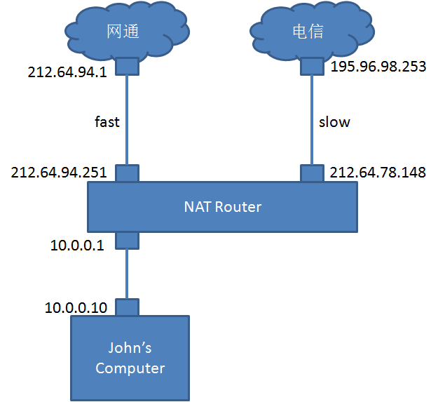
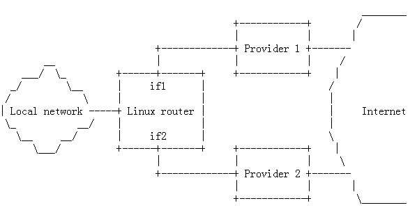
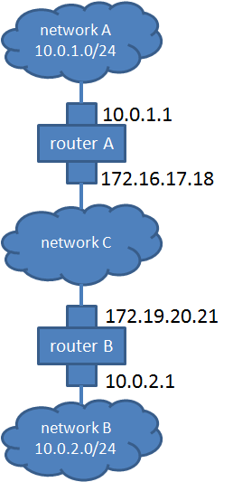

# 前言

[iproute2](./_static/iproute2.png)

## 一、替代 arp, ifconfig, route 等命令

#### 显示网卡
```shell
root@openstack:~# ip link list
1: lo: <LOOPBACK,UP,LOWER_UP> mtu 65536 qdisc noqueue state UNKNOWN
    link/loopback 00:00:00:00:00:00 brd 00:00:00:00:00:00
2: eth0: <BROADCAST,MULTICAST,UP,LOWER_UP> mtu 1500 qdisc pfifo_fast state UP qlen 1000
    link/ether 64:31:50:43:57:fa brd ff:ff:ff:ff:ff:ff
4: br-ex: <BROADCAST,UP,LOWER_UP> mtu 1500 qdisc noqueue state UNKNOWN
    link/ether 64:31:50:43:57:fa brd ff:ff:ff:ff:ff:ff
7: br-int: <BROADCAST,UP,LOWER_UP> mtu 1500 qdisc noqueue state UNKNOWN
    link/ether a2:99:53:93:1b:47 brd ff:ff:ff:ff:ff:ff
10: virbr0: <BROADCAST,MULTICAST,UP,LOWER_UP> mtu 1500 qdisc noqueue state UP
    link/ether fe:54:00:68:e0:04 brd ff:ff:ff:ff:ff:ff
35: br-tun: <BROADCAST,UP,LOWER_UP> mtu 1500 qdisc noqueue state UNKNOWN
    link/ether 42:9b:ec:6c:f6:41 brd ff:ff:ff:ff:ff:ff
71: qbrf38a666d-f5: <BROADCAST,MULTICAST,UP,LOWER_UP> mtu 1500 qdisc noqueue state UP
    link/ether 96:e0:4d:68:c2:6b brd ff:ff:ff:ff:ff:ff
72: qvof38a666d-f5: <BROADCAST,MULTICAST,PROMISC,UP,LOWER_UP> mtu 1500 qdisc pfifo_fast state UP qlen 1000
    link/ether 66:9e:9a:e1:25:37 brd ff:ff:ff:ff:ff:ff
73: qvbf38a666d-f5: <BROADCAST,MULTICAST,PROMISC,UP,LOWER_UP> mtu 1500 qdisc pfifo_fast master qbrf38a666d-f5 state UP qlen 1000
    link/ether 96:e0:4d:68:c2:6b brd ff:ff:ff:ff:ff:ff
74: tapf38a666d-f5: <BROADCAST,MULTICAST,UP,LOWER_UP> mtu 1500 qdisc pfifo_fast master qbrf38a666d-f5 state UNKNOWN qlen 500
    link/ether fe:16:3e:3d:68:e4 brd ff:ff:ff:ff:ff:ff
```

#### 显示IP地址
```shell
root@openstack:~# ip address show
1: lo: <LOOPBACK,UP,LOWER_UP> mtu 65536 qdisc noqueue state UNKNOWN
    link/loopback 00:00:00:00:00:00 brd 00:00:00:00:00:00
    inet 127.0.0.1/8 scope host lo
       valid_lft forever preferred_lft forever
    inet6 ::1/128 scope host
       valid_lft forever preferred_lft forever
2: eth0: <BROADCAST,MULTICAST,UP,LOWER_UP> mtu 1500 qdisc pfifo_fast state UP qlen 1000
    link/ether 64:31:50:43:57:fa brd ff:ff:ff:ff:ff:ff
    inet 16.158.165.152/22 brd 16.158.167.255 scope global eth0
       valid_lft forever preferred_lft forever
    inet6 fe80::6631:50ff:fe43:57fa/64 scope link
       valid_lft forever preferred_lft forever
4: br-ex: <BROADCAST,UP,LOWER_UP> mtu 1500 qdisc noqueue state UNKNOWN
    link/ether 64:31:50:43:57:fa brd ff:ff:ff:ff:ff:ff
    inet 16.158.165.102/22 brd 16.158.167.255 scope global br-ex
       valid_lft forever preferred_lft forever
    inet6 fe80::905e:c9ff:fe4b:36ef/64 scope link
       valid_lft forever preferred_lft forever
7: br-int: <BROADCAST,UP,LOWER_UP> mtu 1500 qdisc noqueue state UNKNOWN
    link/ether a2:99:53:93:1b:47 brd ff:ff:ff:ff:ff:ff
    inet6 fe80::9036:18ff:fe6f:39bb/64 scope link
       valid_lft forever preferred_lft forever
35: br-tun: <BROADCAST,UP,LOWER_UP> mtu 1500 qdisc noqueue state UNKNOWN
    link/ether 42:9b:ec:6c:f6:41 brd ff:ff:ff:ff:ff:ff
    inet6 fe80::90c0:c4ff:fed2:3cfd/64 scope link
       valid_lft forever preferred_lft forever
71: qbrf38a666d-f5: <BROADCAST,MULTICAST,UP,LOWER_UP> mtu 1500 qdisc noqueue state UP
    link/ether 96:e0:4d:68:c2:6b brd ff:ff:ff:ff:ff:ff
    inet6 fe80::a811:6aff:fe0f:667f/64 scope link
       valid_lft forever preferred_lft forever
72: qvof38a666d-f5: <BROADCAST,MULTICAST,PROMISC,UP,LOWER_UP> mtu 1500 qdisc pfifo_fast state UP qlen 1000
    link/ether 66:9e:9a:e1:25:37 brd ff:ff:ff:ff:ff:ff
    inet6 fe80::649e:9aff:fee1:2537/64 scope link
       valid_lft forever preferred_lft forever
73: qvbf38a666d-f5: <BROADCAST,MULTICAST,PROMISC,UP,LOWER_UP> mtu 1500 qdisc pfifo_fast master qbrf38a666d-f5 state UP qlen 1000
    link/ether 96:e0:4d:68:c2:6b brd ff:ff:ff:ff:ff:ff
    inet6 fe80::94e0:4dff:fe68:c26b/64 scope link
       valid_lft forever preferred_lft forever
74: tapf38a666d-f5: <BROADCAST,MULTICAST,UP,LOWER_UP> mtu 1500 qdisc pfifo_fast master qbrf38a666d-f5 state UNKNOWN qlen 500
    link/ether fe:16:3e:3d:68:e4 brd ff:ff:ff:ff:ff:ff
    inet6 fe80::fc16:3eff:fe3d:68e4/64 scope link
      valid_lft forever preferred_lft forever
```

#### 显示路由
```shell
root@openstack:~# ip route show
default via 16.158.164.1 dev br-ex
16.158.164.0/22 dev br-ex  proto kernel  scope link  src 16.158.165.102
16.158.164.0/22 dev eth0  proto kernel  scope link  src 16.158.165.152
192.168.122.0/24 dev virbr0  proto kernel  scope link  src 192.168.122.1
```

#### 显示ARP
```shell
root@openstack:~# ip neigh show
16.158.165.47 dev br-ex lladdr e4:11:5b:53:62:00 STALE
192.168.122.61 dev virbr0 lladdr 52:54:00:68:e0:04 STALE
16.158.164.1 dev br-ex lladdr 00:00:5e:00:01:15 DELAY
16.158.166.177 dev br-ex lladdr 00:26:99:d0:12:a9 STALE
16.158.164.3 dev br-ex lladdr 20:fd:f1:e4:c9:e8 STALE
16.158.165.87 dev br-ex lladdr 70:5a:b6:b3:dd:a5 STALE
16.158.166.150 dev br-ex  FAILED
16.158.164.2 dev br-ex lladdr 20:fd:f1:e4:c9:b1 STALE
```

## 二、Rules: Routing Policy

Routing Table 其实有三个：local, main, default
```shell
root@openstack:~# ip rule list
0:      from all lookup local
32766:  from all lookup main
32767:  from all lookup default
```

原来的route命令修改的是main和local表
```shell
root@openstack:~# ip route list table local
broadcast 16.158.164.0 dev br-ex  proto kernel  scope link  src 16.158.165.102
broadcast 16.158.164.0 dev eth0  proto kernel  scope link  src 16.158.165.152
local 16.158.165.102 dev br-ex  proto kernel  scope host  src 16.158.165.102
local 16.158.165.152 dev eth0  proto kernel  scope host  src 16.158.165.152
broadcast 16.158.167.255 dev br-ex  proto kernel  scope link  src 16.158.165.102
broadcast 16.158.167.255 dev eth0  proto kernel  scope link  src 16.158.165.152
broadcast 127.0.0.0 dev lo  proto kernel  scope link  src 127.0.0.1
local 127.0.0.0/8 dev lo  proto kernel  scope host  src 127.0.0.1
local 127.0.0.1 dev lo  proto kernel  scope host  src 127.0.0.1
broadcast 127.255.255.255 dev lo  proto kernel  scope link  src 127.0.0.1
broadcast 192.168.122.0 dev virbr0  proto kernel  scope link  src 192.168.122.1
local 192.168.122.1 dev virbr0  proto kernel  scope host  src 192.168.122.1
broadcast 192.168.122.255 dev virbr0  proto kernel  scope link  src 192.168.122.1
```
```shell
root@openstack:~# ip route list table main
default via 16.158.164.1 dev br-ex
16.158.164.0/22 dev br-ex  proto kernel  scope link  src 16.158.165.102
16.158.164.0/22 dev eth0  proto kernel  scope link  src 16.158.165.152
192.168.122.0/24 dev virbr0  proto kernel  scope link  src 192.168.122.1
```
```shell
root@openstack:~# ip route list table default
```

#### Simple source policy routing

我们来考虑下面的场景，我家里接了两个外网，一个到网通(用的光纤)，一个到电信(电话拨号)，这两个Modem都连到我的NAT Router上，我把房子出租出去，有很多的室友，其中有一个室友仅仅访问Email，因而想少付费，我想让他仅仅使用电信的线，那么我应该如何配置我的NAT Router呢？



原来的配置是这样的
```shell
root@openstack:~# ip route list table main
195.96.98.253 dev ppp2  proto kernel  scope link  src 212.64.78.148
212.64.94.1 dev ppp0  proto kernel  scope link  src 212.64.94.251
10.0.0.0/8 dev eth0  proto kernel  scope link  src 10.0.0.1
127.0.0.0/8 dev lo  scope link
default via 212.64.94.1 dev ppp0
```
默认都走快的路由

下面添加一个Table，名字叫John
```shell
root@openstack:~# echo 200 John >> /etc/iproute2/rt_tables
root@openstack:~# ip rule add from 10.0.0.10 table John
root@openstack:~# ip rule ls
0:  from all lookup local
32765:  from 10.0.0.10 lookup John
32766:  from all lookup main
32767:  from all lookup default
```
并设定规则从10.0.0.10来的包都查看John这个路由表

在John路由表中添加规则
```shell
root@openstack:~# ip route add default via 195.96.98.253 dev ppp2 table John
root@openstack:~# ip route flush cache
```
默认的路由走慢的，达到了我的需求。

#### Routing for multiple uplinks/providers



$IF1是第一个Interface，它的IP是$IP1

$IF2是第二个Interface，它的IP是$IP2

$P1是Provider1的Gateway，Provider1的网络$P1_NET

$P2是Provider2的Gateway，Provider2的网络$P2_NET

###### 我们要做的第一个事情是Split access.

创建两个routing table, T1和T2，添加到/etc/iproute2/rt_tables.
```shell
    ip route add $P1_NET dev $IF1 src $IP1 table T1
    ip route add default via $P1 table T1
    ip route add $P2_NET dev $IF2 src $IP2 table T2
    ip route add default via $P2 table T2
```
在T1中设定，如果要到达$P1_NET，需要从网卡$IF1出去

在T2中设定，如果要到达$P2_NET，需要从网卡$IF2出去

设置main table
```shell
    ip route add $P1_NET dev $IF1 src $IP1
    ip route add $P2_NET dev $IF2 src $IP2
    ip route add default via $P1
```

添加Rules
```shell
    ip rule add from $IP1 table T1
    ip rule add from $IP2 table T2
```

###### 第二件事情是Load balancing

default gateway 不能总是一个
```shell
    ip route add default scope global nexthop via $P1 dev $IF1 weight 1 nexthop via $P2 dev $IF2 weight 1.
```

#### GRE tunneling



在 Router A 上做如下配置：
```shell
    ip tunnel add netb mode gre remote 172.19.20.21 local 172.16.17.18 ttl 255
    ip link set netb up
    ip addr add 10.0.1.1 dev netb
    ip route add 10.0.2.0/24 dev netb
```
创建一个名为netb的tunnel，模式是GRE，远端是172.19.20.21，此端是172.16.17.18。

所有向 10.0.2.0 的包都通过这个Tunnel转发。

在 Router B 上做如下配置：
```shell
    ip tunnel add neta mode gre remote 172.16.17.18 local 172.19.20.21 ttl 255
    ip link set neta up
    ip addr add 10.0.2.1 dev neta
    ip route add 10.0.1.0/24 dev neta
```


## 三、Netfilter & iproute - marking packets

我们可以在iptable中设置mark，然后在route的时候使用mark

this command marks all packets destined for port 25, outgoing mail:
```shell
    iptables -A PREROUTING -i eth0 -t mangle -p tcp --dport 25 -j MARK --set-mark 1
```
We've already marked the packets with a '1', we now instruct the routing policy database to act on this:
```shell
root@openstack:~# echo 201 mail.out >> /etc/iproute2/rt_tables
root@openstack:~# ip rule add fwmark 1 table mail.out
root@openstack:~# ip rule ls
    0:  from all lookup local
    32764:  from all fwmark        1 lookup mail.out
    32766:  from all lookup main
    32767:  from all lookup default
```

Now we generate a route to the slow but cheap link in the mail.out table:
```shell
    /sbin/ip route add default via 195.96.98.253 dev ppp0 table mail.out
```
