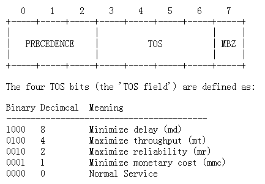
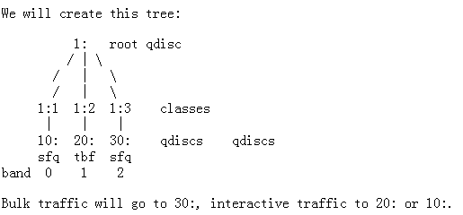
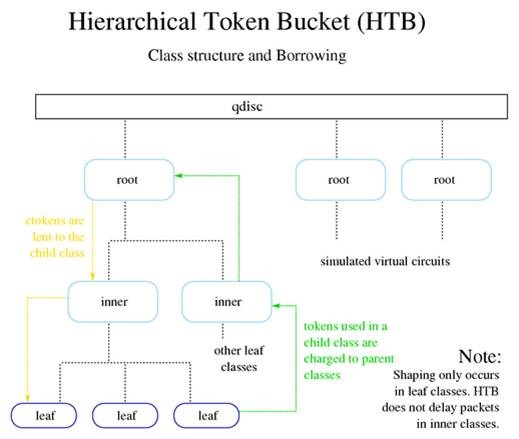

## Queueing Disciplines for Bandwidth Management

With queueing we determine the way in which data is SENT. It is important to realise that we can only shape data that we transmit.

With the way the Internet works, we have no direct control of what people send us.

我们只能控制发送，无法控制接收，所以发送叫shaping，我们可以控制我们的输出流的形态，接收只能设置policy，拒绝或者接受。

#### Simple, classless Queueing Disciplines
##### pfifo_fast
First In, First Out

说是先入先出，实际上一个Queue包含三个Band，每个Band都是先入先出，Band 0优先级最高，它不处理完毕，Band 1不处理，其次是 Band 2。

在IP头里面有TOS (Type of service)，有一个priomap，是一个映射，将不同的TOS映射给不同的Bind。




```shell
root@openstack:~# tc qdisc show dev eth0
qdisc pfifo_fast 0: root refcnt 2 bands 3 priomap  1 2 2 2 1 2 0 0 1 1 1 1 1 1 1 1
```

tx queue len

    The length of this queue is gleaned from the interface configuration, which you can see and set with ifconfig and ip.

##### Token Bucket Filter

Token按照一定的速度来，每个Token都带走一个Packet，当Packet比Token快的时候，会保证按照Token的速度发送，不至于发送太快。

当Packet的速度比Token慢的时候，Token会累积，但是不会无限累积，累积到Bucket大小为止。如果累积的太多了，忽然来了大量的数据，导致瞬时间有大量的包发送。有了Bucket限制，即便积累满了Bucket，大量数据来的时候，最多带走所有的Bucket的Token，然后又按照Token到来的速度慢慢发送了。

limit or latency

    Limit is the number of bytes that can be queued waiting for tokens to become available.

burst/buffer/maxburst

    Size of the bucket, in bytes.

rate

    The speedknob.

peakrate

    If tokens are available, and packets arrive, they are sent out immediately by default.
    That may not be what you want, especially if you have a large bucket.
    The peakrate can be used to specify how quickly the bucket is allowed to be depleted.

```shell
    tc qdisc add dev ppp0 root tbf rate 220kbit latency 50ms burst 1540
```

##### Stochastic Fairness Queueing

随机公平队列

A TCP/IP flow can be uniquely identified by the following parameters within a certain time period:

    Source and Destination IP address
    Source and Destination Port
    Layer 4 Protocol (TCP/UDP/ICMP)

有很多的FIFO的队列，TCP Session或者UDP stream会被分配到某个队列。包会RoundRobin的从各个队列中取出发送。

这样不会一个Session占据所有的流量。但不是每一个Session都有一个队列，而是有一个Hash算法，将大量的Session分配到有限的队列中。这样两个Session会共享一个队列，也有可能互相影响。Hash函数会经常改变，从而session不会总是相互影响。

perturb

    Reconfigure hashing once this many seconds.

quantum

    Amount of bytes a stream is allowed to dequeue before the next queue gets a turn.

limit

    The total number of packets that will be queued by this SFQ

```shell
root@openstack:~# tc qdisc add dev ppp0 root sfq perturb 10
root@openstack:~# tc -s -d qdisc ls
    qdisc sfq 800c: dev ppp0 quantum 1514b limit 128p flows 128/1024 perturb 10sec
     Sent 4812 bytes 62 pkts (dropped 0, overlimits 0)
```
The number 800c: is the automatically assigned handle number, limit means that 128 packets can wait in this queue. There are 1024 hashbuckets available for accounting, of which 128 can be active at a time (no more packets fit in the queue!) Once every 10 seconds, the hashes are reconfigured.

##### Classful Queueing Disciplines

When traffic enters a classful qdisc, The filters attached to that qdisc then return with a decision, and the qdisc uses this to enqueue the packet into one of the classes. Each subclass may try other filters to see if further instructions apply. If not, the class enqueues the packet to the qdisc it contains.

The qdisc family: **roots**, **handles**, **siblings** and **parents**:

    Each interface has one egress 'root qdisc'.

    Each qdisc and class is assigned a handle, which can be used by later configuration
    statements to refer to that qdisc.

    The handles of these qdiscs consist of two parts, a major number and a minor number:
    <major>:<minor>.

##### The PRIO qdisc

它和FIFO Fast很类似，也分多个Band，但是它的每个Band其实是一个Class，而且数目可以改变。默认是三个Band。

每一个Band也不一定是FIFO，而是任何类型的qdisc.

默认也是根据TOS来决定去那个Class，Band是0-2，而Class是1-3.

当然也可以使用filter来决定去哪个Class。

ands

    Number of bands to create. Each band is in fact a class. If you change this number,
    you must also change:

priomap

    If you do not provide tc filters to classify traffic, the PRIO qdisc looks at the
    TC_PRIO priority to decide how to enqueue traffic.



```shell
root@openstack:~# tc qdisc add dev eth0 root handle 1: prio
                # This *instantly* creates classes 1:1, 1:2, 1:3

root@openstack:~# tc qdisc add dev eth0 parent 1:1 handle 10: sfq
root@openstack:~# tc qdisc add dev eth0 parent 1:2 handle 20: tbf rate 20kbit buffer 1600 limit 3000
root@openstack:~# tc qdisc add dev eth0 parent 1:3 handle 30: sfq

root@openstack:~# tc -s qdisc ls dev eth0
     qdisc sfq 30: quantum 1514b
     Sent 0 bytes 0 pkts (dropped 0, overlimits 0)

     qdisc tbf 20: rate 20Kbit burst 1599b lat 667.6ms
     Sent 0 bytes 0 pkts (dropped 0, overlimits 0)

     qdisc sfq 10: quantum 1514b
     Sent 132 bytes 2 pkts (dropped 0, overlimits 0)

     qdisc prio 1: bands 3 priomap  1 2 2 2 1 2 0 0 1 1 1 1 1 1 1 1
     Sent 174 bytes 3 pkts (dropped 0, overlimits 0)
```

##### Hierarchical Token Bucket
```shell
    tc qdisc add dev eth0 root handle 1: htb default 30

    tc class add dev eth0 parent 1: classid 1:1 htb rate 6mbit burst 15k

    tc class add dev eth0 parent 1:1 classid 1:10 htb rate 5mbit burst 15k
    tc class add dev eth0 parent 1:1 classid 1:20 htb rate 3mbit ceil 6mbit burst 15k
    tc class add dev eth0 parent 1:1 classid 1:30 htb rate 1kbit ceil 6mbit burst 15k
```

    The author then recommends SFQ for beneath these classes:
```shell
    tc qdisc add dev eth0 parent 1:10 handle 10: sfq perturb 10
    tc qdisc add dev eth0 parent 1:20 handle 20: sfq perturb 10
    tc qdisc add dev eth0 parent 1:30 handle 30: sfq perturb 10
```

    Add the filters which direct traffic to the right classes:
```shell
    U32="tc filter add dev eth0 protocol ip parent 1:0 prio 1 u32"
    $U32 match ip dport 80 0xffff flowid 1:10
    $U32 match ip sport 25 0xffff flowid 1:20
```

HTB certainly looks wonderful - if 10: and 20: both have their guaranteed bandwidth, and more is left to divide, they borrow in a 5:3 ratio, just as you would expect.

Unclassified traffic gets routed to 30:, which has little bandwidth of its own but can borrow everything that is left over.

A fundamental part of the HTB qdisc is the borrowing mechanism. Children classes borrow tokens from their parents once they have exceeded [rate](http://linux-ip.net/articles/Traffic-Control-HOWTO/classful-qdiscs.html#vl-qc-htb-params-rate). A child class will continue to attempt to borrow until it reaches [ceil](http://linux-ip.net/articles/Traffic-Control-HOWTO/classful-qdiscs.html#vl-qc-htb-params-ceil), at which point it will begin to queue packets for transmission until more tokens/ctokens are available. As there are only two primary types of classes which can be created with HTB the following table and diagram identify the various possible states and the behaviour of the borrowing mechanisms.

###### Table 2. HTB class states and potential actions taken

type of class |  class state   | HTB internal state |  action taken
:------------:|:--------------:|:------------------:|:------------------
leaf          |     < rate     |    HTB_CAN_SEND    | Leaf class will dequeue queued bytes up to available tokens (no more than burst packets)
leaf          | > rate, < ceil |   HTB_MAY_BORROW   | Leaf class will attempt to borrow tokens/ctokens from parent class. If tokens are available, they will be lent in quantum increments and the leaf class will dequeue up to cburst bytes
leaf          |     > ceil     |    HTB_CANT_SEND   | No packets will be dequeued. This will cause packet delay and will increase latency to meet the desired rate.
inner, root   |     < rate     |    HTB_CAN_SEND    | Inner class will lend tokens to children.
inner, root   | > rate, < ceil |   HTB_MAY_BORROW   | Inner class will attempt to borrow tokens/ctokens from parent class, lending them to competing children in quantum increments per request.
inner, root   |     > ceil     |    HTB_CANT_SEND   | Inner class will not attempt to borrow from its parent and will not lend tokens/ctokens to children classes.

This diagram identifies the flow of borrowed tokens and the manner in which tokens are charged to parent classes. In order for the borrowing model to work, each class must have an accurate count of the number of tokens used by itself and all of its children. For this reason, any token used in a child or leaf class is charged to each parent class until the root class is reached.

Any child class which wishes to borrow a token will request a token from its parent class, which if it is also over its rate will request to borrow from its parent class until either a token is located or the root class is reached. So the borrowing of tokens flows toward the leaf classes and the charging of the usage of tokens flows toward the root class.



Note in this diagram that there are several HTB root classes. Each of these root classes can simulate a virtual circuit.

###### 7.1.4. HTB class parameters

default

    An optional parameter with every HTB qdisc object, the default default is 0, which cause
    any unclassified traffic to be dequeued at hardware speed, completely bypassing any of the
    classes attached to the root qdisc.

rate

    Used to set the minimum desired speed to which to limit transmitted traffic. This can be
    considered the equivalent of a committed information rate (CIR), or the guaranteed bandwidth
    for a given leaf class.

ceil

    Used to set the maximum desired speed to which to limit the transmitted traffic. The borrowing
    model should illustrate how this parameter is used. This can be considered the equivalent of
    “burstable bandwidth”.

burst

    This is the size of the rate bucket (see Tokens and buckets). HTB will dequeue burst bytes
    before awaiting the arrival of more tokens.

cburst

    This is the size of the ceil bucket (see Tokens and buckets). HTB will dequeue cburst bytes
    before awaiting the arrival of more ctokens.

quantum

    This is a key parameter used by HTB to control borrowing. Normally, the correct quantum is
    calculated by HTB, not specified by the user. Tweaking this parameter can have tremendous
    effects on borrowing and shaping under contention, because it is used both to split traffic
    between children classes over rate (but below ceil) and to transmit packets from these same
    classes.

r2q

    Also, usually calculated for the user, r2q is a hint to HTB to help determine the optimal
    quantum for a particular class.

mtu

prio

## The u32 classifier

The U32 filter is the most advanced filter available in the current implementation.
```shell
    tc filter add dev eth0 protocol ip parent 1:0 pref 10 u32 match u32 00100000 00ff0000 at 0 flowid 1:10
```
