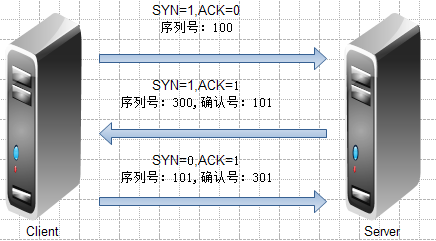
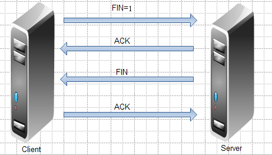
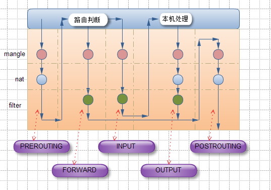
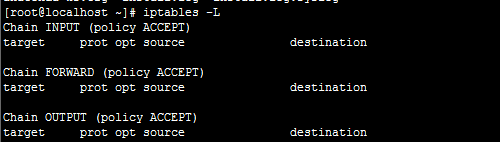
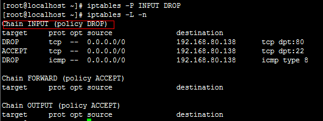

### 1、TCP/IP三次握手



客户端发起请求，SYN=1，ACK=0，产生个序列号(以100为例)

服务端确认客户端的请求，并且也想客户端请求，SYN=1，ACK=1,确认客户端的请求，所以确认号+1 =101，并且在产生个序列号(这里以300为例)

客户端发送确认，所以SYN=0，ACK=1，序列号=101，确认服务器的序列号=301

### 2、TCP/IP四次断开



首先客户端发起断开请求，FIN=1

服务器确认客户端断开请求，发个ACK

之后服务器在向客户端发起FIN断开请求

客户端在确认服务器的断开请求

---

所以第一次发起SYN=1的请求，也就是NEW状态

当双方已经建立连接后在发送的请求，就是ESTABLISHED状态

当SYN=1，FIN=1的请求时，是INVALID状态

最后还有个RELATED 相关联状态

### 3、iptables 工作流程



1、首先数据包进入，先进入mangle表的PREROUTING链，在这里可以根据需要改变数据包头内容

2、之后进入nat表的PREROUTING链，在这里可以根据需要做DNAT，也就是目标地址转换

3、进入路由判断，判断是进入本地的还是转发的

    (1) 如果进入本地的话进入INPUT链，之后按条件过滤限制进入
        之后进入本机，在进入OUTPUT链，按条件过滤限制出去
        离开本地
    (2) 如果是转发的话进入，进入FORWARD链，根据条件限制转发
        之后进入POSTROUTING链，这里可以做SNAT
        离开网络接口


### 4、itpables表和链的功能

(1)filter表主要处理过滤功能的

    包含INPUT链：过滤所有目标地址是本机的数据包
    FORWARD链：过滤所有路过本机的数据包
    OUTPUT链：过滤所有由本机产生的数据包

(2)nat表主要处理网络地址转换，可以进行SNAT(改变数据包的源地址),DNAT(改变数据包的目标地址)

    包含PREROUTING链：可以再数据包到达防火墙是改变目标地址
    OUTPUT链：可以改变本地产生的数据包的目标地址
    POSTROUTING链：在数据包离开防火墙是改变数据包的源地址

(3)mangle表修改数据包：

    包含PREROUTING链，INPUT链，FORWARD链，OUTPUT链，POSTROUTING链
    这里mangle不做过多操作，具体内容不多介绍了
    其实还有一个表示raw表的，不常用的，但是他们的级别是 raw-->mangle-->nat-->filter
    raw最高，filter最低，iptables默认操作的是filter表

### 5、iptables命令

iptables 格式

    # iptables [-t tables] command chains [creteris] -j ACTION

##### -t 指定表：

    {raw|mangle|nat|filter}, 默认filter

##### command: 对表的操作，分为以下几类

    规则管理类：（# 表示数字）
        -A： 追加
        -I：插入
        -D：删除
        -R：替换，修改
    链管理类：
        -F：清空链
        -N：新建链
        -X：删除自定义链，必须空链
        -E：重命名
        -L：查看
            -n：以数字显示
            -v：详细信息
            -x：精确的
            --line-number ：显示行号
        -P：修改链的默认策略
        -Z：清空计数器

    每条规程都有俩计数器
    被此规则匹配到的所有数据包的个数；
    被此规则匹配到的所有数据包的大小和；

##### creteris: 匹配条件

    基本匹配
        -s 源地址，ip/network  !表示取反
        -d 目标地址
        -p 协议  {tcp|udp|icmp}
        -i INTERFACE：那个接口进来的,例"-i eth0"表示从 eth0 进来的
        -o INTERFACE：那个接口出去的,例"-i eth0"表示从 eth0 出去的

    扩展匹配: 指的是调用 iptables 的模块，以扩展iptables的匹配功能，需要加-m
    隐含扩展,省略了-m
    协议扩展指定
        -p tcp
            --sport PORT：源端口+ 端口号
            --dport PORT：目标端口+ 端口号
        -p udp
            --sport PORT
            --dport PORT
        -p icmp
            --icmp-type
                echo-request：表示请求，可以用数字8表示
                echo-reply：表示回应，可以用数字0表示

##### -j：判断

    ACCEPT  允许
    DROP 丢弃
    REJECT 拒绝

### 6、iptables简单使用：

```
    # iptabls -L：查看
```



如果相信其他表指定即可,这里我们都是空的，-L 后面也可以加-n,-v,--line-number使用也可以一起添加，每个选项间要加空格
```
    # iptables -t nat -L
    # iptables -L -n -v --line-number
```

首先先做个httpd服务，访问正常的，之后下的命令是拒绝任何人访问192.168.80.138,在访问就不行了，而且ssh也被断开了，所以如果这远程在机房的话就很麻烦了，所有我们可以写个每3分钟执行清空iptables的计划任务就可以了
```
    # iptables -t filter -A INPUT -s 0.0.0.0/0.0.0.0 -d 192.168.80.138 -j DROP
```
（这里我指定了filter表，不指的话默认也是filter表）

下面清空下 iptables
```
    # iptables -F
```

之前的命令拒绝了所有，不可能这样的，要指定拒绝那个服务才可以，所以下面拒绝别人访问本机web服务，其他服务正常
```
    # iptables -A INPUT -s 0.0.0.0/0.0.0.0 -d 192.168.80.138 -p tcp --dport 80 -j DROP
```
（这里没有指定表，所以默认是filter表）

下面我们拒绝别人Ping,ping协议是icmp的，8代表请求，所以下面就在Ping下就发现不通了。
```
    # iptables -A INPUT -s 0.0.0.0/0.0.0.0 -d 192.168.80.138 -p icmp --icmp-type 8 -j DROP
```
这需要注意-A是在当前的规则后面增加，-I的话可以指定在那个规则前面添加，比如
```
    # iptables -I INPUT 2 -s 0.0.0.0/0.0.0.0 -d 192.168.80.138 -p tcp --dport 22 -j ACCEPT
```

下面修改默认策略
```
    # iptables -P INPUT DROP
```



注：下发规则后重启服务是不会保存的，所以可以通过 `service iptables save` 来保存我们的规则 。

PS:
本文出自 “毛竹之势” 博客，请务必保留此出处 http://peaceweb.blog.51cto.com/3226037/923270
