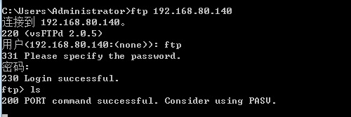
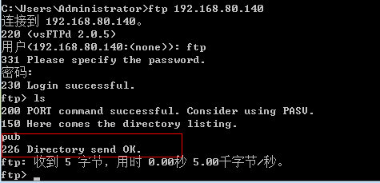
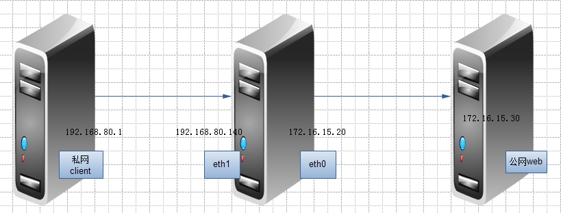
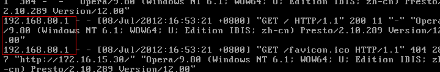
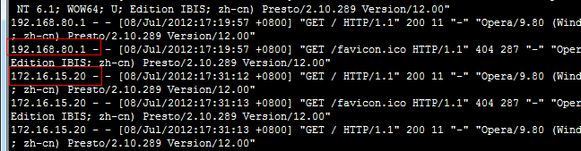
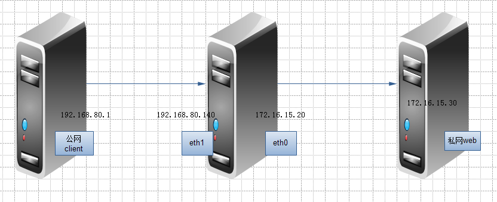
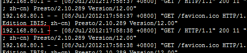
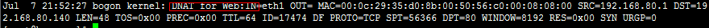

### 1、匹配扩展

其实匹配扩展中，还有需要加 -m 引用模块的显示扩展，默认是隐含扩展，不要使用 -m

##### 状态检测的包过滤

    -m state
        --state {NEW,ESTATBLISHED,INVALID,RELATED}  指定检测那种状态

    -m multiport 指定多端口号
        --sport
        --dport
        --ports

    -m iprange 指定IP段
        --src-range ip-ip
        --dst-range ip-ip

    -m connlimit 连接限定
        --comlimit-above # 限定大连接个数

    -m limit 现在连接速率，也就是限定匹配数据包的个数
        --limit  指定速率
        --limit-burst # 峰值速率，最大限定

    -m string 按字符串限定
        --algo bm|kmp  指定算法bm或kmp
        --string "STRING" 指定字符串本身

##### Examples

```
    # iptables -A INPUT -s 0.0.0.0/0.0.0.0 -d 192.168.80.139 -p tcp --dport 22 \
      -m state --state NEW,ESTABLISHED -j ACCEPT
```
允许任何主机状态为NEW,ESTABLISHED的状态连接，这里要注意当写成0.0.0.0/0.0.0.0 表示任意地址的时候是可以省略的，如下即可：
```
    # iptables -A INPUT -d 192.168.80.140 -p tcp --dport 22 -m state \
      --state NEW,ESTABLISHED -j ACCEPT
```

允许本机的ESTABLISHED状态出去，为了防止有反弹时木马，让服务器主动向外发起请求
```
    # iptables -A OUTPUT -s 192.168.80.140 -p tcp --sport 22 -m state \
      --state ESTABLISHED -j ACCEPT
```
之后再修改默认权限为拒绝即可
```
    # iptables -P INPUT DROP
    # iptables -P OUTPUT DROP
```

现在在本机ping 127.0.0.1, 发现时不同的，所以要允许本机，下面在写一个：
```
    # iptables -I INPUT 1 -s 127.0.0.1 -d 127.0.0.1 -j ACCEPT
    # iptables -I OUTPUT 1 -s 127.0.0.1 -d 127.0.0.1 -j ACCEPT
```

如果要限制80端口的话，那在就在写一条，现在写在一条里，为了节省查询时间。
之前的--sport或--dport后面可以添加连续的如 --sport 22:80 表示从22到80的所有端口，不符合现在的条件，所以我们用第二个显示扩展：
```
    # iptables -A INPUT -d 192.168.80.140 -p tcp -m multiport --dport 22,80 \
      -m state --state NEW,ESTABLISHED -j ACCEPT
```
这样就把22,80和在一起的，OUTPUT同理但注意源端口目标端口，之后再删除原来的即可
（注意：有SSH的话一定要先添加在删除）

这里需要知道一点，从本机出去的ESTABLISHED都是现请求进来的，所以可以写成如下：
```
    # iptables -A OUTPUT -m state --state ESTABLISHED -j ACCEPT
```
表示所有客户端NEW请求进来服务器返回ESTABLISHED的状态全部允许

也可以添加在INPUT中，提高查询速度
```
    # iptables -I INPUT 1 -m state --state ESTABLISHED -j ACCEPT　
```
这里的原理是，当NEW请的时候匹配他自己的那条规则，当建立连接后直接就匹配这条规则，提高效率。

例如：第一条是允许ESTABISHED的，第二条是22的NEW，ESTABLISHED的规则，这样当用户请求22的时候先匹配22的NEW，之后的ESTABLISHED状态时直接匹配第一条，不用在去匹配第二条的规则了，这样当我们有许多条目的时候大大提高了效率。

```
    # iptables -A INPUT -d 192.168.80.140 -m iprange \
       --src-range 192.168.80.130-192.168.80.150 -p tcp --dport 23 \
       -m state --state NEW -j ACCEPT
```
指定 192.168.80.130-192.168.80.150 可以访问本机的23端口

```
    # iptables -I INPUT 2 -d 192.168.80.140 -p tcp --dport 22 -m state \
      --state NEW -m connlimit ! --connlimit-above 2 -j ACCEPT
```
这里 connlimit ! --connlimit-above 2 -j ACCEPT 表示只允许SSH本机2次，connlimit --connlimit-above 2 -j DROP 表示超过2次后拒绝，这里因为默认权限是拒绝的所以用！取反，而且前面有写允许22端口的，这里不匹配后就会先下匹配那条，将匹配22允许的更改即可。

```
    # iptables -A INPUT -d 192.168.80.140 -p tcp --dport 80 -m state \
      --state  NEW -m limit --limit 1/second --limit-burst 3 -j ACCEPT
```
表示对web服务的新连接请求，平均每秒只允许1个，最多一次进3个

```
    # iptables -I OUTPUT 1 -m string --algo kmp --string "peace" -j DROP
```
表示本机响应当中包含“peace”字符串的机拒绝

### 2、如何开发FTP

##### 主动模式开放FTP
```
    # iptables -A INPUT -d 192.168.80.140 -p tcp --dport 21 -m state \
      --state NEW -j ACCEPT
    # iptables -A INPUT -d 192.168.80.140 -p tcp --dport 20 -m state \
      --state NEW -j ACCEPT
    # iptables -A INPUT -m state --state ESTABLISHED,RELATED -j ACCEPT
    # iptables -A OUTPUT -m state --state ESTABLISHED,RELATED -j ACCEPT
```

##### 被动模式开放FTP
(1)清空之前的配置，重启服务即可
```
    # service iptables restart
```

(2)先添加ssh规则
```
    # iptables -A INPUT -m state --state ESTABLISHED -j ACCEPT
    # iptables -A OUTPUT -m state --state ESTABLISHED -j ACCEPT
    # iptables -A INPUT -d 192.168.80.140 -p tcp --dport 22 -m state \
      --state NEW -m connlimit ! --connlimit-above 3 -j ACCEPT
    # iptables -P INPUT DROP
    # iptables -P OUTPUT DROP
```

(3)下面开启FTP
```
    # iptables -A INPUT -d 192.168.80.140 -p tcp --dport 21 -m state --state NEW -j ACCEPT
```
但是访问还是不行



(4)先加载模块
```
    # modprobe ip_nat_ftp
    # lsmod | grep ftp
    ip_nat_ftp              7361  0
    ip_nat                 20973  1 ip_nat_ftp
    ip_conntrack_ftp       11569  1 ip_nat_ftp
    ip_conntrack           53409  5 ip_nat_ftp,ip_nat,ip_conntrack_ftp,xt_connlimit,xt_state
```

(5)开发RELATED状态
```
    # iptables -R INPUT 2 -m state --state ESTABLISHED,RELATED -j ACCEPT
    # iptables -R OUTPUT 1 -m state --state ESTABLISHED,RELATED -j ACCEPT
```

(6)在连接下发现可以了



前面重启服务的话规则就没有了，所以当确定后了之后执行以下命令保存：
```
    # service iptables save
    或
    # iptables-save > /etc/sysconfig/iptables
```

这里有两个文件要知道下：

    /etc/sysconfig/iptables: 保存规则的文件
    /etc/sysconfig/iptables-config：向iptables脚本提供配置文件的文件

### 3、SNAT于DNAT配置

#### SNAT
首先清空之前的配置，拓扑如下：



先ping下，是不同的


(1)先开启路由功能
```
    # vim /etc/sysctl.conf
    net.ipv4.ip_forward = 1
    # sysctl -p
```

(2)client 添加路由
```
    # route add 172.16.0.0 mask 255.255.0.0 192.168.80.140

    web添加路由
    # route add -net 0.0.0.0 gw 172.16.15.20
```

访问发现是192.168.80.1访问的



(3)下面也可以添加个拒绝PING的
```
    # iptables -A FORWARD -p icmp --icmp-type 8 -j REJECT

    添加SNAT规则
    # iptables -t nat -A POSTROUTING -s 192.168.80.0/24 -j SNAT --to-source 172.16.15.20
```

(4)访问172.16.15.30下web在看日志，发现已经是172.16.15.20



这里至指定的一个IP地址，如果是拨号的话这个地址是不固定的所以可以用如下方式：
```
    # iptables -t nat -A POSTROUTING -s 192.168.80.0/24 -j MASQUERADE
```
不过这种方法比指定更消耗资源

另将web添加的路由删除，发现也是可以访问的。


#### DNAT的实现：
拓扑如下：



(1)先开启路由功能
```
    # vim /etc/sysctl.conf
    net.ipv4.ip_forward = 1
    # sysctl -p
```

(2)这里的web就一定要指定网关了
```
    # route add -net 0.0.0.0 gw 172.16.15.20
```

(3)添加规则，将请求192.168.80.140的web转换到172.16.15.30上
```
    # iptables -t nat -A PREROUTING -d 192.168.80.140 -p tcp --dport 80 \
      -j DNAT --to-destination 172.16.15.30
```

(4)访问192.168.80.140后看下日志，发现是192.168.80.1



(5)这里本地服务器没有log记录，要添加的话如下：
```
    # iptables -t nat -I PREROUTING 1 -d 192.168.80.140 -p tcp --dport 80 \
      -j LOG --log-prefix "DNAT for Web:"
```

(6)之后看下本地日志,tail /var/log/messages 发现本地已经有日志信息了



### 4、利用recent抵御DOS攻击
```
    # iptables -I INPUT -p tcp --dport 22 -m connlimit -connlimit-above 3 -j DROP
    # iptables -I INPUT -p tcp --dport 22 -m state --state NEW -m recent --set -name SSH
```
记录访问tcp 22端口的新连接，记录名称为 SSH --set 记录数据包的来源IP，如果IP已经存在将更新已经存在的条目

```
    # iptables -I INPUT -p tcp --dport 22 -m state --state NEW -m recent \
      --update --seconds 300 --hitcount 3 --name SSH -j DROP
```
指SSH记录中的IP，300s内发起超过3次连接则拒绝此IP的连接。


### 5、做应用层的iptables，限制迅雷，QQ

注意这里的版本有要求的：

    iptables-1.4.3 以上
    kernel-2.6.20 以上

#### 试验步骤

(1)给内核打补丁，并重新编译内核
```
    # tar zxvf  linux-2.6.28.10.tar.gz  -C  /usr/src
    # tar zxvf  netfilter-layer7-v2.22.tar.gz  -C  /usr/src
    # cd /usr/src
    # ln –s  linux-2.6.28.10  linux
    # cd /usr/src/linux/
    # patch -p1  <  ../netfilter-layer7-v2.22/kernel-2.6.25-2.6.28-layer7-2.22.patch
    # cp /boot/config-2.6.18-164.el5  /usr/src/linux/.config
    # make  menuconfig
```

编译选着如下内容：
```
Networking support → Networking Options →Network packet filtering framework →Core Netfilter Configuration
<M>  Netfilter connection tracking support
<M>  “layer7” match support
<M>  “string” match support
<M>  “time”  match support
<M>  “iprange”  match support
<M>  “connlimit”  match support
<M>  “state”  match support
<M>  “conntrack”  connection  match support
<M>  “mac”  address  match support
<M>   "multiport" Multiple port match support

Networking support → Networking Options →Network packet filtering framework → IP: Netfilter Configuration
<M> IPv4 connection tracking support (required for NAT)
<M>   Full NAT
 <M>     MASQUERADE target support
 <M>     NETMAP target support
 <M>     REDIRECT target support
```

编译安装
```
    # make
    # make modules_install
    # make install
```

(2)给iptables源码打补丁，并重新编译iptables
```
    # cp /etc/init.d/iptables ~/iptables
    # cp /etc/sysconfig/iptables-config ~/
    # rpm  -e  iptables-ipv6  iptables  iptstate  --nodeps
    # tar jxvf iptables-1.4.6.tar.bz2 –C  /usr/src
    # cd /usr/src/iptables-1.4.6
    # cp ../netfilter-layer7-v2.22/iptables-1.4.3forward-for-kernel-2.6.20forward/libxt_layer7.*   ./extensions/
    # ./configure  --prefix=/usr  --with-ksource=/usr/src/linux
    # make
    # make install
```

(3)安装l7proto
```
    # tar zxvf l7-protocols-2009-05-28.tar.gz
    # cd l7-protocols-2009-05-28
    # make install

    这里的iptables文件要做修改的将/sbin/$IPTABLES改成/usr/sbin/$IPTABLISH
    # mv ~/iptables  /etc/rc.d/init.d/

    # service iptables start

    限制xunlei
    #　iptables -A FORWARD -m layer7 --l7proto xunlei -j DROP
```
限制的相关信息都在这里 /etc/l7-protocols/protocols/ 可以产考，像qq,pplive等都有的


PS:
本文出自 “毛竹之势” 博客，请务必保留此出处http://peaceweb.blog.51cto.com/3226037/924184
