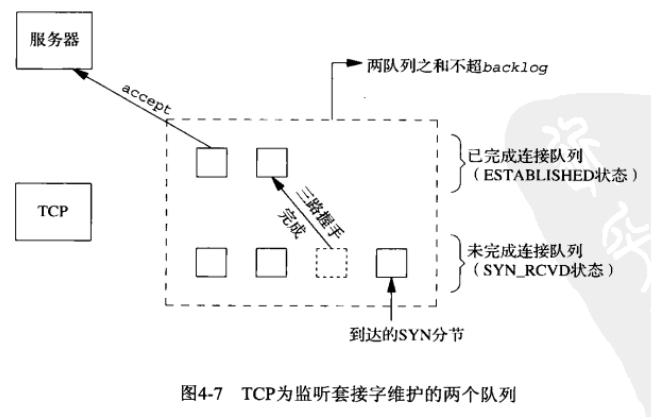

Linux Socket Listen Backlog
===========================

### 测试环境
服务端环境：`ubuntu12.04`，客户端无要求。

### Man手册
```shell
$ man listen
```
    If the backlog argument is greater than the value in /proc/sys/net/core/somaxconn,
    then it is silently truncated to that value; the default value in this file is 128.
    In kernels before 2.4.25, this limit was a hard coded value, SOMAXCONN, with the value 128.

`$ cat /proc/sys/net/core/somaxconn` 可以看 Linux 的 `SOMAXCONN` 值，一般情况下是 `128`，可以将其调大。

```shell
$ man tcp
```
    tcp_max_syn_backlog (integer; default: see below; since Linux 2.2)
        The maximum number of queued connection requests which have still not received an acknowledgement
        from the connecting  client. If this number is exceeded, the kernel will begin dropping requests.
        The default value of 256 is increased to 1024 when the memory present in the system is adequate or
        greater (>= 128Mb), and reduced to 128 for those systems with very low memory (<= 32Mb). It is
        recommended that if this needs to be increased above 1024, TCP_SYNQ_HSIZE in include/net/tcp.h be
        modified to keep TCP_SYNQ_HSIZE*16<=tcp_max_syn_backlog, and the kernel be recompiled.



### 测试与总结
**注意：**

    不要在同一个机器上测试，我怀疑同一个机器下没有经历三次握手。
    我在 ubuntu12.04 下同时跑客户端和服务端程序时就发现无论 backlog 设为多少，
    “已完成连结队列”都一直上涨根本没有停止，“未完成连结队列”在10左右摇摆。

(1) 当传参 `backlog` 的值**`小于`** `somaxconn` 时，`已完成连结队列` 的数量最多就是 `backlog` 的值，未完成连结队列的数量在 `10` 左右摇摆。

(2) 当传参 `backlog` 的值**`大于等于`** `somaxconn` 时，`已完成连结队列` 的数量最多就是 `somaxconn`，`未完成连结队列`的数量同上。

结论：在 ubuntu12.04 上，`backlog` 的值就是 `已完成连结队列的值`，此值受限于 `somaxconn`。

最后，给出查看服务端两队列的值的脚本(脚本里的 4333 是我服务端程序的端口值)：
```shell
#!/bin/sh
echo "已建立连结队列里套接字的数量"
while [ "1" = "1" ]
do
netstat -nat | grep ESTABLISHED | grep 4333 | wc -l
sleep 2
done
```

```shell
#!/bin/sh
echo "未建立连结队列里套接字的数量"
while [ "1" = "1" ]
do
netstat -nat | grep SYN_RECV | grep 4333 | wc -l
sleep 2
done
```
顺便说一下，`listen` 函数不是阻塞式的，它只是告诉内核打开某端口监听，真正“监听”的是内核，而不是我们的服务端程序。`listen` 函数只是把第一个参数（即套接字）转换成监听套接字。

------

From: https://github.com/xgfone/snippet/new/master
