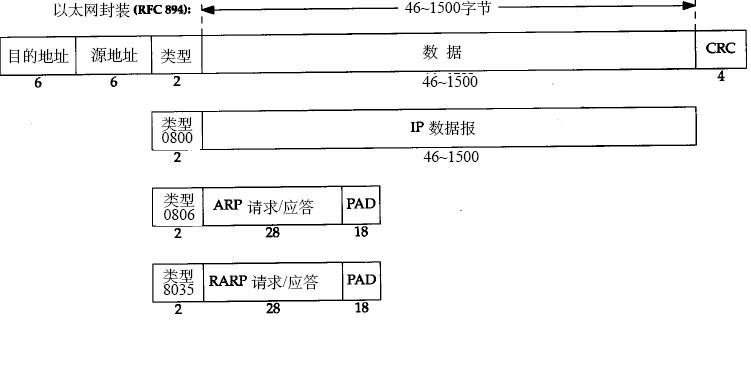

数据链路层协议
===========

数据链路层有三个目的：

    - 为IP模块发送和接收IP数据报。
    - 为ARP模块发送ARP请求和接收ARP应答。地址解析协议。
    - 为RARP发送RARP请 求和接收RARP应答。逆地址解析协议。

数据链路层的协议：

    最常用的以太网链路层协议
    串行接口链路层协议（SLIP和PPP)
    大多数实现都包含的环回（loopback)驱动程序
    还有PPP协议(adsl宽带)。

### 1. 以太网和IEEE 802封装
`以太网（Ether-net）`是指数字设备公司（ Digital Equipment Corp.）、英特尔公司（Intel Corp.）和Xerox公司在1982年联合公布的一个标准，这个标准里面使用了一种称作CSMA/CD的接入方法。而IEEE802提供的标准集802.3(还有一部分定义到了802.2中)也提供了一个CSMA/CD的标准。这两个标准稍有不同，TCP/IP协议对这种情况的处理方式如下:

    - 一台主机一定要能发送和接收RFC894定义的数据报。
    - 一台主机可以接收RFC894和RFC1042的封装格式的混合数据报。
    - 一台主机也许能够发送RFC1042数据报。如果主机能同时发送两种类型的分组数据，
      那么发送的分组必须是可以设置的，而且默认条件下必须是RFC894分组。

以太网的IP数据报封装在RFC894中定义，而IEEE802网络的IP数据报封装在RFC1042中定义。

### 2. SLIP: 串行线路IP(Serial Line IP) {RFC1055}
适用于家庭中每台计算机几乎都有的 RS-232 串行端口和高速调制解调器接入Internet。

#### 帧格式
    (1) IP数据报以0Xco(END)分割；
    (2) IP数据报有END字符，由连续传输两个字节0Xdb(ESC)和0xdc取代；
    (3) IP数据报有ESC字符，由连续传输两个字节0Xdb和0xdd取代。

#### 缺陷
    (1) 每一端必须知道对方的IP地址；
    (2) 帧中没有类型字段。如果一条串行线路用于SLIP，那么它不能同时使用其他协议。
    (3) 没有CRC字段。如果SLIP传输的报文被线路噪声影响而发生错误，只能通过上层协议来发现
        （另一种方法是，新型的调制解调器可以检测并纠正错误报文）。这样，上层协议提供某种形式的CRC就显得很重要。

### 3. CSLIP: 压缩的SLIP {RFC1144}
大多数的SLIP产品都支持CSLIP。

### 4. PPP: 点对点协议 {RFC1548}

PPP比SLIP的优点

    (1) PPP支持在单根串行线路上运行多种协议，不只是IP协议；
    (2) 每一帧都有循环冗余检验CRC；
    (3) 通信双方可以进行IP地址的动态协商(使用IP网络控制协议)；
    (4) 与CSLIP类似，对TCP和IP报文首部进行压缩；
    (5) 链路控制协议可以对多个数据链路选项进行设置。
        为这些优点付出的代价是在每一帧的首部增加3个字节，当建立链路时要发送几帧协商数据，以及更为复杂的实现。

### 5. 环回接口(Loopback Interface)
允许运行在同一台主机上的客户程序和服务器程序通过TCP/IP进行通信。

A类网络号127就是为环回接口预留的。

根据惯例，大多数系统把IP地址`127.0.0.1`分配给这个接口，并命名为`localhost`。

    (1) 传给环回地址（一般是127.0.0.1）的任何数据均作为IP输入。
    (2) 传给广播地址或多播地址的数据报复制一份传给环回接口，然后送到以太网上。
    (3) 任何传给该主机I P地址的数据均送到环回接口。

### 6. 其他概念

最大传输单元`MTU{RFC1191}`:

    (1)不同类型的网络大多数都有一个上限。
    (2)且数据的长度比链路层的MTU还大，那么IP层就需要进行分片。

路径`MTU{RFC1191}`:

---

From: http://www.cnblogs.com/dubingsky/archive/2009/06/16/1504507.html
