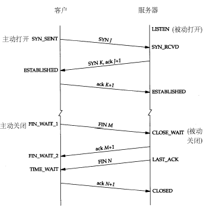

`CLOSE_WAIT` and `TIME_WAIT`
===========================

在服务器的日常维护过程中，会经常用到下面的命令：
```shell
netstat -n | awk '/^tcp/ {++S[$NF]} END {for(a in S) print a, S[a]}'
```
它会显示例如下面的信息：
```
TIME_WAIT 814
CLOSE_WAIT 1
FIN_WAIT1 1
ESTABLISHED 634
SYN_RECV 2
LAST_ACK 1
```
常用的三个状态是：`ESTABLISHED` 表示正在通信，`TIME_WAIT` 表示主动关闭，`CLOSE_WAIT` 表示被动关闭。

具体每种状态什么意思，其实无需多说，看看下面这种图就明白了，注意这里提到的服务器应该是业务请求接受处理的一方：



这么多状态不用都记住，只要了解到我上面提到的最常见的三种状态的意义就可以了。一般不到万不得已的情况也不会去查看网络状态，如果服务器出了异常，百分之八九十都是下面两种情况：
1. 服务器保持了大量`TIME_WAIT`状态
2. 服务器保持了大量`CLOSE_WAIT`状态

因为linux分配给一个用户的文件句柄是有限的，而 `TIME_WAIT` 和 `CLOSE_WAIT` 两种状态如果一直被保持，那么意味着对应数目的通道就一直被占着，而且是“占着茅坑不使劲”，一旦达到句柄数上限，新的请求就无法被处理了，接着就是大量 `Too Many Open Files` 异常，服务器崩溃了。

下面来讨论下这两种情况的处理方法，网上有很多资料把这两种情况的处理方法混为一谈，以为优化系统内核参数就可以解决问题，其实是不恰当的，优化系统内核参数解决 `TIME_WAIT` 可能很容易，但是应对 `CLOSE_WAIT` 的情况还是需要从程序本身出发。现在来分别说说这两种情况的处理方法：

### 服务器保持了大量`TIME_WAIT`状态

这种情况比较常见，一些爬虫服务器或者WEB服务器（如果网管在安装的时候没有做内核参数优化的话）上经常会遇到这个问题，这个问题是怎么产生的呢？

从前面的示意图可以看得出来，`TIME_WAIT`是主动关闭连接的一方保持的状态，对于爬虫服务器来说他本身就是“客户端”，在完成一个爬取任务之后，他就会发起主动关闭连接，从而进入`TIME_WAIT`的状态，然后在保持这个状态2MSL（max segment lifetime）时间之后，彻底关闭回收资源。为什么要这么做？明明就已经主动关闭连接了为啥还要保持资源一段时间呢？这个是 TCP/IP 的设计者规定的，主要出于以下两个方面的考虑：
1. 防止上一次连接中的包，迷路后重新出现，影响新连接（经过2MSL，上一次连接中所有的重复包都会消失）。
2. 可靠的关闭TCP连接。在主动关闭方发送的最后一个 ack(fin) ，有可能丢失，这时被动方会重新发fin, 如果这时主动方处于 `CLOSED` 状态 ，就会响应 rst 而不是 ack。所以主动方要处于 `TIME_WAIT` 状态，而不能是 `CLOSED`。另外这么设计 `TIME_WAIT` 会定时的回收资源，并不会占用很大资源的，除非短时间内接受大量请求或者受到攻击。

关于MSL引用下面一段话：

> MSL 為一個 TCP Segment (某一塊 TCP 網路封包) 從來源送到目的之間可續存的時間 (也就是一個網路封包在網路上傳輸時能存活的時間)，由於 RFC 793 TCP 傳輸協定是在 1981 年定義的，當時的網路速度不像現在的網際網路那樣發達，你可以想像你從瀏覽器輸入網址等到第一個 byte 出現要等 4 分鐘嗎？在現在的網路環境下幾乎不可能有這種事情發生，因此我們大可將 TIME_WAIT 狀態的續存時間大幅調低，好讓 連線埠 (Ports) 能更快空出來給其他連線使用。

再引用网络资源的一段话：

> 值得一说的是，对于基于TCP的HTTP协议，关闭TCP连接的是Server端，这样，Server端会进入TIME_WAIT状态，可 想而知，对于访问量大的Web Server，会存在大量的TIME_WAIT状态，假如server一秒钟接收1000个请求，那么就会积压 240*1000=240000个 TIME_WAIT的记录，维护这些状态给Server带来负担。当然现代操作系统都会用快速的查找算法来管理这些TIME_WAIT，所以对于新的 TCP连接请求，判断是否hit中一个TIME_WAIT不会太费时间，但是有这么多状态要维护总是不好。

> HTTP协议1.1版规定default行为是Keep-Alive，也就是会重用TCP连接传输多个 request/response，一个主要原因就是发现了这个问题。

也就是说HTTP的交互跟上面画的那个图是不一样的，关闭连接的不是客户端，而是服务器，所以web服务器也是会出现大量的 `TIME_WAIT` 的情况的。

现在来说如何来解决这个问题。

解决思路很简单，就是让服务器能够快速回收和重用那些 `TIME_WAIT` 的资源。

下面来看一下我们网管对 `/etc/sysctl.conf` 文件的修改：
```shell
#对于一个新建连接，内核要发送多少个 SYN 连接请求才决定放弃,不应该大于255，默认值是5，对应于180秒左右时间
net.ipv4.tcp_syn_retries=2
#net.ipv4.tcp_synack_retries=2
#表示当keepalive起用的时候，TCP发送keepalive消息的频度。缺省是2小时，改为300秒
net.ipv4.tcp_keepalive_time=1200
net.ipv4.tcp_orphan_retries=3
#表示如果套接字由本端要求关闭，这个参数决定了它保持在FIN-WAIT-2状态的时间
net.ipv4.tcp_fin_timeout=30
#表示SYN队列的长度，默认为1024，加大队列长度为8192，可以容纳更多等待连接的网络连接数。
net.ipv4.tcp_max_syn_backlog = 4096
#表示开启SYN Cookies。当出现SYN等待队列溢出时，启用cookies来处理，可防范少量SYN攻击，默认为0，表示关闭
net.ipv4.tcp_syncookies = 1

#表示开启重用。允许将TIME-WAIT sockets重新用于新的TCP连接，默认为0，表示关闭
net.ipv4.tcp_tw_reuse = 1
#表示开启TCP连接中TIME-WAIT sockets的快速回收，默认为0，表示关闭
net.ipv4.tcp_tw_recycle = 1

##减少超时前的探测次数
net.ipv4.tcp_keepalive_probes=5
##优化网络设备接收队列
net.core.netdev_max_backlog=3000
```

修改完之后执行 `/sbin/sysctl -p` 让参数生效。

这里头主要注意到的是 `net.ipv4.tcp_tw_reuse`、`net.ipv4.tcp_tw_recycle`、`net.ipv4.tcp_fin_timeout`、`net.ipv4.tcp_keepalive_*` 这几个参数。其中，`net.ipv4.tcp_tw_reuse` 和 `net.ipv4.tcp_tw_recycle` 的开启都是为了回收处于 `TIME_WAIT` 状态的资源。`net.ipv4.tcp_fin_timeout` 这个时间可以减少在异常情况下服务器从 `FIN-WAIT-2` 转到 `TIME_WAIT` 的时间。`net.ipv4.tcp_keepalive_*` 一系列参数，是用来设置服务器检测连接存活的相关配置。

**注意：**开启 `tcp_tw_recycle` 是有风险的。

### 服务器保持了大量`CLOSE_WAIT`状态

`TIME_WAIT` 状态可以通过优化服务器参数得到解决，因为发生 `TIME_WAIT` 的情况是服务器自己可控的，要么就是对方连接的异常，要么就是自己没有迅速回收资源，总之不是由于自己程序错误导致的。

但是 `CLOSE_WAIT` 就不一样了，从上面的图可以看出来，如果一直保持在 `CLOSE_WAIT` 状态，那么只有一种情况，就是在对方关闭连接之后服务器程序自己没有进一步发出 `ack` 信号。换句话说，就是在对方连接关闭之后，程序里没有检测到，或者程序压根就忘记了这个时候需要关闭连接，于是这个资源就一直被程序占着。个人觉得这种情况，通过服务器内核参数也没办法解决，服务器对于程序抢占的资源没有主动回收的权利，除非终止程序运行。

TCP 状态转移要点
> TCP协议规定，对于已经建立的连接，网络双方要进行四次握手才能成功断开连接，如果缺少了其中某个步骤，将会使连接处于假死状态，连接本身占用的资源不会被释放。网络服务器程序要同时管理大量连接，所以很有必要保证无用连接完全断开，否则大量僵死的连接会浪费许多服务器资源。

客户端TCP状态迁移：`CLOSED->SYN_SENT->ESTABLISHED->FIN_WAIT_1->FIN_WAIT_2->TIME_WAIT->CLOSED`

服务器TCP状态迁移：`CLOSED->LISTEN->SYN_RECV->ESTABLISHED->CLOSE_WAIT->LAST_ACK->CLOSED`

当客户端开始连接时，服务器还处于`LISTENING`，客户端发一个SYN包后，他就处于`SYN_SENT`状态,服务器就处于`SYN_RCVD`状态,然后互相确认进入连接状态`ESTABLISHED`。

`TIME_WAIT`状态可以通过优化服务器参数得到解决，因为发生`TIME_WAIT`的情况是服务器自己可控的，要么就是对方连接的异常，要么就是自己没有迅速回收资源，总之不是由于自己程序错误导致的。

但是`CLOSE_WAIT`就不一样了，如果一直保持在`CLOSE_WAIT`状态，那么只有一种情况，就是在对方关闭连接之后服务器程序自己没有进一步发出`ack`信号。换句话说，就是在对方连接关闭之后，程序里没有检测到，或者程序压根就忘记了这个时候需要关闭连接，于是这个资源就一直被程序占着。个人觉得这种情况，通过服务器内核参数也没办法解决，服务器对于程序抢占的资源没有主动回收的权利，除非终止程序运行。

什么情况下，连接处于CLOSE_WAIT状态呢？

**答案一：**在被动关闭连接情况下，在已经接收到`FIN`，但是还没有发送自己的`FIN`的时刻，连接处于`CLOSE_WAIT`状态。通常来讲，`CLOSE_WAIT`状态的持续时间应该很短，正如`SYN_RCVD`状态。但是在一些特殊情况下，就会出现连接长时间处于`CLOSE_WAIT`状态的情况。

**答案二：**出现大量`CLOSE_WAIT`的现象，主要原因是某种情况下对方关闭了socket链接，但是我方忙与读或者写，没有关闭连接。代码需要判断socket，一旦读到0，断开连接，read返回负，检查一下errno，如果不是AGAIN，就断开连接。

所以，如果将大量 `CLOSE_WAIT` 的解决办法总结为一句话那就是：`查代码`。因为问题出在服务器程序里头啊。

------

From:
- http://blog.csdn.net/shootyou/article/details/6622226
- http://itindex.net/detail/50213-%E6%9C%8D%E5%8A%A1%E5%99%A8-time_wait-close_wait

