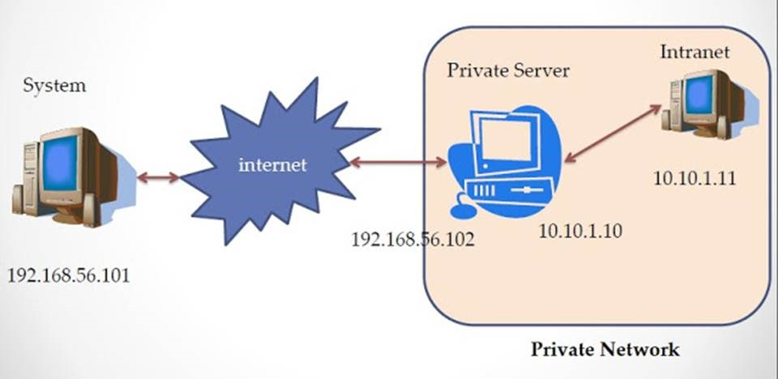
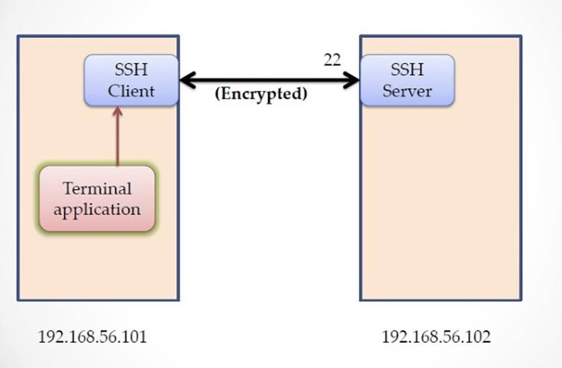
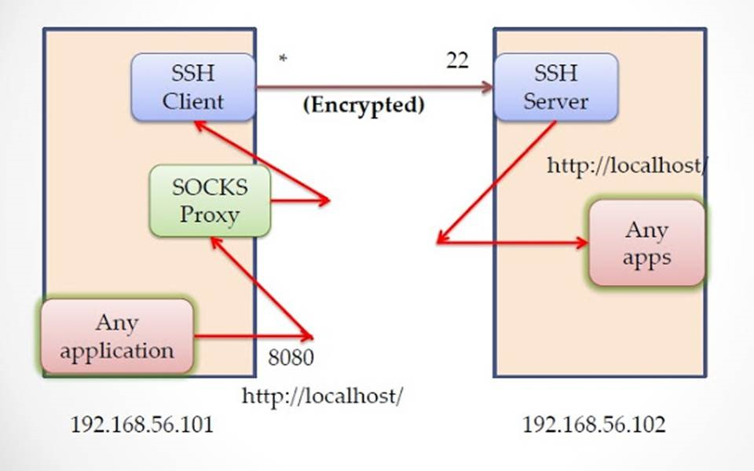
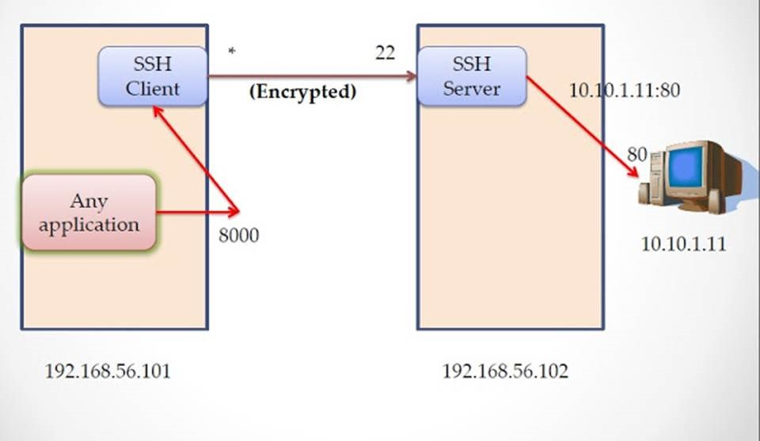
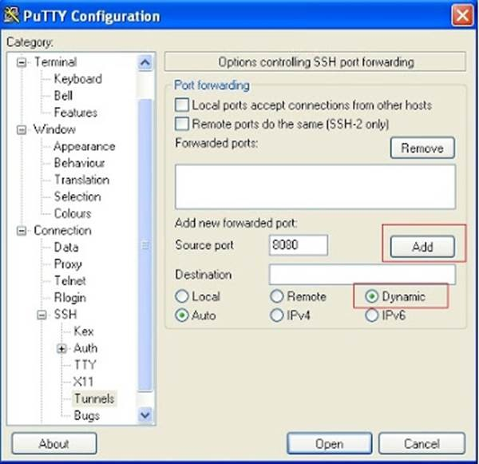
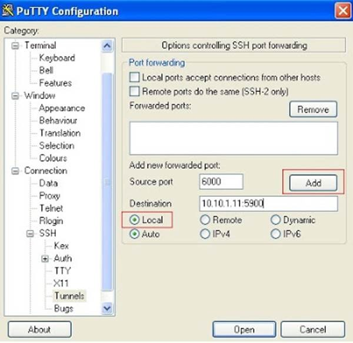
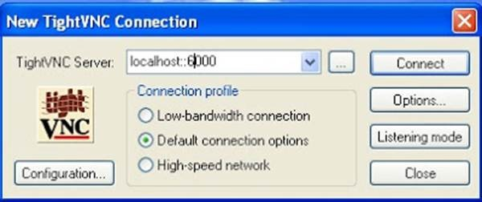

## How to do SSH Tunneling (Port Forwarding)

In this post we will see how ssh works?, what is SSH tunneling? what is important of ssh tunnels and how to setup the ssh tunnel. When SSH server is installed in machine then by default its allowed ssh tunneling.

### SSH Tunneling (Port Forwarding)

Tunneling is the concept to encapsulate the network protocol to another protocol. Here we put into SSH. So all network communication are encrypted. It also called Port Forwarding. Because in ssh tunneling we are going to bind one local port. So what are the packet we are going to send that particular port, all packets are transparently encrypt and delivered to remote system.

### What is the need for SSH Tunneling?

SSH is enough to administrate the remote system. its not enough to access the all services which are available in remote system.

### Let i describe in the following scenario



now lets consider the scenario, System (192.168.56.101) is my system its connected to internet and server its called PrivateServer (192.168.56.102) machine have two Ethernet interfaces. one is connected to Internet. and another is connected to 10.10.1.0/24 local network. Intranet (10.10.1.11) machine is part of 10.10.1.0/24 sub network.

**Note: here i mentioned local system(192.168.56.101) and remote system(192.168.56.102) are looking like local sub-net IP address. For VM purpose i used these IP address. But reality is it should be any public IP address.**

**Important Note: SSH Server daemon service is running in port 22 in all these three system and firewall is allowed to connect these system using SSH client.**

now System (192.168.56.101) can communicate to PrivateServer (192.168.56.102), because both system are connected to internet directly. But System (192.168.56.101) can't communicate to Intranet (10.10.1.11) machine, because from System (192.168.56.101) perspective 10.10.1.11 is non route able IP address. 10.10.1.11 is not public IP address, its local IP address. so we can't route the packets directly.

Now the situation like that from System(192.168.56.101) i want to access the Intranet (10.10.1.11) machine. **without modifying IP tables, redirect, like tools/services in intermediate (or) target machine. Because i m not sys-admin, so i don't have root privilege.**

One of the possible solution is first use ssh to log in into PrivateServer(192.168.56.102) and then again (nested) log in to Intranet(10.10.1.11). Yes its good idea, its works, now i can remotely administrate the Intranet(10.10.1.11). but if Intranet(10.10.1.11) offer some services like VNC, Apache httpd, smtp, pop3, squid proxy then **how we can access these services from System(192.168.56.101)?**

here its not strictly Intranet(10.10.1.11) offer these service, it may be 10.10.1.0/24 sub net any one of the machine can offer these services. Even in 10.10.1.0/24 sub-net have one intranet-website. how we can access these site from System(192.168.56.101) machine Firefox?

### The solution is SSH Tunneling or SSH Port Forwarding

#### How SSH Works
```
In terminal when we type ssh ramki@Private-Server.org then terminal application invoke the ssh
client, ssh client connect to Private-Server.org's SSH server in port 22. then both client and
server exchange the identity, public keys, cipher suite information and create one shell process
in server side. then secure channel is established between client and server. then future all
commands from 192.168.101 are go through this secure channel to server (192.168.56.102) and
execute the command and the response are come back in same secure channel.
```
For example after establish ssh, i will issue the ls command. the ls command goes to SSH client then that command encapsulate and encrypted then send to server. Server decrypt and extract the command and execute the command in shell (which is created when ssh is established), the output of ls command is not printed in shell. Its redirect the output to SSH client in same secure channel and follow the same procedure (encapsulate and encrypt). and finally Terminal application shows the output of ls command.

I think here all command is encoded to Base64 encoding before send to server and before encrypt. **(But i am not sure)**

here very important note that SSH is not disturb  the port other than 22 (or which port ssh server is running).



#### SSH Tunneling
```
SSH can work many channel's simultaneously. In normal case we use shell channel. But now we are
going to use data channel. so base concept is, in 192.168.56.101 machine ssh client bind one port
and establish secure connection with server (192.168.56.102). and create one data channel and
shell channel. (we can omit shell channel using -N option in ssh command).
```
Now In system machine ( 192.168.56.101) any application send data to that port (which one ssh client is bind), then ssh client transparently receive the data and encrypt and sent to server machine. In server  ( 192.168.56.102) receive and decrypt it and make the local call. (we discuss later)

#### SSH Tunneling types

SSH offers three types of tunneling

    (1) Dynamic Tunneling (SOCKS Proxy)
    (2) Local Port Forwarding
    (3) Remote Port Forwarding


##### Dynamic Tunneling

Command: `ssh -D <LOCAL_PORT>  <REMOTE_USER>@<REMOTE_HOST>`

For Example: `ssh -D 8080 ramki@192.168.56.102`

here -D 8080 is mention SOCKS v5 Proxy bind 8080 port in client side.
Now ssh client in 192.168.56.101 machine create one SOCKS proxy server in client side and bind one local port.then connect to 192.168.56.102 remote machine and establish secure channel.

Now all client application like Firefox, chrome, ... need to configure the proxy setting  to SOCKS proxy server localhost and port number. (check video for reference below the post)

**Note : consider server (192.168.56.102) and Intranet (10.10.1.11) both machines run Apache httpd server and bind port 80**

After configuration is completes, in Firefox now type http://localhost/, we know that in client machine (192.168.56.101) there is no service is running in port 80. but when we hit enter in browser, we can see the website of server machine (192.168.56.102).

**How we can access server website using http://localhost/ in client machine?**

we configure the proxy in browser. so browser send all HTTP request (even localhost anf 127.0.0.1) to port 8080, here SOCKS proxy is running in that port. Then socks proxy server packs our HTTP request to ssh client and encrypt and send to server. Server decrypt and extract the HTTP Request. Now in server side the HTTP request http://localhost/ is point to server machine itself. so server invoke the request. If any service is running in port 80, is called and response is send back to client using same secure channel. so browser shows server webpage in client side.



We know that from client machine (192.168.56.101), the IP address 10.10.1.11 is non routable. but now if we issue http://10.10.1.11/ in Firefox browser, its shows the 10.10.1.11 Apache server webpage.

**Advantage:**

One proxy server is enough to access the all services of remote machine and its sub-net services

**Disadvantage:**

We need to configure the Proxy settings in client application, If application doesn't support the proxy then we can't access the service.

##### Local Port Forwarding

Command: `ssh -L <LOCAL_PORT>:<REMOTE_HOST>:<REMOTE_SERVICE_PORT>  <REMOTE_USER>@<REMOTE_HOST>`

For Example: `ssh -L 8000:localhost:80 ramki@192.168.56.102`

so when we execute the command, its bind port 8000 in client side. now what are request send to port 6000 its redirect to ssh client, then encrypt and send to server machine. now server directly delivered the data to port 80.

In dynamic tunnel, server checks the packet and decide where we need to send the packet, for example http://localhost/ then its send to 80, smtp then send to 25. But in local port it always send to single port which one we mention during setup the local port forwarding `<remote hostname>:<remote service port>`.

This time in Firefox no need to configure the proxy, clear the proxy(if its present) and type in address bar http://localhost:8000/ then HTTP request is going to local port 8000, then its redirect and send to server. server directly send to port 80. (Its based on `<remote hostname>:<remote service port>`, here now `localhost:80`)


If u want to access the 10.10.1.11 machine http service then we need to setup new local port forwarding.

we can't use prior port forwarding. because old one always pointing to localhost:80.

Command: `ssh -L 8000:10.10.1.11:80 ramki@192.168.56.102`

now client side local port 8000 is redirected to 10.10.1.11:80 machine via 192.168.56.102.

In Firefox using http://localhost:8080/ we can access the 10.10.1.11 machine http service.

(For further reference check the video below. in video i show the how to access remote desktop using VNC.)



**Advantage:**

no need to configure the proxy setting

**Disadvantage:**

Each service we need to setup different local port forwarding, (i.e for example, 2 port forwarding is needed to get 192.168.56.102 and 10.10.1.11 http services).

##### Remote Port Forwarding

Remote port forwarding is same like local port forwarding. but this time we need to set the port forwarding in server side(192.168.56.102), not client side

Command: `ssh -R <CLIENT_PORT>:<SERVICE_HOST>:<SERVICE_PORT>  <CLIENT_USER>@<CLIENT_HOST>`

For Example: `ssh -R 8000:localhost:80 ramki@192.168.56.101`

here very important changes is from server we going to connect client, so ramki@192.168.56.101 here its 192.168.56.101 not 102.

when we execute this command its connect to client and create 8000 port in client side(not server side). as usual client use its local port 8000 to connect server, like local port forwarding.

**Why Remote Port Forwarding is Important?**

    Its rarely used, when we worked the machine. that machine is inside the NAT. so from outside
    no one can access it. that kind of situation physically access the machine and connect back to
    our client system (192.168.56.101) using remote port forward. then from client machine we can
    access the services.(Its seems to be little bit confusing, but its simple)

### In Windows Machine

In windows machine if want to run ssh server then there is lots of ssh servers are available [WinSSHD](http://www.bitvise.com/winsshd), [freeSSHd](http://www.freesshd.com/), [openssh](http://sshwindows.sourceforge.net/). If we want only ssh client then we can use [Putty](http://www.chiark.greenend.org.uk/~sgtatham/putty/download.html).

Suppose in System(192.168.56.101), i am using Windows then how we access the ssh tunneling.

open the putty and type the host `ramki@192.168.56.102` and select `Connection->SSH->Tunnels` (see the image), then type `8080` in source port and select `Dynamic`, if u want dynamic tunnel (Its equal to `-D 8080` in command option)



If we want local port forwarding then put any unused port `6000` in source port and destination is `localhost:80` and select `Local`. (Its equal to `-L 6000:localhost:80`)



If u want to access 10.10.1.11 machine  the remote desktop then make local port forward (check above image) and Destination is `10.10.1.11:5900`, here 5900 is the port used by vnc server. then using any vnc client (here i used tightvnc client) to connect ur local port 6000.

so mention `localhost::6000`, here we need to mention double colon ::, because in vnc client port no is specified in this manner. (Check the video )



### Bypass Firewall

This SSH Tunnel concept can be use to bypass firewall. lets consider the scenario. In server side its enable firewall and some service are running and these services are can access through localhost or same machine. but u can't access through remote machine. because firewall block the all the port except ssh port (22).

this kind of situation we use tunnel and almost all services can be accessed from outside. because firewall is rule based. In firewall perspective all traffic is goes through port 22. so its allowed. but internally we made tunnel and access all services.

#### How to prevent SSH Tunnel

Open the ssh server config file /etc/ssh/sshd_config then set the parameter **`AllowTcpForwarding no`** then restart ssh service. then they not allow the ssh tunnel service, but still we can access ssh shell service.

But in ssh man page they clearly mentioned

**Note that disabling TCP forwarding does not improve security unless users are also denied shell access, as they can always install their own forwarders.**

so still we can use use ssh tunnel even though we set **`AllowTcpForwarding no`**.

I hope everything is clear. If any misunderstanding please let me know.
