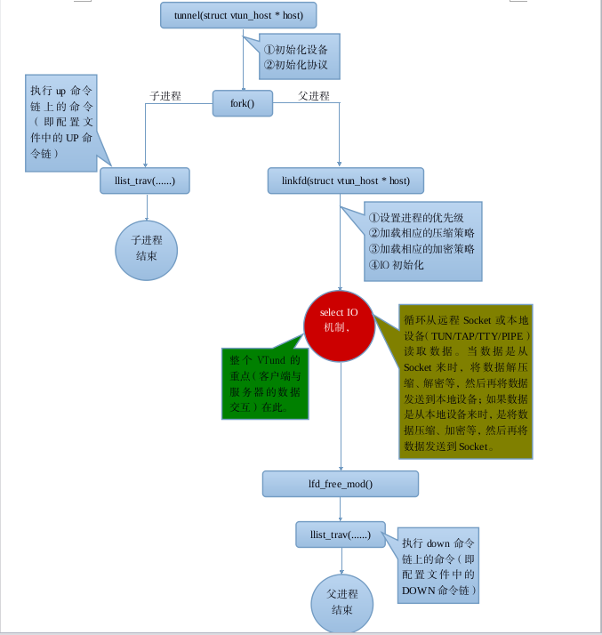

VTun Usage
==========
TODO

VTun src Analysis
=================

本文目标立足于代码层次的大致流程分析，但不会一句一句地分析源代码。如下图：

### 注

（1）`Vtun`经过编译之后，生成的可执行程序是`vtund`。`Vtund`是个一般程序，运行在用户空间，和普通进程没有什么太大的区别。

（2）`Vtund`以 `-s` 选项启动时，则是服务器模式；如果没有 `-s` 选项，则是客户端登录模式。

（3）当客户端和服务器都运行到`tunnel`函数时，以后的代码则是二者共用的、相同的，换句话说就是，在`tunnel`以后的代码，不再区分到底是客户端还是服务器端，其处理是一样的。

（4）在`Vtund`启动时（不管是以`服务器方式`还是以`客户端方式`），会读取配置文件，从配置文件中构建一个主机链表`host_list`（一个全局变量），其中保存了在配置文件列出的所有主机的信息。

（5）当`Vtund`以客户端启动时，在`main`主函数中会首先在`host_list`主机链表中查找在命令行提供的主机名（即是登录名）。如果找不到，则退出（即登录失败）；如果查找到，则会将该主机信息保存到全局变量`lfd_host`中（但`lfd_host`是个指针，可以通过它来访问主机信息）。

（6）当`Vtund`以服务器启动时，当认证客户端信息时，它也会在`host_list`中查找客户端提供的主机名。如果找不到，则认证失败；如果找到了，则会将该主机信息保存到全局变量`lfd_host`中，同时会清空`host_list`链表。

（7）`Vtund`中有两个全局变量——`vtun`和`host_list`；配置文件分为三种类型——`options`、`default`和`XXX`，其中`XXX`是主机名（可以有无限多个）。`options`是设置一些一般属性，它的值会被读取到`vtun`全局变量中；每个主机信息都有一些属性信息，当在`XXX`中没有给出时，则使用`default`中的属性信息，换句话说就是，_**default是XXX在没有给出属性信息时的默认信息**_。**`XXX主机信息会被构建一个主机链表放在host_list全局变量中，当查找主机（find_host）时，凡是不匹配的主机信息都会被清除`**。

（8）根据`(6)`和`(7)`，我们会发现，一个`Vtund服务器`对应一个`Vtund客户端`，换句话说就是，**`一个Vtund服务器只能接受到一个客户端的登录，多个Vtund客户端不能登录到同一个Vtund服务器中`**。

（9）在配置文件中的主机信息中，可以有`up`和`down`命令链，`up`命令链用于在建立隧道之前初始化一些设备，`down`命令链用于在结束隧道之后释放一些初始化设备时占用的设备资源。

（10）`Vtun`支持`TTY`、`PIPE`、`TUN`、`TAP`四种设备；`Vtund`不会在一启动之后就打开相应的设备，而是在客户端连接上服务器并认证成功后，在`tunnel`函数中建立隧道时打开的；一旦打开设备，就几乎等同于建立了隧道——随时等待 `select IO机制`通知`Vtund`进程数据可读。隧道的大致含义是通过Socket把压缩、加密之后的数据在两台计算机之间进行传递，这就相当于在两台计算机之间建立了一条只有这两台计算机才能识别的安全通信信道。

（11）`Vtund`在以`服务器方式`启动时，如果认证失败，Vtund的退出并不意味着整个Vtund程序退出了，而是与客户端的一次连接结束了：每当客户端连接到Vtund服务器时，服务器都会fork一个新的子进程来与客户端交互，退出的也就是这个子进程，而主进程仍然没有结束，而是在监听着客户端的到来。但是，有个问题（疑问？？），在第一个客户端连接时，VTund服务器端已经把 host_list 全局变量给清空了，后续无论有多少个客户端来到来，都是认证失败。不知道这就有什么意义！

### 参考

Tun/Tap interface tutorial：http://backreference.org/2010/03/26/tuntap-interface-tutorial/ 。
