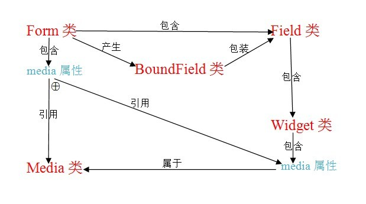

Django Form工作流程
=================

###该库包含以下概念
####（1）Widget
    与HTML表格面板相关的类，如：<input typ="text" />。

####（2）Field
    一个类，做一些数据验证，如：EmailField确保该域中的数据是一个合法的email地址。

####（3）Form
    一个Field的集合类。

####（4）Form Media
    引发一个Form所必需的CSS、JavaScript资源。

####（5）BoundField
    一个对Field类的包装，由Form产生。

---

在以下各类说明中，不带括号的则是属性，带括号但不带参数的则是无参数的方法，带括号且括号中有参数的则是带相应参数的方法，带括号且括号中有省略号的则是方法（其参数省略或有多个参数）。


## 一、Form类
### is_bound：
    判断Form是否绑定数据。

### is_valid()
验证表格中的数据是否正确。工作流程：

    1）Form.is_bound
    2）Form.errors -> Form._get_errors() -> Form.full_clean()
                                            | 1、Form._clean_fields() -> Field.clean(value)
                                            |                            | 1、value = Field.to_python(value)
                                            |                            | 2、Field.validate(value)
                                            |                            |    说明：使用Field本身的提供的验证机制。
                                            |                            | 3、Field.run_validates(value)
                                            |                            |    说明：使用默认的验证机制（默认为无）
                                            |                            |         和初始化Field对象时传递的验证机制
                                            |                            | 4、return value
                                            |   说明：Form._clean_fields()将Field.clean(value)的返回值保存在
                                            |        Form.cleaned_data字典中；如果Field.clean()抛出异常，
                                            |        则将异常错误信息记录在Form._errors字典中。
                                            | 2、Form._clean_form() -> Form.clean()
                                            | 3、Form._post_clean()
### as_table()
    Form._html_output(...) -> Form.__getitem__(name) 【返回BoundField实例对象】-> 产生HTML代码

### as_ul()
    Form._html_output(...) -> Form.__getitem__(name) 【返回BoundField实例对象】-> 产生HTML代码

### as_p()
    Form._html_output(...) -> Form.__getitem__(name) 【返回BoundField实例对象】-> 产生HTML代码

### media
产生CSS、JS外部引用代码。工作流程：

    Form.fields["field_name"].widget.media.__str__() -> Media.render()
    其中，media是Media类实例。

### is_multipart()
判断表格中是否含有文件或图片域。工作流程：

    Form.fields["field_name"].widget.need_multipart_form

### hidden_fields()：
一个列表，包含着带有“`hidden`”属性的域。

### visible_fields()
一个列表，包含着不带有“`hidden`”属性的域。

### __getitem__(name)
从表`Form`类中得到一个域，返回值是个`BoundField`实例对象。

### errors
一个字典，包含着相应域的错误信息。工作流程：

    Form._errors属性值。

### clean()
返回`Form.cleaned_data`属性的值。

### cleaned_data
一个字典，包含着提交到服务器的、相应域的值。

## 二、BoundField类
### __str__()
    BoundField.as_widget(...)

### __iter__()
    BoundField.field.widget.subwidget(...，...)
    产生SubWidget实例对象（SubWidget对象只有__str__()方法）

### __getitem__(idx)
    BoundField.__iter__

### errors
    BoundField._errors() -> BoundField.form.errors.get(...，...)

### as_widget(...)
    BoundField.field.widget.render(...)

### as_text(...)
    BoundField.as_widget(...)

### as_textarea(...)
    BoundField.as_widget(...)

### as_hidden(...)
    BoundField.as_widget(...)

### value()
返回当前域提交到服务器的值。

### is_hidden
判断当前域是否被隐藏（即带有hidden属性）。工作流程：

    BoundField._is_hidden() -> BoundField.field.widget.is_hidden

### label
当前域的标签值。

### label_tag()
返回label面板，即带有label标签的HTML代码，如：
```html
<label for="id_XXX"> label_value </label>。
```

### help_text
帮助文本。工作流程：

    BoundField.field.help_text 或空字符串。

### field
Form类对象中的Field类实例。

### form
Form类对象。


## 三、Field类
Field类几乎被`BoundField`封装，在此省略。

## 四、Widget类
### __init__(attrs=None)
初始化函数，具有一个参数，该参数是一个字典，内容是该`Widget`产生的HMTL标签的属性和属性值。

### attrs
即`__init__`函数中的`attrs`参数值。

### render(...)
产生相应的HTML标签代码。


## 五、Media类
### __getitem__(name)
产生新的`Media`对象。

### __str__()
    Media.render()

### render()
产生`Form`或`Widget`所依赖的`CSS`、`JS`外部引用。依次调用`Media.render_js()`和`Media.render_css()`。

### render_js()
产生`Form`或`Widget`所依赖的`JS`外部引用。

### render_css()
产生`Form`或`Widget`所依赖的`CSS`外部引用。


## 六、各类间的关系



## 七、Django Form 的使用
在Django中，`HTML form`的使用有多种方式：

    (1) 不使用Django中的Form模块，而是像PHP中那样，直接编写HTML form表格代码；
        在服务器端，通过request.POST、request.FILES等来获取form表数据。这种方式不利于使用Rich Text Editor（RTE），
        尤其RTE中的图片、文件、附件上传等功能。
    (2) 完全使用Django中Form模块：在View（视图）端，直接使用{{ form.as_p }}或{{ form.as_table }}或{{ form.as_ul }}
        等来自动产生所有的域代码；在服务器端，把request.POST（以及request.FILES）参数传递给Form类，
        来构造一个Form实例并验证、处理数据。
    (3) 同（2），但在View端，不是直接使用{{ form.as_p }}或{{ form.as_table }}或{{ form.as_ul }}等，
        而是从form实例对象中得到每个field（该类型是BoundField——对Field类的封装），分别对每个域进行特定的布局。
        这种方式能够根据实际情况进行独特布局。
    (4) ......


## 八、ModelForm类
有时候，由`form`提交的数据需要保存到数据库中。 所以Django就实现了一个类`ModelForm`，该类将`Form`和`Model`连接起来，它即是个Form类，又具有Model类功能（即将数据保存到数据库中）。在使用该类时，就像其它Form类一样，不过，在最后调用`ModelForm.save()`方法——将`form`提交的数据保存到数据库中。

`ModelForm`对此情况提供了简化操作。但也可以不使用这个类来完成数据的保存：首先，像其它Form一样正常地将`form`提交的数据提取出来，然后把这些数据传递给Model类，来构造一个Model实例对象，最后调用Model实例对象的`save`方法即可。此方法也可完成ModelForm的功能。
