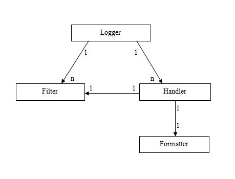
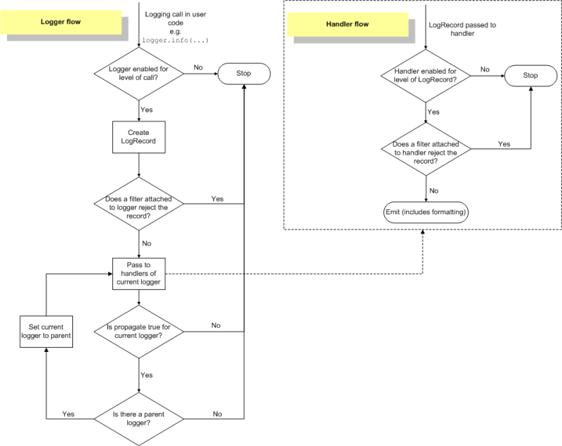

Python日志系统Logging
===================

这篇文章不讲述如何使用Python标准库中的`logging`模块，而是探讨该模块如何工作，即工作流程。如果想找`logging`模块的使用介绍，可以看Python官方的标准文档或教程，也可以百度或Google一下。

在Python中的`logging`模块中，有四个最重要的东西，即**`Logger`**、**`Handler`**、**`Filter`**、**`Formatter`**四个类。注：其中，`Handler`是个抽象类，不能直接使用，必须有其它的子`Handler`类来继承它，关于这点，请往下看。

## 1、总体介绍
### (1) Logger
一个界面，程序员在写应用程序时直接使用它来记录日志信息。该类无需自定义重载。

### (2) Handler
处理器，它用于将由`Logger`创建的日志信息发送到相应的目的地；不同的`Handler`种类（继承自Handler抽象类）发送到不同的目的地，比如：`FileHandler`将日志写入到文件中，`StreamHandler`将日志输出到控制台（默认），`SMTPHandler`将日志以邮件的形式发送出去，`SocketHandler`将日志用TCP Socket发送出去，而`DatagramHandler`将日志用UDP数据报发送出去，等等。以上都是logging已经实现的Handler，另外，也可以自己定义自己的Handler，只要继承自Handler抽象类并重载`emit`方法即可。

### (3) Filter
过滤器，表明一个日志信息是否要被过滤掉而不记录；它提供了一个好的、细粒度的日志控制。可以重载Filter来自定义自己的Filter，此时要重载Filter类的`filter`方法。

### (4) Formatter
格式化工具，在Handler处理器把日志信息发送出去之后，会使用该类对象格式日志信息，即该类指定日志信息最终被输出的格式。该类无需自定义重载。

## 2、相互关系
（1）**`Logger`**可以包含一个或多个**`Handler`**和**`Filter`**，即**`Logger`**与**`Handler`**或**`Fitler`**是一对多的关系；

（2）**`Handler`**可以包含一个或多个**`Filter`**，但只能包含一个**`Formatter`**，即**`Handler`**与**`Filter`**是一对多的关系，与**`Formatter`**是一对一的关系；

（3）**`Filter`**可以多次被包含在**`Logger`**和**`Handler`**中；

（4）**`Formatter`**只能被包含在**`Handler`**中，不能被包含在**`Logger`**中，并且只能有一个被包含在**`Handler`**中。

### 说明
不带箭头端是包含者，带箭头端是被包含者；箭头线旁边的`1`和`n`表示箭头线两端的对象之间对应关系（一对多或一对一），此处的“`一对多`”指的是一个对象可以包含多个另外一个对象，“`一对一`”指的是一个对象只能包含一个另外一个对象。

## 3、常用功能
### (1) Logger
可以设置`Logger`上的日志等级（`Logger.setLevel`方法）、添加或移除过滤器（`Logger.addFilter`和`Logger.removeFilter`方法）、添加或移除处理器（`Logger.addHanlder`和`Logger.removeHandler`方法）以及一些日志记录工具（`Logger`类的`debug`、`info`、`error`、`warning`、`critical`、`log`等方法）。

### (2) Handler
可以设置Handler上的日志等级（`Handler.setLevel`方法）、设置Formatter（`Handler.setFormatter`方法）、添加或移除过滤器（`Handler.addFilter`和`Handler.removeFilter`方法）。

### (3) Fitler
默认的Filter类，需要获取一个字符串类型的参数，该参数是用来判断日志信息是否允许被记录。Filter类中有一个`filter`方法，该方法返回真则表示日志信息被记录，否则将丢弃，不再处理。

如果该参数为空字符串，则`filter`方法返回真；否则，该字符串参数表示着一个Logger（每个Logger对象都有一个用点分隔的字符串名字），只有当前处理日志信息的Logger对象是该字符串参数指定的Logger对象或子对象，`filter`方法才返回真，其它情况返回假。

### (4) Formatter
Formatter在实例化时，需要传递至少一个参数、至多三个参数

    第一个参数代表格式化字符串，
    第二个参数代表日期格式，
    第三个参数表示格式化字符串中将要使用哪种占符符
    (“%”表示旧的Python格式化方式，“{”表示新的Python格式化方式，“$”表示模板格式化方式)。

## 4、logging工作流程
    (1) 第一次导入logging模块或使用reload函数重新导入logging模块，logging模块中的代码将被执行，
        这个过程中将产生logging日志系统的默认配置。
    (2) 自定义配置（可选）。logging标准模块支持三种配置方式：dictConfig、fileConfig、listen。
        其中，dictConfig是通过一个字典进行配置Logger、Handler、Filter、Formatter，fileConfig则是通过一个文件进行配置，
        而listen则监听一个网络端口，通过接收网络数据来进行配置。当然，除了以上集体化配置外，也可以直接调用Logger、
        Handler等对象中的方法在代码中来手工进行单独配置。关于字典配置和文件配置的格式，请参见Python logging官方文档。
    (3) 使用logging模块的全局作用域中的getLogger函数来得到一个Logger对象（其参数即是一个字符串，表示Logger对象的名字，
        即通过该名字来得到相应的Logger对象）。
    (4) 使用Logger对象中的debug、info、error、warning、critical、log等方法记录日志信息，其处理流程如下：
        1> 判断日志的等级是否大于Logger对象的等级：如果大于，则往下执行；否则，流程结束。
        2> 产生日志。
           第一步，判断是否有异常，如果有，则添加异常信息；
           第二步，处理日志记录方法（如debug、info等）中的占位符，即一般的字符串格式化处理。
        3> 使用注册到Logger对象中的Filters进行过滤。如果有多个过滤器，则依次过滤；只要有一个过滤器返回假，则过滤结束，
           且该日志信息将丢弃，不再处理，而处理流程也至此结束。否则，处理流程往下执行。
        4> 在当前Logger对象中查找Handlers，如果找不到任何Handler，则往上到该Logger对象的父Logger中查找；
           如果找到一个或多个Handler，则依次用Handler来处理日志信息。但在每个Handler处理日志信息过程中，会首先判断日志
           信息的等级是否大于该Handler的等级，如果大于，则往下执行（由Logger对象进入Handler对象中）；否则，处理流程结束。
        5> 执行Handler对象中的filter方法，该方法会依次执行注册到该Handler对象中的Filter。如果有一个Filter判断该日志信息为假，
           则此后的所有Filter都不再执行，而直接将该日志信息丢弃，处理流程结束。
        6> 使用Formatter类格式化最终的输出结果。 注：Formatter同上述第2步（即2>）的字符串格式化不同，它会添加额外的信息，
           比如：日志产生的时间、产生日志的源代码所在的源文件的路径等等。
        7> 真正地输出日志信息（到网络、文件、终端、邮件等）。至于输出到哪个目的地，由Handler的种类来决定。

