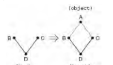

五、类
=====

在没有讲述本节之前，先澄清一个事实：在class语句中定义方法时，我们在第一个参数位置处问题写一个`self`，但这不是强制的，这是一个约定（Python官方的约定），是为了告诉编写者或其他查看本代码的人——这是调用本方法的对象本身。当然，你可以把`self`改成任意合法的标识符，但你要记着，不管你把它改成什么样的标识符，Python在执行该方法时，都把调用该方法的对象本身传递给它，换句话说，你在使用它时，要把它当成调用该方法的 对象本身，而不是其它的什么；不管你把它当成什么，反正Python语言本身会把它当成调用该方法的对象本身。但是，在调用该方法时，你不能把调用该方法的对象传递给它，因为这是Python默认在后台进行传递的，是Python的约定的任务，而不是你的任务。请注意它！此外，还有一个`cls`，和`self`作用相似，但它是对类自身的名字的约定。

1、同def语句一样，class语句也是一个执行语句；当执行class语句时，Python将创建一个该类型的类型对象，然后把该类型对象赋值给类名，由类名来引用；当执行class语句时（不是调用该类），Python会从头至尾执行其主体内的所有语句，在这个过程中，进行的赋值运算会在这个类作用域中创建变量名，从而成为对应的类对象内的属性。

注：类主体中的方法可以理解为函数；“`Python会从头至尾执行其主体内的所有语句`”的意思是执行那些class主体中的顶层的赋值语句和定义的方法（相当于函数，也可以认为是一个赋值语句），以便建立类对象的内置属性，而方法中的语句并不执行；对于类主体中的方法中的主体代码，只有当用该类型对象创建对象后，通过该对象调用该方法，才执行该方法中的主体代码。

2、不像C++等其他编程语言，Python中的类对象也有属性，称为类本身的属性，它是由class语句内的顶层的赋值语句（包括方法）产生的，该属性存储在类对象的命令空间当中。

3、由类对象创建的该类型的对象也有属性，它不是由类对象创建的，而是当该对象调用类中的方法时，由该方法中的self（指该对象本身）创建的。另外，对象并不保存类的属性，但可以引用类的属性（其原因请参见下面）；而类对象却不能引用对象的属性。换句不太十分准确的话，类对象的属性是类对象和所有的由该类对象创建的对象所共享。

4、我们再反向说明一下

**`类对象的属性是在class语句中的顶层做赋值运算（包括方法）来创建的，而对象的属性是通过在方法中引用 self.attribution，并为其提供一个赋值操作来创建的，即在方法内对self属性做赋值运算会产生每个实例自己的属性。对self的属性做赋值运算，会创建或修改实例内的数据，而不是类的数据。`**

5、**`class语句内的顶层的赋值语句（不是在def之内）会产生类对象中的属性`**。从技术角度来讲，class语句的作用域会变成类对象的属性的命名空间。因此，类中的所有方法（实例方法、类方法、静态方法）都是类的属性，而不是实例的属性。

6、每个实例对象继承类的属性并获得了自己的命名空间。由类所创建的实例对象是新命名空间。

7、不像C++等其他编程语言，在Python中，不管是类对象的属性还是对象的属性，在其创建之后，还可以动态的修改、增加、删除其属性，而且你无法对这种现象做出限制；换句话说，你没有任何办法来防止他人在使用它的过程中动态地修改、增加、删除它的属性。在Python中，默认所有的属性都是可读取的。

8、对实例的属性进行赋值运算会在该实例内创建或修改变量名，而不是在共享的类中。因此，我们无法通过对实例对象引用的属性直接进行赋值通常的情况下，**`继承搜索只会在属性引用时发生，而不是在赋值运算时发生：对对象属性进行赋值总是会修改该对象，除此之外，没有其他的影响`**。附加在类上时，变量名共享的（类似于C++中的静态成员变量）；附加在实例上时，变量名是属于每个实例的数据，而不是共享的行为或数据。

9、理论的角度讲，类（和类实例）是可改变的对象。所有从类产生的实例都共享这个类的命名空间，任何在类层次所做的修改都会反映在所有实例中，除非实例拥有自己的被修改的类属性版本。
修改可变的类属性也可能产生副作用。如果一个类属性引用一个可变对象，那么从任何实例来源处修改该对象都会立刻影响到所有实例。

10、类只是独立完备的命名空间，只要有类的引用值，就可以在任何时刻增删或修改其属性。

11、命名空间对象的属性通常都是以字典的形式实现的，而类继承树（一般而言）只是连接至其他字典而已。另外，值得注意的是，**`任何对象（无论是内置还是自定义创建的）都有一个__dict__属性，它是一个字典，是用来保存该对象的属性及其值的，我们平常所使用的object.attribution，在底层上，Python会把先转换成object.__dict__[attribution]字典（可能的话会进行继承搜索），然后通过键引用其值。`**

12、因为属性实际上是Python的字典键，所以其实有两种方式可以读取并对其进行赋值：通过点号运算或者通过键索引运算。不过，这种等效关系只适用于实际中附加在实例上的属性。因为属性点号运算也会执行继承搜索，所以可以存取命名空间字典索引运算无法读取的属性。

13、**`内置的instance.__class__属性提供了一个从实例到创建它的类的链接`**。类反过来有一个__name__（就像模块一样），还有一个__base__序列，提供了超类的访问。内置的object.__dict__属性提供了一个字典，带有一个键/值对，以便每个属性都附加到一个命名控件对象（包括模块、类和实例）。因此，**`对象可以通过instance.__class__.__dict__[attribution]来引用类对象的属性，甚至可以通过instance.__class__.__base__.dict__[attribution]来引用基类对象中的属性`**。

14、每个object.attribute都会开启新的独立搜索。_**继承搜索只发生在引用时，而不是赋值时**_。`每次使用object.attr形式的类表达式时（object是实例或类对象），Python会从头至尾搜索命名空间树，先从对象开始，接着是类对象，最后是超类对象（新式是广度优先，旧式类是深度优先，看下文），寻找所能找到的第一个attr为止`。这包括在方法中对self属性的引用。因为树中较低的定义会覆盖较高的定义，继承构成了专有化的基础。

15、类、实例属性的搜索算法（MRO，Method Resolution Order，方法解析顺序）

**（1）概念：**

    旧式类：又称传统类，是Python2中的默认类。
    新式类：是Python3的默认类。在Python2中，继承自 object 基类的子类都是新式类；在Python3中，所有的类都是新式类。

在设计和功能上，新式类要比旧式类要好，建议所有的类都使用新式类。

**（2）来由：**


在旧式类中，类和类型是两个不同的概念，这就造成了用户无法继承基本类型（如 int、float 等）。因此，在 Python 2.2 中，Python 首次引入了新式类，将类和类型统一了起来，即类和类型是同一个概念。在新式类中，所有的类都是 object 的子类。

**（3）搜索算法：**

    在旧式类中，实例属性的搜索是按深度优先进行的，即从上到下，从左到右，递归地搜索。
    在新式类中，实例属性的搜索是按广度优先进行的，即从左到右，从上到下，递归地搜索。

**（4）更新搜索算法的原因：**

将深度优先算法作为实例属性的搜索策略，完全没有问题。但是，有人认为，广度优先更合理一些，因为在亲缘关系上，广度优先搜索出来的属性是距离实例最近的。其实，这并不是最主要的原因，而是一个旁带的原因。最主要的原因是新式类与旧式类之间的继承结构模型发生了变化。

    在旧式类中，没有像 object 这样的公共基类，因此其继承结构模型可以简单地认为是一个未封闭的三角形（笔者依据下文例子命名的）。
    在新式类中，所有的类都是 object 的子类，因此其继承结构模型可以简单地认为是一个封闭的菱形（笔者依据下文例子命名的）。

举例：
```python
class B: pass
class C: pass
class D(B, C): pass
```
上述代码在旧式类和新式类下的继承结构转变如下图：



在新式类中，如果继续使用深度优先算法，大部分情况可能是没有问题的，在某些情况下，会出现一些小问题。因此，深度优先算法不能再新式类继续使用，于是，广度优先被使用。

另外，**`在新式类中，每个类都有一个__mro__属性，它表示了搜索该类型实例的属性时的查找顺序；它的值是个元组，包含了所有的基类，直到object，并删除重复的基类`**。

16、**`在构造时，Python会找出并且只调用一个__init__。如果要保证子类的构造函数也会执行超类构造时的逻辑，一般必须通过类明确地调用超类的__init__方法。`**

17、对于类中方法的调用，Python有两个方式：一个是`class.method(instance, args ...)`，另一个是`instance.method(args ...)`。_**在底层上，Python会自动地将`instance.method(args...)`调用方式转换为 `class.method(instance, args...)`调用方式**_。一般来说，这两种方式使用哪一种都可以；但是，这两种方式还是有区别的，前一种方式只会在本类对象的命名空间中查找该 method方法，如果找不到，就宣告调用失败；而后一种方式首先在该类对象的命名空间中查找method方法，如果找不到，就继续向上、向其基类中查找，直到查到object类（所有类的父类、基类），如果还是找不到，才宣告失败；如果找到了，就调用相应的方法。

18、类中方法其实和普通函数是一样的，即同样遵守和普通函数一样的规则。类中的方法和普通函数是有区别的，其区别仅在类中的类方法或实例方法会比普通函数多传递一个参数（该参数位于所有参数的第一个上，对于类方法——用`classmethod`内建装饰器来修改，它是创建实例的类对象；对于实例方法——没用`classmethod`或`staticmethod`来装饰的，它是由类创建的实例对象本身）。但是，类中的静态方法和普通函数几乎是完全一样，可以把该静态方法当成普通函数来使用。
