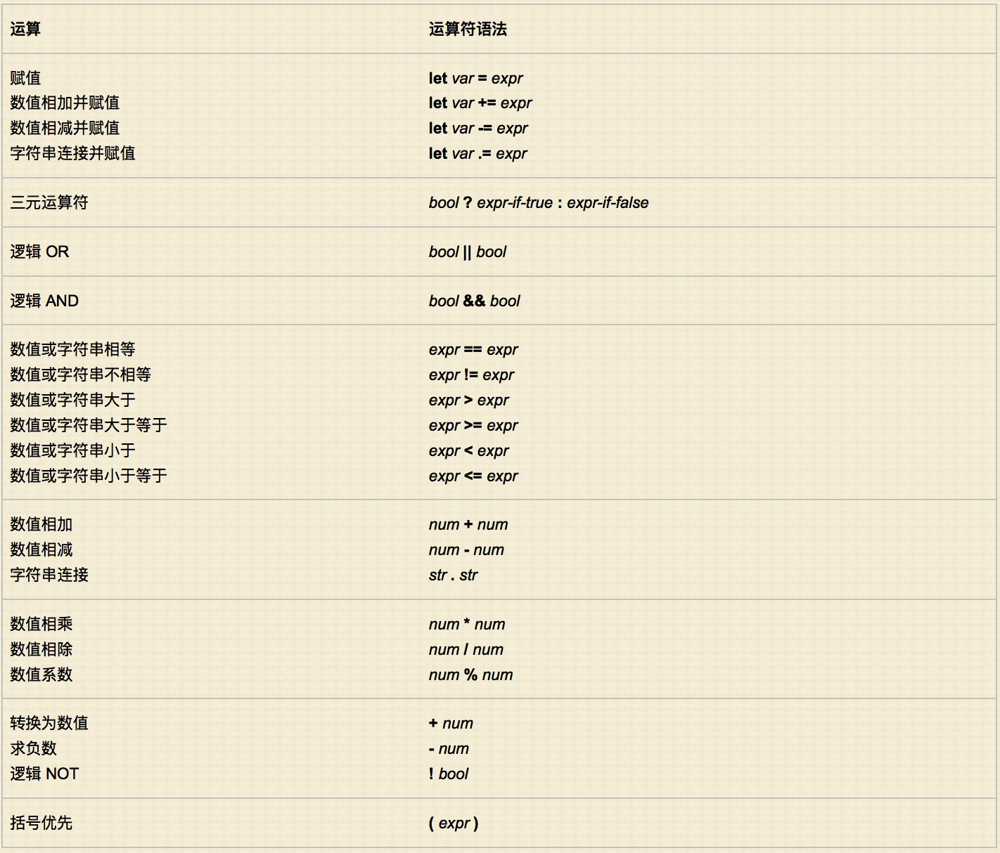

使用脚本编写 Vim 编辑器
===================

本节摘录自：http://www.ibm.com/developerworks/cn/linux/l-vim-script-1/ 。

## 优秀的文本编辑器
有这样一则老笑话：如果 Emacs 拥有一款优良的文本编辑器，那么它将是一个优秀的操作系统，相反，如果 vi 拥有一个不错的操作系统，那么它将是一款非常出色的文本编辑器。这个笑话反映了 Emacs 有一个一直比 vi 好的策略优势：一种嵌入式扩展编程语言。实际上，Emacs 用户一直乐于忍受引入了 RSI 的控制问题，并且愿意在 Lisp 中编写他们的扩展，这个事实展示了内置扩展语言的强大优势。

现在，vi 程序员不再需要向 Emacs 的插入式脚本语言投去嫉妒的眼光。我们最喜欢的编辑器现在也可以使用脚本进行更改 — 并且比 Emacs 更友好。

在本系列文章中，我们将考查最受欢迎的 vi 新版本，即 Vim 编辑器，以及 Vim 提供的简单但功能极其强大的脚本语言。第一篇文章将探究 Vim 脚本的基本构建块：变量、值、表达式、简单流控制以及 Vim 为数众多的实用函数。

我将假设您已经接触过 Vim 并且熟悉它的交互式特性。如果还没有这些基础的话，Vim 网站和各种在线资源以及一些书籍都是非常不错的学习起点，或者只需在 Vim 内部输入 `:help` 获得帮助。

如没有特别说明，本系列文章的所有示例将假设您使用的是 Vim 7.2 版本或更高版本。如果要检查所使用的 Vim 的版本，只需要像下面这样调用编辑器：

```shell
vim --version
```

或者在 Vim 内输入 `:version`。如果使用的是旧版本的 Vim，强烈建议您升级到最新版本，因为早期版本并不支持我们将要讨论的大部分 Vimscript 特性。


## Vimscript

Vim 的脚本语言被称为 Vimscript，是典型的动态命令式语言，提供了大多数常见的语言特性：`变量`、`表达式`、`控制结构`、`内置函数`、`用户定义函数`、`一级字符串`、`高级数据结构`（列表和字典）、`终端和文件 I/O`、`正则表达式模式匹配`、`异常`和`集成调试器`。

如果要通过内置的帮助系统读取 Vim 自带的 Vimscript 文档，在任何 Vim 会话内部输入下面的内容即可：
```vim
:help vim-script-intro
```
然后阅读这些文档。

## 运行 Vim 脚本

有许多种方法可以执行 Vim 脚本命令。最简单的方法就是将命令放入到一个文件（通常使用 .vim 作为扩展名），然后执行该文件，方法为在一个 Vim 会话内部对文件执行 `:source`：
```vim
:source /full/path/to/the/scriptfile.vim
```
或者，可以在 Vim 命令行中，在冒号后面直接输入脚本命令。例如：
```vim
:call MyBackupFunc(expand('%'), { 'all':1, 'save':'recent'})
```
但很少有人这样做。毕竟，脚本的一个重要方面就是减少 输入的内容。因此，调用 Vim 脚本的最普通的方法就是创建新的键盘映射，如下所示：
```vim
:nmap ;s :source /full/path/to/the/scriptfile.vim<CR>
:nmap \b :call MyBackupFunc(expand('%'), { 'all': 1 })<CR>
```

这些命令通常被放在主目录的 `.vimrc` 初始化文件中。随后，当处于 Normal 模式（就是说不能插入文本）时，关键序列 `;s` 将执行指定的脚本文件，而 `\b` 序列将调用 `MyBackupFunc()` 函数（该函数大概也是在 `.vimrc` 文件的某个位置中定义的）。

本文中的所有 Vimscript 示例使用各种类型的键映射作为触发器。在后续文章中，我们将探究另外两个常见调用技巧：从 Vim 命令行中以冒号形式运行脚本，并使用编辑器事件自动触发脚本。


## 语法示例

Vim 提供有非常复杂的语法突出显示功能，该特性可以通过内置 `:syntax enable` 命令启用，并使用 `:syntax off` 命令关闭。

但是，在每次需要启用或关闭语法突出显示功能时，都需要输入 10 个以上的字符，这一点令人很恼火。相反，您可以在自己的 `.vimrc` 文件中添加以下 Vimscript 代码行：

### 清单 1. 启用或关闭语法突出显示功能
```vim
function! ToggleSyntax()
    if exists("g:syntax_on")
        syntax off
    else
        syntax enable
    endif
endfunction

nmap <silent> ;s :call ToggleSyntax()<CR>
```
这些代码的作用是：在 Normal 模式下，每当输入命令时，`;s` 序列将开启或关闭语法突出显示功能。让我们看看这段脚本的每个部分。

显然，第一个代码块是一个函数声明，定义了名为 `ToggleSyntax()` 的函数，它没有包含任何参数。这个用户定义函数首先调用名为`exists()`的 Vim 函数，为它传递一个字符串。`exists()` 函数确定是否定义了一个具有由字符串定义的名称的变量（在本例中为全局变量 `g:syntax_on`）。

如果是的话，if 语句将执行一个 `syntax off` 命令；否则它将执行 `syntax enable` 命令。由于 `syntax enable` 定义了 `g:syntax_on` 变量，而 `syntax off` 解除了变量定义，反复调用 `ToggleSyntax()` 函数将不停地启用和禁用语法突出显示。

剩下的工作就是设置一个关键的序列（本例中为 `;s`）来调用 `ToggleSyntax()` 函数：
```vim
nmap <silent> ;s :call ToggleSyntax()<CR>
```
nmap 表示 “normal-mode key mapping”。nmap 之后的 `<silent>` 选项使得映射不能回传它所执行的任何命令，确保新的 `;s` 命令默默地完成它的工作。它的职责就是执行下面的命令：
```vim
:call ToggleSyntax()<CR>
```
这就是希望忽略返回值时，在 Vimscript 中调用函数的方式。

注意，最后的 `<CR>` 序列是字符 `<`、`C`、`R` 和 `>` 的字母序列。Vimscript 将它与回车符等同起来。事实上，Vimscript 理解非打印字符的许多其他类似的表示。例如，可以创建一个键盘映射，使空格键起到下翻键的功能（和在大多数 Web 浏览器中一样），如下所示：
```vim
:nmap <Space> <PageDown>
```

通过在 Vim 内输入 `:help keycodes`，可以看到这些特殊符号的完整列表。

还需注意，`ToggleSyntax()` 能够直接调用内置 `syntax` 命令。这是因为 Vim 中的每个内置冒号命令都自动成为 Vimscript 中的一个语句。例如，要为使用 Vim 编写的文档更方便地创建中心标题，可以创建一个函数，将当前行中的每个字母大写，将整个行集中在一起，然后跳到下一行，如下所示：

### 清单 2. 创建中心标题
```vim
function! CapitalizeCenterAndMoveDown()
    s/\<./\u&/g     " Built-in substitution capitalizes each word
    center          " Built-in center command centers entire line
    +1              " Built-in relative motion (+1 line down)
endfunction

nmap <silent> \C :call CapitalizeCenterAndMoveDown()<CR>
```

## Vimscript 语句

如此前的例子所示，**`Vimscript 中的所有语句都以换行符结尾`**（和 shell 脚本或 Python 一样）。**`如果需要跨多个行运行一条语句，只需要使用反斜杠作为续行符。在表示续行时，反斜杠很少被放在行的末尾，而是放在延续行的开始处`**：

### 清单 3. 使用反斜杠作为续行符
```vim
call SetName(
\    first_name,
\    middle_initial,
\    family_name
\)
```

**`通过使用竖线做分隔符，可以将两个或更多个语句放在单个行中`**：
```vim
echo "Starting..." | call Phase(1) | call Phase(2) | echo "Done"
```

也就是说，Vimscript 中的竖线相当于其他大多数编程语言中的分号。不幸的是，Vim 不能使用分号，因为这个符号在命令的开始处已经有了其他含义（它表示 “从当前行到……”，是命令的行范围的一部分）。

## 注释
竖线作为语句分隔符的一个重要用途体现在注释中。**`Vimscript 注释以一个双引号开始并持续到行末`**，如下所示：

### 清单 4. Vimscript 中的注释
```vim
if exists("g:syntax_on")
    syntax off          " Not 'syntax clear' (which does something else)
else
    syntax enable       " Not 'syntax on' (which overrides colorscheme)
endif
```

不幸的是，Vimscript 字符串也可以以双引号开头并且始终优先于注释。这意味着不能把注释放到可能需要使用字符串的位置，因为注释将始终被解释为字符串：
```vim
echo "> "   " Print generic prompt
```
echo 命令要求一个或多个字符串，因此此行代码将生成一个错误，指出第二个字符串缺少一个右引号（Vim 是这样认为的）。

然而，**可以始终将注释放在语句的最前头，这样，通过在开始注释之前使用竖线显式地开始一条新语句，就可以解决上面的问题**，如下所示：
```vim
echo "> " |"Print generic prompt
```


## 值和变量

**`Vimscript 中的变量分配需要一个特殊的关键字，let`**。

### 清单 5. 使用 let 关键字
```vim
let name = "Damian"
let height = 165
let interests = [ 'Cinema', 'Literature', 'World Domination', 101 ]
let phone = { 'cell' : 5551017346,  'home' : 5558038728,  'work' : '?' }
```

注意，字符串可以使用双引号或单引号作为分隔符进行指定，双引号字符串用于特殊的 “转义序列”，比如 "\n"（用于换行符）、"\t"（用于制表符）、"\u263A"（用于 Unicode 笑脸标志）或者 "\<ESC>"（用于转义字符）。相比之下，使用单引号分隔的字符串将包括在其中的所有内容视为文字字符 — 两个连续的单引号是一个例外，它们被单纯地当作单引号。

**Vimscript 的值通常为以下三种类型的其中之一：**

    scalar：一个单个值，比如字符串或数字。例如："Damian" 或 165
    list：使用方括号分隔的有序值序列，并带有以 0 开头的隐式整数索引。如：['Cinema', 'Literature', 'World Domination', 101]
    dictionary：使用花括号分隔的一组无序值集合，带有显式的的字符串键。如：{'cell':5551017346, 'home':5558038728, 'work':'?'}

注意，**`列表或字典中的值不一定必须是相同的类型；可以混合使用字符串、数字，甚至是嵌套的列表或字典，如果需要的话`**。

和值不同的是，**`变量没有固有类型。相反，它们使用分配得到的第一个值的类型`**。因此，在前面的例子中，name 和 height 变量现在都是标量（就是说，它们现在只能存储字符串或数字），interests 现在是一个 list 变量（就是说，它只能存储列表），而 phone 现在是一个 dictionary 变量（并且只能存储字典）。**`变量类型一旦分配后，就会保持不变并在运行时严格遵守`**：
```vim
let interests = 'unknown'     " Error: variable type mismatch
```

**`默认情况下，变量的范围是变量第一次被分配到的函数的内部，如果它的第一次分配出现在任何函数的外部，那么它就是全局变量。然而，也可以显式地将变量声明为属于其他范围，可以使用各种前缀进行声明`**，表 1 进行了总结。

#### 表 1. Vimscript 变量范围
前缀         |  含义
------------|-------------------------
g: varname  |  变量为全局变量
s: varname  |  变量的范围为当前的脚本文件
w: varname  |  变量的范围为当前的编辑器窗口
t: varname  |  变量的范围为当前的编辑器选项卡
b: varname  |  变量的范围为当前的编辑器缓冲区
l: varname  |  变量的范围为当前的函数
a: varname  |  变量是当前函数的一个参数
v: varname  |  变量是 Vim 的预定义变量

还有一些伪变量（pseudovariables），脚本可以使用它们访问 Vim 提供的其他类型的值容器。表 2 对此进行了总结。

#### 表 2. Vimscript 伪变量
前缀         |    含义
-------------|--------------------------------------------------
& varname    |  一个 Vim 选项（如果指定的话，则为本地选项，否则为全局选项）
&l: varname  |  本地 Vim 选项
&g: varname  |  全局 Vim 选项
@ varname    |  一个 Vim 注册器
$ varname    |  一个环境变量

“option” 伪变量非常有用。例如，可以设置两个键映射（key-map）来增加或减小当前的表空间，如下所示：
```vim
nmap <silent> ]] :let &tabstop += 1<CR>
nmap <silent> [[ :let &tabstop -= &tabstop > 1 ? 1 : 0<CR>
```


## 表达式
注意，上例中的 `[[` 键映射使用了一个包含类似 C 的 “`三元表达式`” 的表达式：
```c
&tabstop > 1 ? 1 : 0
```
这可以阻止键映射将当前表空间递减到最小值 1 以下。如这个例子所示，Vimscript 中的表达式由大多数其他现代脚本语言中使用的相同的基本运算符组成，并且使用基本相同的语法。可用的运算符（按照优先权分组）在表 3 中做了总结。

#### 表 3. Vimscript 运算符优先表



## 逻辑说明
和 C 一样，**`在 Vimscript 中，对于布尔值来说，只有数值 0 为假；任何非 0 数值 — 不管是正数还是负数 — 都为真。然而，所有逻辑和比较运算符都全部返回值 1，表示真`**。

**`当将字符串作为布尔值使用时，将首先把字符串转换为整数，然后再计算真（非 0）或假（0）`**。这意味着大部分字符串 — 包括大部分非空字符串 — 将被计算为 false。一个典型的错误是像下面这样测试空字符串：


#### 清单 6. 错误的空字符串测试
```vim
let result_string = GetResult();
if !result_string
    echo "No result"
endif
```
问题在于，在 result_string 被分配了一个空字符串后，上面的代码就不能正常工作，如果 result_string 包含诸如 "I am NOT an empty string" 之类的字符串，它仍然表示 "No result"，因为该字符串首先将被转换为一个数字（0），然后再转换为布尔值（假）。

**`正确的做法是显式地测试字符串是否为空，使用相应的内置函数`**：

#### 清单 7. 正确地测试空字符串
```vim
if empty(result_string)
    echo "No result"
endif
```

## 比较函数说明
**`在 Vimscript 中，比较函数始终执行数字比较，除非两个运算对象都是字符串`**。特别是，如果一个运算对象是字符串，另一个是数字，那么字符串将被转换为数字，然后再对两个数字进行数值比较。这样做会导致一个难以发现的错误：
```vim
let ident = 'Vim'
if ident == 0 "Always true (string 'Vim' converted to number 0)
```

在这种情况下，一种更健壮的解决方案是：
```vim
if ident == '0'    " Uses string equality if ident contains string
                   " but numeri c equality if ident contains number
```

字符串比较通常使用 Vim 的 ignorecase 选项的本地设置，但是任何字符串比较函数都可以被显式地标记为大小写敏感（通过附加一个 #）或大小写不敏感（通过附加一个 ?）：

#### 清单 8. 将字符串比较函数设置为大小写敏感或大小写不敏感
```vim
if name ==? 'Batman'               |   " Equality always case insensitive
    echo "I'm Batman"
elseif name <# 'ee cummings'       |   " Less-than always case sensitive
    echo "the sky was can dy lu minous"
endif
```

强烈推荐对所有字符串比较使用 “显式设置大小写的” 运算对象，因为这样可以确保无论用户选项设置如何变化，脚本都可以可靠地执行。

## 算术说明
在使用算术表达式时，还需要记住一点，在版本 7.2 之前，Vim 只支持整数运算。早期版本中的一个普遍错误是编写类似下面的代码：

#### 清单 9. 整数算术的问题
```vim
" Step through each file...
for filenum in range(filecount)
    " Show progress...
    echo (filenum / filecount * 100) . '% done'

    " Make progress...
    call process_file(filenum)
endfor
```
由于 filenum 始终小于 filecount，整数除法 filenum/filecount 将始终生成 0，因此每次迭代循环都将生成：
```
Now 0% done
```

即使对于版本 7.2，如果其中一个运算对象被明确声明为浮点类型，那么 Vim 只支持浮点算术：
```vim
let filecount = 234
echo filecount/100      |   " echoes 2
echo filecount/100.0    |   " echoes 2.34
```


## 另一个切换示例
可以采用前面所示的语法切换示例轻松地创建更多有用工具。例如，如果您经常会拼错或错误使用一组单词，那么可以向 `.vimrc` 添加一个脚本来激活 Vim 的匹配机制并在检查文本时突出显示错误的单词。

比如，可以创建一个键映射（比如 ;p），能够按照下面的方式在 Vim 中显式文本（比如前一个段落）：

**It's** easy **to** adapt the syntax-toggling script shown earlier **to** create other useful tools. For example, if **there** is a set of words that you frequently misspell or misapply, you could add a script **to your** .vimrc **to** activate Vim's match mechanism and highlight problematic words when **you're** proofreading text.

这段脚本可能类似清单 10。

#### 清单 10. 突出显示经常拼错的单词
```vim
" Create a text highlighting style that always stands out...
highlight  STANDOUT  term=bold  cterm=bold  gui=bold

" List of troublesome words...
let s:words = ["it's", "its", "your", "you're", "were", "we're", "where", "their", "they're", "there", "to", "too", "two"]

" Build a Vim command to match troublesome words...
let s:words_matcher = 'match STANDOUT /\c\<\(' . join(s:words, '\|') . '\)\>/'

" Toggle word checking on or off...
function! WordCheck ()
    " Toggle the flag (or set it if it doesn't yet exist)...
    let w:check_words = exists('w:check_words') ? !w:check_words : 1

    " Turn match mechanism on/off, according to new state of flag...
    if w:check_words
        exec s:words_matcher
    else
        match none
    endif
endfunction

" Use ;p to toggle checking...
nmap <silent>  ;p  :call WordCheck()<CR>
```

变量 `w:check_words` 被用作一个布尔标记，用来启用或关闭单词检查。`WordCheck()` 函数的第一行代码检查标记是否已经存在，如果存在的话，变量分配仅仅启用变量的布尔值：
```vim
let w:check_words = exists('w:check_words') ? !w:check_words : 1
```

如果 `w:check_words` 不存在，那么将通过向它分配值 1 来创建：
```vim
let w:check_words = exists('w:check_words') ? !w:check_words : 1
```
注意使用了 `w:` 作为前缀，这表示标记变量对于当前窗口来说始终是本地变量。这将允许在每个编辑器窗口中独立启用单词检查（这与 match 命令的行为是一致的，后者的作用也只对当前窗口有效）。

单词检查是通过设置 Vim 的 match 命令启用的。match 要求一个文本突出显示说明（本例中为 STANDOUT），紧接着是一个正则表达式，指定要突出显示哪段文本。在本例中，正则表达式的构建方式是对脚本 s:words list 变量中指定的所有单词执行 OR 运算（即`join(s:words, '\|')`）。这组待选对象随后使用大小写不敏感的单词边界括起（`\c\<\(...\)\>`），确保只有完整的单词被匹配，而不需要关心大小写。

WordCheck() 函数随后将结果字符串转换为一个 Vim 命令并执行它（`exec s:words_matcher`），从而启用匹配功能。当`w:check_words`被关闭后，函数将执行 `match none` 命令，解除特殊匹配。


## 在 Insert 模式下使用脚本

**`Vimscript 绝不仅限于 Normal 模式。还可以使用 imap 或 iabbrev 命令设置键映射或缩写词（vmap在visual模式下映射键），可以在插入文本时使用`**。例如：
```vim
imap <silent> <C-D><C-D> <C-R>=strftime("%e %b %Y")<CR>
imap <silent> <C-T><C-T> <C-R>=strftime("%l:%M %p")<CR>
```
在 .vimrc 中有了这些映射后，在 Insert 模式下输入两次 CTRL-D 将促使 Vim 调用它的内置 strftime() 函数并插入生成的日期，同样，两次按下 CTRL-T 将插入当前时间。

可以使用相同的通用模式，让插入模式或缩写词执行任何 可编写脚本的操作。只需要将相应的 Vimscript 表达式或函数调用放到第一个 <C-R>=（告诉 Vim 插入后面内容的计算结果）和最后一个 <CR>（告诉 Vim 实际地执行前面的表达式）之间。但是，要注意，<C-R>（Vim 对 CTRL-R 使用的缩写）和 <CR>（Vim 对回车使用的缩写）是不同的。

比如，可以使用 Vim 的内置 getcwd() 函数为当前的工作目录创建缩写，如下所示：
```vim
iabbrev <silent> CWD <C-R>=getcwd()<CR>
```
或者，可以嵌入一个简单的计算器，在文本插入期间输入 CTRL-C 便可调用该计算器：
```vim
imap <silent> <C-C> <C-R>=string(eval(input("Calculate: ")))<CR>
```
下面这个表达式：
```vim
string( eval( input("Calculate: ") ) )
```
首先调用内置的 input() 函数来请求用户输入他们的计算，随后 input() 作为一个字符串返回。该输入字符串被传递到内置的 eval()中，后者将它作为一个 Vimscript 表达式进行计算并返回结果。接下来，内置 string() 函数将数值结果转换回一个字符串，键映射的<C-R>= 序列将能够插入该字符串。

## 更加复杂的 Insert 模式的脚本

插入映射所涉及的脚本要比前面的例子更加复杂。在这种情况下，通常最好将代码重构为一个用户定义的函数，键映射随后就可以调用该函数。

例如，可以在插入期间改变 CTRL-Y 的行为。通常，CTRL-Y 在 Insert 模式下会执行 “纵向复制（vertical copy）”。也就是说，它将从紧挨着游标的上一行中复制同一列中的字符。例如，在下面的情形中，将在游标处插入一个 “m”：
```vim
Glib jocks quiz nymph to vex dwarf
Glib jocks quiz ny_
```

然而，您可能希望忽略中间的空行，并复制插入点上方的第一个非空 行的同一列中的字符。这将意味着，举例说，下面情形中的 CTRL-Y 也将插入一个 “m”，即使紧挨着它的上一行是空行：
```vim
Glib jocks quiz nymph to vex dwarf
Glib jocks quiz ny_
```
通过在 .vimrc 文件中添加以下代码，您就可以实现这种增强的行为：

#### 清单 11. 改进纵向复制，忽略空行
```vim
" Locate and return character "above" current cursor position...
function! LookUpwards()
    " Locate current column and preceding line from which to copy...
    let column_num = virtcol('.')
    let target_pattern = '\%' . column_num . 'v.'
    let target_line_num = search(target_pattern . '*\S', 'bnW')

    " If target line found, return vertically copied character...
    if !target_line_num
        return ""
    else
        return matchstr(getline(target_line_num), target_pattern)
    endif
endfunction

" Reimplement CTRL-Y within insert mode...
imap <silent> <C-Y> <C-R><C-R>=LookUpwards()<CR>
```

LookUpwards() 函数首先判断插入点目前位于屏幕上的哪个列（即 “虚拟列”），使用内置的 virtcol() 函数可以做到这点。'.' 参数指定当前游标位置的列编号：
```vim
let column_num = virtcol('.')
```
LookUpwards() 随后使用内置 search() 函数从当前的游标位置倒退着浏览文件：
```vim
let target_pattern = '\%' . column_num . 'v.'
let target_line_num = search(target_pattern . '*\S', 'bnW')
```
搜索使用了一个特殊的目标模式（即 `\%column_numv.*\S`）来查找最近的一个行，这个行在游标所处的这一列（`\%column_numv`）或后一列（.*）应当具有一个非空字符（`\S`）。search() 的第二个参数是配置字符串 bnW，它告诉函数向后搜索，而不是移动游标，也不是封装搜索。如果搜索成功，search() 将返回相应行的行号；如果搜索失败，它将返回 0。

if 语句将判断哪个字符 — 如果有的话 — 将被复制到插入点。如果没有找到符合条件的行，target_line_num 将被分配一个 0 值，因此，第一个返回语句被执行并返回空字符串（表示 “没有插入任何内容”）。

但是，如果找到符合条件的行，那么将执行第二个返回语句。它首先从当前编辑器缓冲区中获得前面行的副本：
```vim
return matchstr(getline(target_line_num), target_pattern)
```

然后查找并返回之前调用 search() 并成功匹配的只包含一个字符的字符串：
```vim
return matchstr(getline(target_line_num), target_pattern)
```

在 LookUpwards() 内部实现了这个新的纵向复制行为后，剩下的工作就是在 Insert 模式中覆盖标准的 CTRL-Y 命令，使用下面的 imap：
```vim
imap <silent> <C-Y> <C-R><C-R>=LookUpwards()<CR>
```

注意，考虑到前面的 imap 示例都使用 `<C-R>=` 调用 Vimscript 函数调用，因此本例使用 `<C-R><C-R>=`。使用 single-CTRL-R 表单插入后面的表达式的结果，就好象是直接输入的一样，这意味着结果中的任何特殊字符将保留它们的特殊含义和行为。另一方面，double-CTRL-R 表单将按原样逐字插入结果，不做任何处理。

在本例中更适合使用逐字插入，因为这里的目标是精确地复制游标上方的文本。如果键映射使用 <C-R>=，那么从前面的行中复制字母转义字符就相当于输入字符，而这将会造成编辑器立刻退出 Insert 模式。


## 学习 Vim 的内置函数

从前面的每一个示例中可以看到，Vimscript 的大部分功能都来源于它提供的广泛的内置函数，数目大约超过 200 个。可以通过输入下面的内容开始学习这些函数：
```vim
:help functions
```
或者，可以访问一个（更加有用的）分类列表：
```vim
:help function-list
```

## 结束语

Vimscript 是一种用来重组和扩展 Vim 编辑器的机制。通过脚本能够创建新的工具（比如突出显示拼错的单词）并简化常见任务的执行（比如修改表空间或者插入时间和日期信息，或者启用语法突出显示功能），甚至能够完全重新设计已有的编辑器特性（比如增强 CTRL-Y 的 “复制上一行” 的行为）。

对于许多人，学习任何一种新语言的最简单方法就是参考示例。为此，您可以在 Vim Tips wiki 中找到大量的样例 Vimscripts — 大多数样例本身就是非常有用的工具。或者，要获得更广泛的样例 Vim 脚本，可以参考 Vim 脚本归档中 2000 多个更大型的项目。

如果您已经熟悉使用 Perl、Python、Ruby、PHP、Lua、Awk、Tcl 或任何 shell 语言，那么 Vimscript 会让您觉得既熟悉又陌生，它具有与上述语言类似的通用方法和概念，但是又具有特殊的语义特性。为了克服这些冲突并掌握 Vimscript，您将需要花一些时间来实际体验、研究并使用这种语言。那么，为什么不研究一下 Vim 目前的工作原理并尝试编写一个更好的解决方案呢？

本文仅仅描述了 Vimscript 的基本变量、值、表达式和函数。您使用这些内容所能构建的 “更好的解决方案” 显然是十分有限的。因此，在未来的几期文章中，我们将查看更高级的 Vimscript 工具和技巧：`数据结构`、`流控制`、`用户定义命令`、`事件驱动脚本`、`构建 Vim 模块`，并`使用其他脚本语言扩展 Vim`。特别是，本系列的下一篇文章将重点考察 Vimscript 的用户定义函数的特性，以及它们如何改善您的 Vim 体验。

