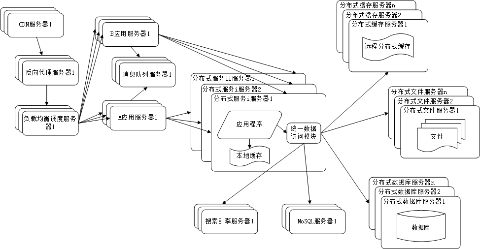
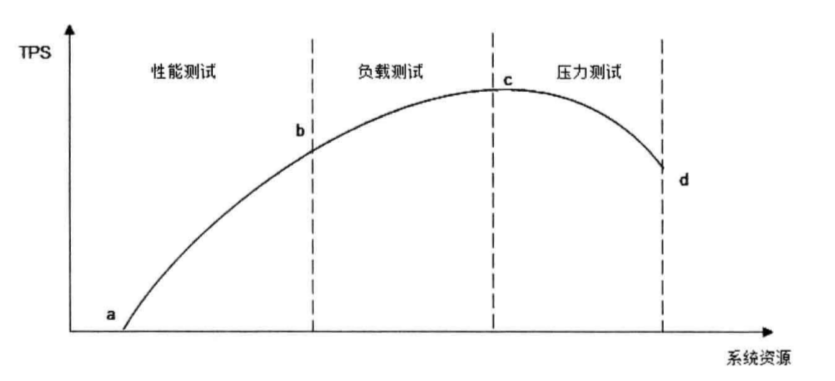

大型网站技术架构-入门梳理
=========================

## 前言

- 本文是对《大型网站架构设计》(李智慧 著)一书的梳理，类似文字版的“思维导图”。
- 全文主要围绕“性能，可用性，伸缩性，扩展性，安全”这五个要素。
- 性能，可用性，伸缩性这几个要素基本都涉及到应用服务器，缓存服务器，存储服务器这几个方面。

## 概述

- 三个纬度：演化、模式、要素。
- 五个要素： 性能，可用性，伸缩性，扩展性，安全。

### 演化历程

图例可参考 [大型网站架构演化历程](http://www.hollischuang.com/archives/728)：

1. **初始阶段的网站架构**：一台服务器，上面同时拥有应用程序，数据库，文件，等所有资源。例如 LAMP 架构
2. **应用和数据服务分离**：三台服务器（硬件资源各不相同），分别是应用服务器，文件服务器和数据库服务器
3. **使用缓存改善网站性能**：分为两种，缓存在应用服务器上的本地缓存和缓存在专门的分布式缓存服务器的远程缓存
4. **使用应用服务器集群改善网站并发处理能力**：通过负载均衡调度服务器来将访问请求分发到应用服务器集群中的任何一台机器
5. **数据库读写分离**：数据库采用主从热备，应用服务器在写数据时访问主数据库，主数据库通过主从复制机制将数据更新同步到从数据库。应用服务器使用专门的数据访问模块从而对应用透明
6. **使用反向代理和 CDN 加速网站响应**：这两者基本原理都是缓存。反向代理部署在网站的中心机房，CDN 部署在网络提供商的机房
7. **使用分布式文件系统和分布式数据库系统**：数据库拆分的最后手段，更常用的是业务分库
8. **使用 NoSQL 和搜索引擎**：对可伸缩的分布式有更好的支持
9. **业务拆分**：将整个网站业务拆分成不同的应用，每个应用独立部署维护，应用之间通过超链接建立联系/消息队列进行数据分发/访问同一数据存储系统
10. **分布式服务**：公共业务提取出来独立部署

演化的价值观

- 大型网站架构的核心价值是随网站所需灵活应对
- 驱动大型网站技术发展的主要力量是网站的业务发展

误区

- 一味追随大公司的解决方案
- 为了技术而技术
- 企图用技术解决所有问题

### 架构模式

模式的关键在于模式的可重复性

- **分层**：横向切分
- **分割**：纵向切分
- **分布式**：分层和分割的主要目的是为了切分后的模块便于分布式部署。常用方案：
    - 分布式应用和服务
    - 分布式静态资源
    - 分布式数据和存储
    - 分布式计算
    - 分布式配置，分布式锁，分布式文件，等等
- **集群**：多台服务器部署相同的应用构成一个集群，通过负载均衡设备共同对外提供服务
- **缓存**：将数据放距离计算最近的位置加快处理速度，改善性能第一手段，可以加快访问速度，减小后端负载压力。使用缓存 **两个前提条件** ：1.数据访问热点不均衡；2.数据某时段内有效，不会很快过期
    - CDN
    - 反向代理
    - 本地缓存
    - 分布式缓存
- **异步**：旨在系统解耦。异步架构是典型的消费者生产者模式，特性如下：
    - 提高系统可用性
    - 加快网站访问速度
    - 消除并发访问高峰
- **冗余**：实现高可用。数据库的冷备份和热备份
- **自动化**：包括发布过程自动化，自动化代码管理，自动化测试，自动化安全检测，自动化部署，自动化监控，自动化报警，自动化失效转移，自动化失效恢复，自动化降级，自动化分配资源
- **安全**：密码，手机校验码，加密，验证码，过滤，风险控制

### 核心要素

架构是“最高层次的规划，难以改变的规定”。主要关注五个要素：

- 性能
- 可用性(Availability)
- 伸缩性(Scalability)
- 扩展性(Extensibility)
- 安全性

## 架构

下面依次对这五个要素进行归纳

### 高性能

性能的测试指标主要有：

- 响应时间：指应用执行一个操作需要的时间
- 并发数：指系统能够同时处理请求的数目
- 吞吐量：指单位时间内系统处理的请求数量
- 性能计数器：描述服务器或者操作系统性能的一些数据指标

性能测试方法：

- 性能测试
- 负载测试
- 压力测试
- 稳定性测试

性能优化,根据网站分层架构，可以分为三大类：

-  **Web 前端性能优化**
     - 浏览器访问优化
        - 减少 http 请求
        - 使用浏览器缓存
        - 启用压缩
        - CSS 放在页面最上面，JavaScript 放在页面最下面
        - 减少 Cookie 传输
     - CDN 加速：本质是一个缓存，一般缓存静态资源
     - 反向代理
        - 保护网站安全
        - 通过配置缓存功能加速 Web 请求
        - 实现负载均衡
- **应用服务器性能优化**：主要手段有 缓存、集群、异步
    - 分布式缓存(*网站性能优化第一定律：优化考虑使用缓存优化性能*)
    - 异步操作(*消息队列，削峰作用*)
    - 使用集群
    - 代码优化
        - 多线程(设计为无状态，使用局部对象，并发访问资源使用锁)
        - 资源复用(单例，对象池)
        - 数据结构
        - 垃圾回收
- **存储服务器性能优化**
    - 机械硬盘 vs. 固态硬盘
    - B+ 树 vs. LSM 树
    - RAID vs. HDFS

### 高可用

- 高可用的网站架构：目的是保证服务器硬件故障时服务依然可用、数据依然保存并能够被访问，主要手段数据和服务的冗余备份及失效转移
- 高可用的应用：显著特点是应用的无状态性
    - 通过负载均衡进行无状态服务的失效转移
    - 应用服务器集群的 Session 管理
        - Session 复制
        - Session 绑定
        - 利用 Cookie 记录 Session
        - Session 服务器
- 高可用的服务：无状态的服务，可使用类似负载均衡的失效转移策略，此外还有如下策略
    - 分级管理
    - 超时设置
    - 异步调用
    - 服务降级
    - 幂等性设计
- 高可用的数据：主要手段是数据备份和失效转移机制
    - CAP 原理
        -  数据一致性(Consisitency)
        -  数据可用性(Availibility)
        -  分区耐受性(Partition Tolerance)
    - 数据备份
        - 冷备：缺点是不能保证数据最终一致和数据可用性
        - 热备：分为异步热备和同步热备
    - 失效转移：由以下三部分组成
        - 失效确认
        - 访问转移
        - 数据恢复
- 高可用网站的软件质量保证
    - 网站发布
    - 自动化测试
    - 预发布验证
    - 代码控制
        - 主干开发、分支发布
        - 分支开发、主干发布
    - 自动化发布
    - 灰度发布
-  网站运行监控
    - 监控数据采集
        - 用户行为日志采集（服务器端和客户端）
        - 服务器性能监控
        - 运行数据报告
    - 监控管理
        - 警报系统
        - 失效转移
        - 自动优雅降级

### 伸缩性

大型网站的“大型”是指：

- 用户层面：大量用户及大量访问
- 功能方面：功能庞杂，产品众多
- 技术层面：网站需要部署大量的服务器

伸缩性的分为如下几个方面

- 网站架构的伸缩性设计
    - 不同功能进行物理分离实现伸缩
        - 纵向分离(分层后分离)
        - 横向分离(业务分割后分离)
    - 单一功能通过集群规模实现伸缩
- 应用服务器集群的伸缩性设计
    - HTTP 重定向负载均衡
    - DNS 域名解析负载均衡
    - 反向代理负载均衡(在 HTTP 协议层面，应用层负载均衡)
    - IP 负载均衡(在内核进程完成数据分发)
    - 数据链路层负载均衡(数据链路层修改 mac 地址，三角传输模式，LVS)
    - 负载均衡算法
        - 轮询(Round Robin, RR)
        - 加权轮询(Weighted Round Robin, WRR)
        - 随机(Random)
        - 最少链接(Least Connections)
        - 源地址散列(Source Hashing)
- 分布式缓存集群的伸缩性设计
    - Memcached 分布式缓存集群的访问模型
        - Memcached 客户端（包括 API，路由算法，服务器列表，通信模块）
        - Memcached 服务器集群
    - Memcached 分布式缓存集群的伸缩性挑战
    - 分布式缓存的一致性 Hash 算法(一致性 Hash 环，虚拟层)
- 数据存储服务集群的伸缩性设计
    - 关系数据库集群的伸缩性设计
    - NoSQL 数据库的伸缩性设计

### 可扩展

系统架构设计层面的“开闭原则”

- 构建可扩展的网站架构
- 利用分布式消息队列降低耦合性
    - 事件驱动架构(Event Driven Architecture)
    - 分布式消息队列
- 利用分布式服务打造可复用的业务平台
    - Web Service 与企业级分布式服务
    - 大型网站分布式服务的特点
    - 分布式服务框架设计(Thrift, Dubbo)
- 可扩展的数据结构(如 ColumnFamily 设计)
- 利用开放平台建设网站生态圈

### 网站的安全架构

XSS 攻击和 SQL 注入攻击是构成网站应用攻击最主要的两种手段，此外还包括 CSRF,Session 劫持等手段。

- 攻击与防御
    - XSS 攻击：跨站点脚本攻击（Cross Site Script）
        - 反射型
        - 持久型
    - XSS 防御手段
        - 消毒(即对某些 html 危险字符转义)
        - HttpOnly
    - 注入攻击
        - SQL 注入攻击
        - OS 注入攻击
    - 注入防御
        - 避免被猜到数据库表结构信息
        - 消毒
        - 参数绑定
    - CSRF 攻击：跨站点请求伪造（Cross Site  Request Forgery）
    - CSRF 防御：主要手段是识别请求者身份
        - 表单 Token
        - 验证码
        - Referer Check
    - 其他攻击和漏洞
        - Error Code
        - HTML 注释
        - 文件上传
        - 路径遍历
    - Web 应用防火墙（ModSecurity）
    - 网站安全漏洞扫描
- 信息加密技术及密钥安全管理
    - 单向散列加密：不同输入长度的信息通过散列计算得到固定长度的输出
        - 不可逆，非明文
        - 可加盐(salt)增加安全性
        - 输入的微小变化会导致输出完全不同
    - 对称加密：加密和解密使用同一个密钥
    - 非对称加密
        - 信息传输：公钥加密，私钥解密
        - 数字签名：私钥加密，公钥解密
    - 密钥安全管理：信息安全传输是靠密钥保证的，改善手段有：
        - 把密钥和算法放在一个独立的服务器上
        - 将加解密算法放在应用系统中，密钥放在独立服务器
- 信息过滤与反垃圾
    - 文本匹配
    - 分类算法
    - 黑名单

------

作者[@brianway](http://brianway.github.io/)更多文章：[个人网站](http://brianway.github.io/) `|` [CSDN](http://blog.csdn.net/h3243212/) `|` [oschina](http://my.oschina.net/brianway)

------

From: http://brianway.github.io/2017/01/18/reading-note-architecture-design
