大型网站技术架构的演进
=================

## 摘要

最近我在阅读2本关于大型网站架构的书：`《大型网站技术架构——核心原理与案例分析》`李智慧、`《大型网站系统与Java中间件实践》`曾宪杰。

我期望从这些书中学习到大型网站是如何做架构的，这个过程会遇到什么问题。当看完这2本书后，我总结出两个大问题：

    1. 网站技术架构为什么会演进？换个说法就是，为什么网站会变大？
    2. 演进的过程会遇到什么问题？或者说为了演进，会遇到什么问题？

## 网站技术架构为什么会演进

我个人总结出来我们的技术架构演进的两种驱动力，驱动着我们为什么演进网站的技术架构：

    1. 内在驱动力：我们期望把当前的业务做得更好，开发更多新业务。
    2. 外在驱动力：用户量的上升、用户种类的多样化。

这两种驱动力不是独立的，更多时候是并行的。我想淘宝就是两种驱动力并行驱动的结果。

演进的原因很简单。但是在什么时机我们就应该演进网站的技术架构了，以及如何演进？面对这些问题，说实话，我没有任何经验，再说现实中每家企业当时都面临的问题都不一样，所以，我很难从经验中总结出什么是演进的时机。

但是我可以从另一个角度切入这个问题：**`研究网站内外结构，找到这些结构可能出现的问题点，知道或者预见到问题点了`**，你当然就知道应该怎么演进了。类似于你了解了PC机的结构，你也就知道什么时候要加内存了，什么时候要加硬盘了。

那么我们先看看网站的外部结构：

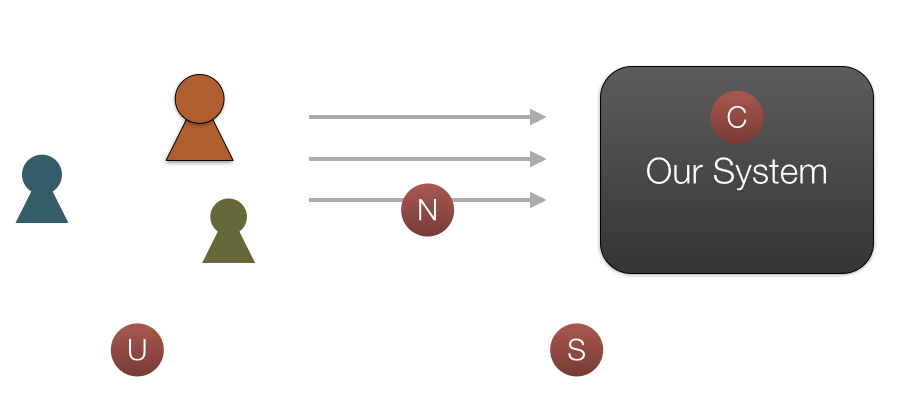

外部结构中，我们可以看由以下几个部分构成：

    U: 代表用户群。
       当用户群变了，我们的网站如何演进？用户群的分析，我目前能知道的维度有：数量，种类，地理位置（区域）。
    N: 代表网络环境。
       网络环境在每个地区都不同。你可以想像我们为什么需要CDN。当我们期望每个区域的用户都能得到好的体验，我们的网站如何演进？
    S: 代表安全。
       就是我们要安全到什么程度？这与网站当前所处阶段及你网站的性质有关。
    C：代表我们的网站。
       属于内部结构。

网站的内部结构：

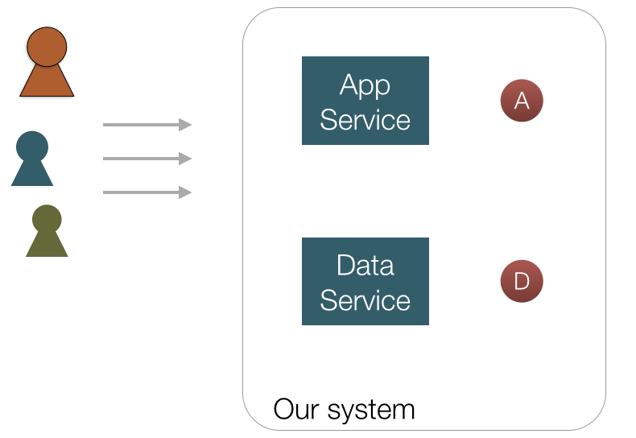

内部结构的组成：

    A：应用服务。
    D：数据服务

总结下来就是，我们在考虑网站是否应该演进了或者如何演进时，这些组成部分为我们提供了考虑问题的基准。

那么我们为什么不一开始就把网站设计成“大型”的。李智慧在后记里写到：“`不要企图去设计一个大型网站`”，“`原因是互联网发展运行有其自己的规律，短暂的互联网历史已经一再证明这种企图行不通`”。还说了：“`大型网站不是设计出来的，而是逐步演化出来的`”。对于最后这句话，我需要提醒下：_**“不是设计出来的”并不代表“随意设计”**_。

对于“`大型网站的设计`”，我个人的看法是现在我们的有“云”了，计算是可以买的，只要我们的设计能适应“云”，我是不是就可以一开始就设计大型网站了？

## 演进的过程会遇到什么问题

### 最初

从一个小网站说起。一台服务器也就足够了。

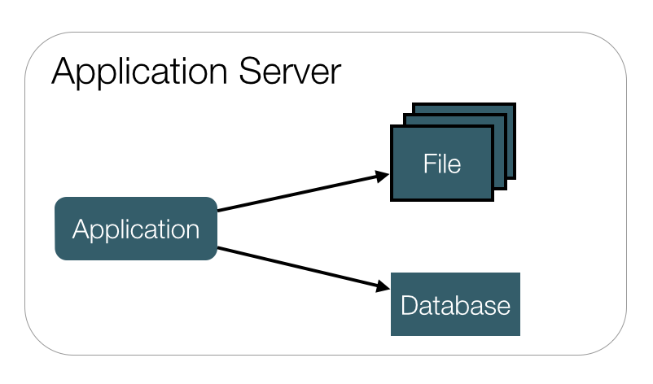

### 数据服务与应用服务分离

越来越多的用户代表着越来越多的数据，一台服务器已经满足不了。我们将数据服务和应用服务分离，给应用服务器配置更好的CPU，内存。而给数据服务器配置更好更大的硬盘。

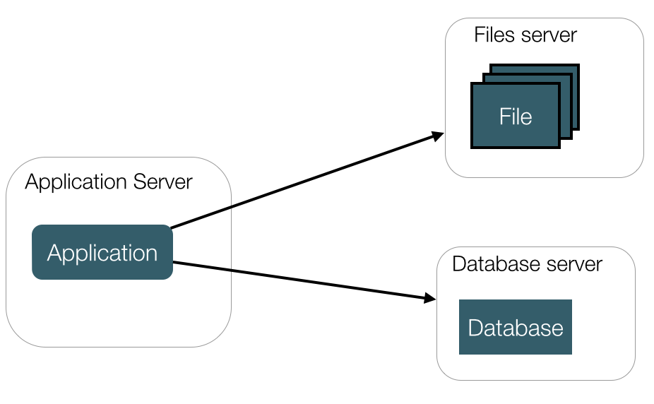

### 使用缓存

因为80%的业务访问都集中在20%的数据上，如果我们能将这部分数据缓存下来，性能一下子就上来了。而缓存又分为两种：`本地缓存` 和 `远程分布式缓存`。具体使用哪种？还是两种都用，我目前不知道。

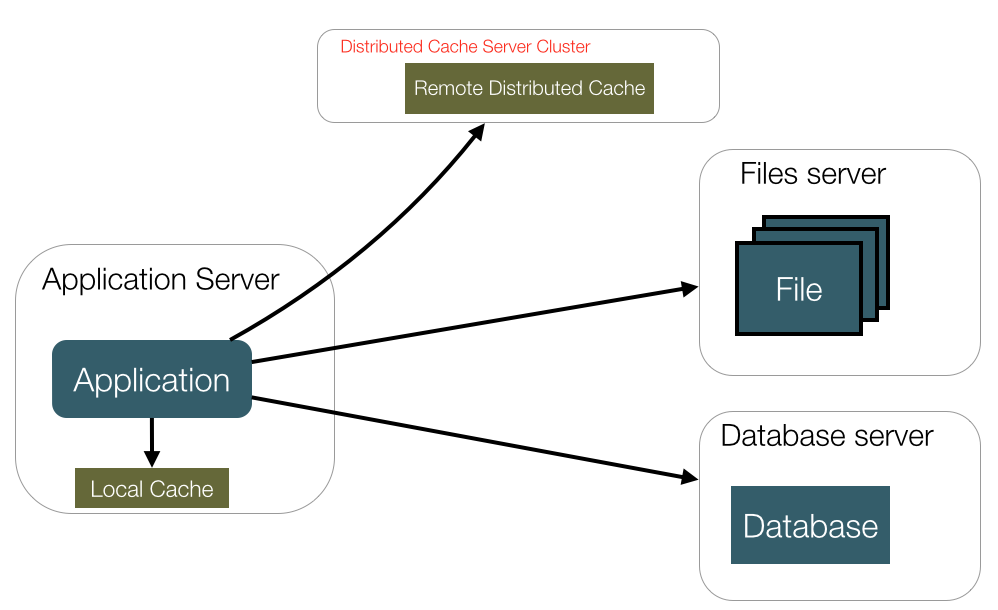

这里有一个问题，书没有提到：`应该缓存哪些数据？`应该有一些原则的吧。

### 使用服务器集群

当这台服务器的处理能力达到上限时，它就会成为瓶颈。虽然你是可以通过购买更强大的硬件，但总会有上限。这时，我们就需要服务器的集群。这时，就必须加个新东西：`负载均衡调度服务器`。

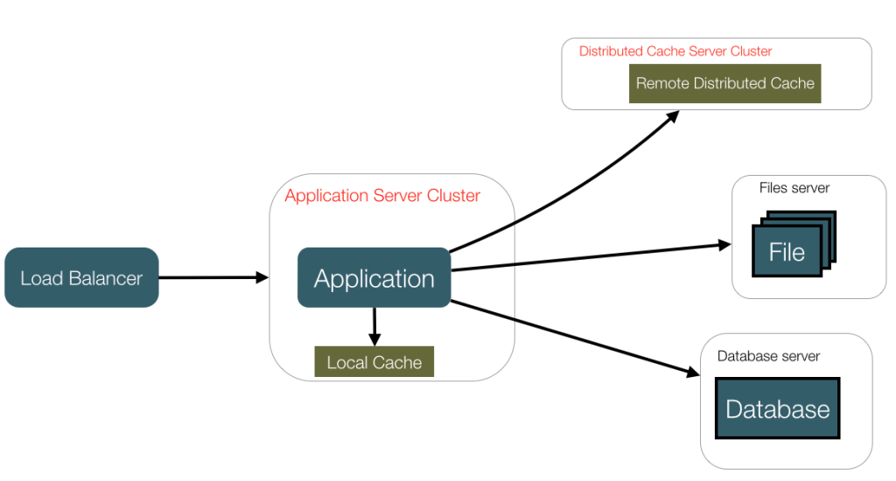

但是，使用服务器集群时，需要考虑一个问题：`Session的管理问题`。Session的管理有以下几种方式：

#### Session Sticky
打个比方就是如果我们每次吃饭都要保证我们用的是自己的碗筷，而只要我们在一家饭店里存着我们的碗筷，只要我们每次去这家饭店吃饭就好了。

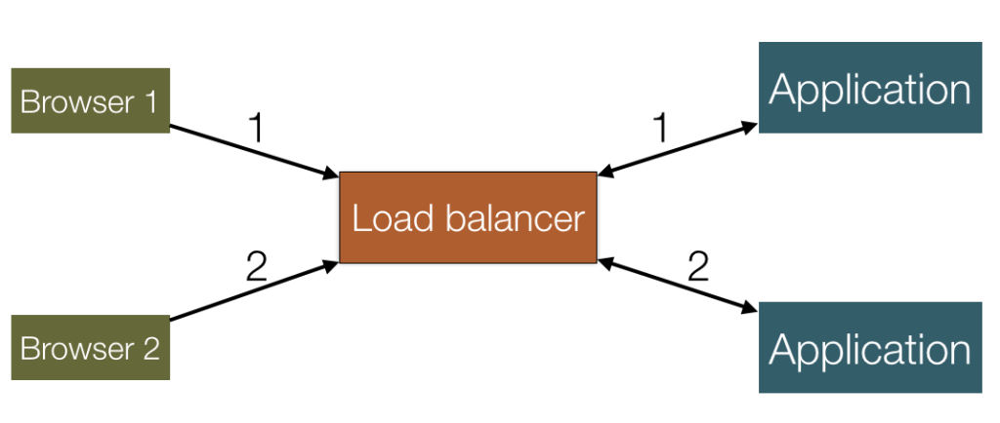

这种方式的问题：

    1. 一台服务器重启，上面的session都没了
    2. 负载均衡器成了有状态的机器，要实现容灾会有麻烦

#### Session复制
就像我们在所有的饭店里都存一份自己的碗筷。_**`不适合做大规模集群，适合机器不多的情况`**_。

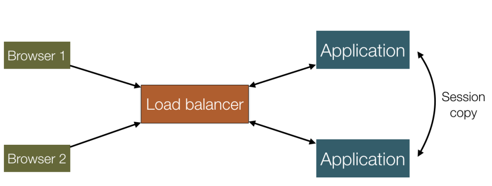

这种方案的问题：

    1. 应用服务器间带宽问题
    2. 大量用户在线时，占用内存过多

#### 基于Cookie
类似于每次吃饭都把自己的碗筷带上。

这种方案的问题：

    1. Cookie的长度限制
    2. 安全性
    3. 数据中心外部带宽的消耗
    4. 性能影响，服务器处理每次的请求的内容又多了

#### Session服务器
同样可以是集群的。**_`这种方式适用于session数量及web服务器数量大的情况`_**。

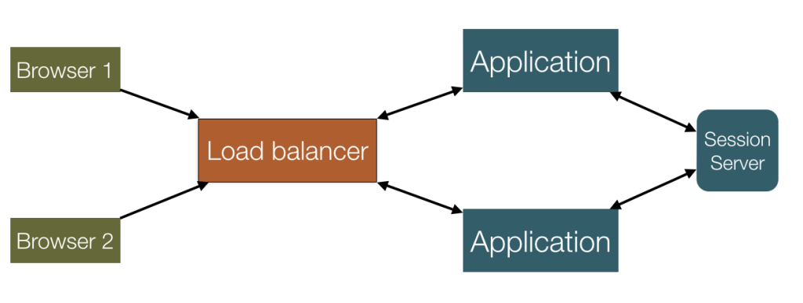

这种方案需要考虑的是：

    1. 保证session服务器的可用性
    2. 我们在写应用时需要做调整，我目前不知道应用服务器能否将这部分逻辑透明化

### 数据库读写分离

数据库的一部分读（未缓存、缓存过期）及所有的写操作都还需要经过数据库。当用户量达到一定量，数据库将会成为瓶颈。这边我们使用数据库提供的热备功能，将所有的读操作引入`slave服务器`。

注意：**读写分离解决的是读压力大的问题**。

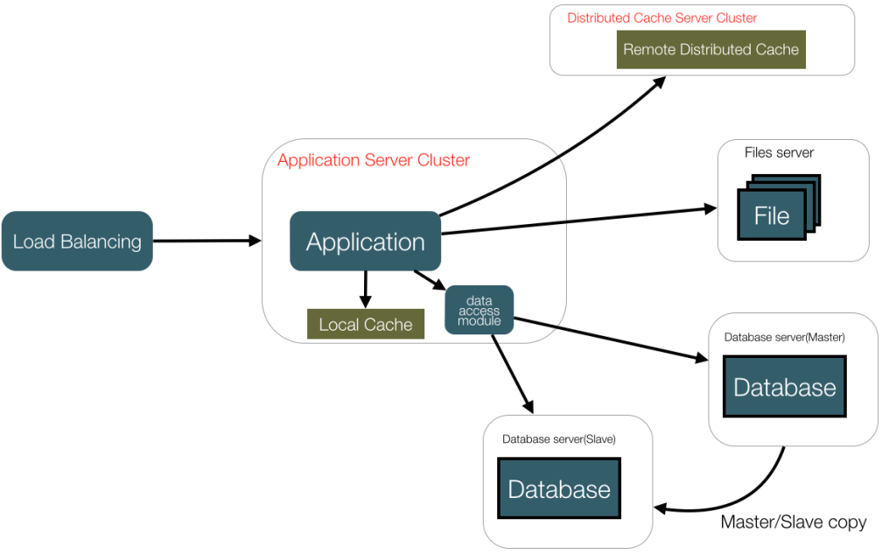

因为数据库的读写分离了，所以，我们的应用程序也得做相应的变化。我们实现一个数据访问模块使上层写代码的人不知道读写分离的存在。这里，我很想知道如果我使用ORM模型时，如何实现读写的分离？

数据库读写分离会遇到如下问题：

    1. 数据复制问题： 考虑时延、数据库的支持、复制条件支持。不要忘了，分机房后，这个更是问题。
    2. 应用对于数据源的路由问题。

### 使用反向代理和CDN加速网站响应

使用CDN可以很好的解决不同的地区的访问速度问题，反向代理则在服务器机房中缓存用户资源：

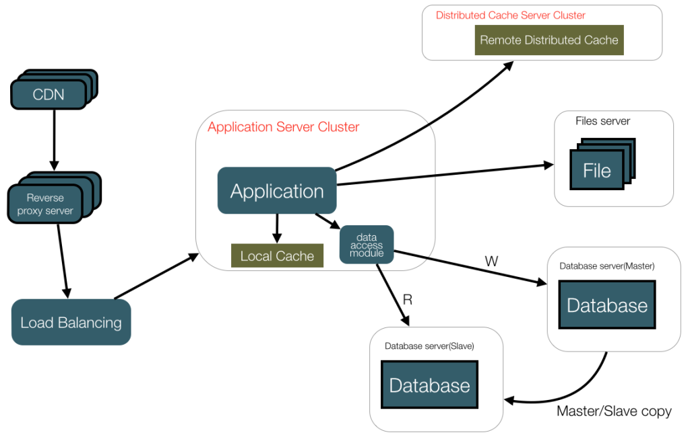

### 使用分布式文件系统

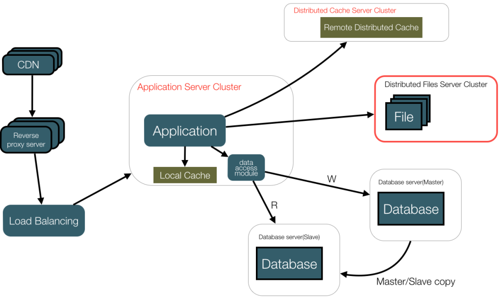

### 数据库专库专用：数据垂直拆分
这样可以解决部分数据写的问题

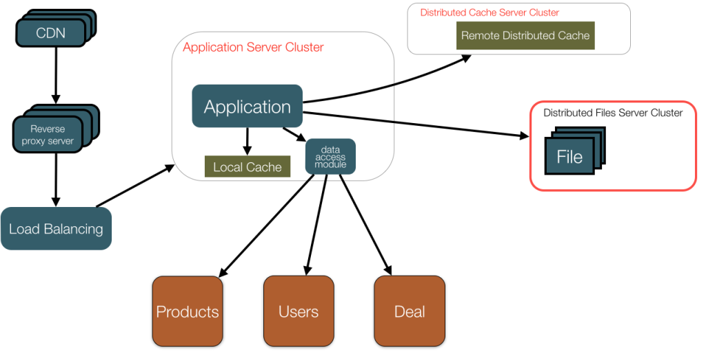

垂直拆分数据库时，会遇到的问题：

    - 跨业务的事务
    - 应用的配置项多了

关于事务的问题，有两种办法：

    - 使用分布式事务
    - 去掉事务或不追求强事务

#### 数据水平拆分
某个业务的数据表的数据量或者更新量达到了单个数据库的瓶颈：`数据水平拆分`。
将同一个表的数据拆分到两个数据库中。

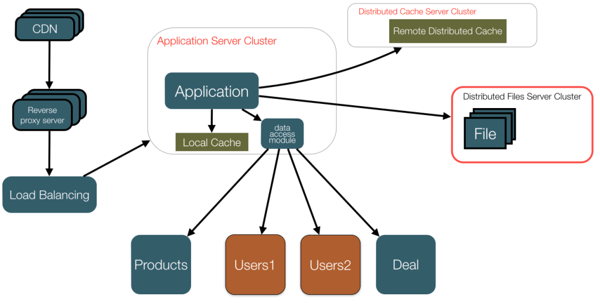

数据水平拆分会遇到的问题：

    - SQL的路由问题，需要知道某个User在哪个数据库上。
    - 主键的策略会有不同。
    - 查询时的性能问题，如分页问题

### 使用搜索引擎：解决数据查询问题

### 部分场景可使用NoSQL提高性能

### 开发数据统一访问模块
解决上层应用开发的数据源问题

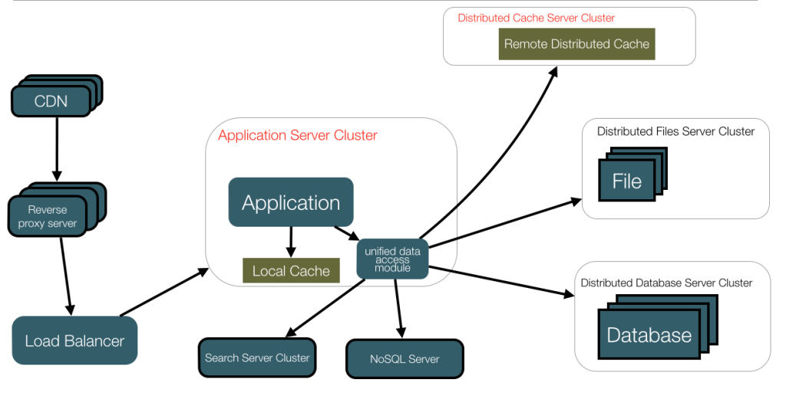

### 业务拆分及应用拆分

网站的业务日益复杂，建立一个独立的大型应用来完成这所有的业务变得不实际。从管理角度来，也不方便管理。然而，业务的拆分很难找到一种通用的模式，这是一个企业管理问题和技术问题的混合问题。同时和每个企业的具体情况有关。

但是从这两本书来看，最终架构都走向服务化，也就是SOA。而如何实现SOA，是另一个很大的话题，不是本篇文章的范畴。

我从程立08年的 [演讲](http://www.infoq.com/cn/presentations/chengli-soa) 中截个图来说明SOA后的架构大概是怎样的：

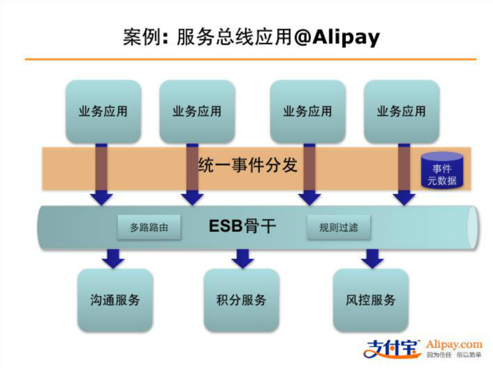

### 非功能性问题

     – 安全性问题、监控问题
     – 发布问题：新的架构意味着新的发布方式
     – 分机房
     – 组织架构的变化

这两本书都没有说分机房的问题。我没有经验，可是也可以猜到如果要分机房了，所有上面的问题都可能要重新考虑。

我们的技术架构的变化，势必会引起我们的组织架构的变化，反之亦然。

这部分看似不应该由我们来管，但是，我觉得，我们技术人员也要参与一部分的组织架构的设计。举个例子，组织架构的设计会涉及绩效，而绩效有时很像一个国家的法律。如果一个国家的法律不健全，会发生什么？你懂的。

同时，我们还必须考虑人员对新架构的学习成本。

这部分我目前在看相关的书籍，还没有一个系统的认识。

## 总结

### 关于演进的顺序

在现实中，技术架构的演进不一定就是按文章从头到尾这样列下来的，所以，要视具体情况来下决定。

### 关于传统演进与现代有“云”环境下的演进

很可惜，只有李智慧谈到云，而且只点了一下——“现在越来越多人的网站从建立之初就是搭建在大型网站提供的云计算服务基础之上，所需的一切资源：计算、存储、网络都可以按需购买线性伸缩，不需要自己一点一点地拼凑各种资源，综合使用各种技术方案逐步去完善自己的网站架构”。

因为我用“云”的时间也不长，还不能总结出有云架构与传统的无云架构在演进的时候有什么不同。

### 说回传统的架构演进，我自己总结和思考的结果是：

在对网站进行架构调整时，可以从两大的维度考虑：`数据服务`和`应用服务`。而这个调整的过程中，需要分清当前哪个点是瓶颈，需要知道哪个点优化的优先级最高。同时，最重要的一点：我们虽然作为技术人员，也应该去学习业务知识，这样我们在考虑问题时分清哪些是业务问题，哪些是技术问题，分清后才能对症下药。你要知道有些问题用技术手段并不比用业务手段更有效。12306的分时卖票就是一个典型例子。

以上总结及思考有不对，欢迎斧正。非常感谢。

---

From: http://insights.thoughtworkers.org/website-architecture-evlovement/
